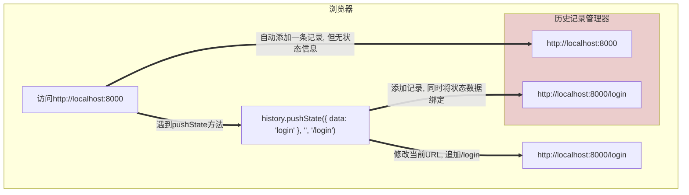
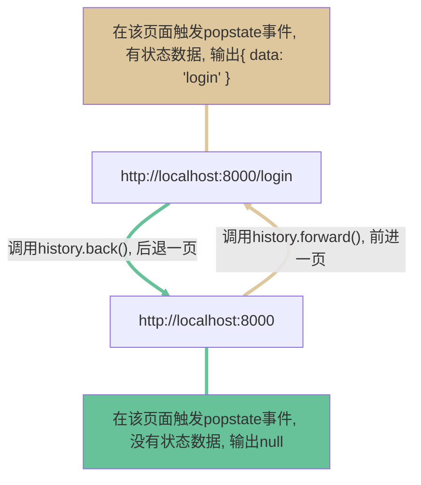
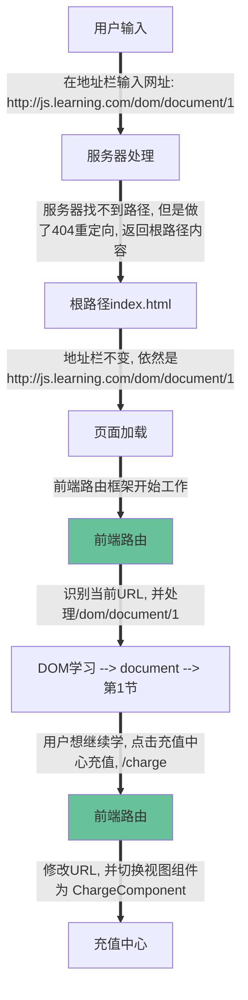

+ [总目录](../readme.md)
***
- [window对象](#window对象)
- [location对象](#location对象)
- [navigator对象](#navigator对象)
- [history对象](#history对象)
- [前端路由](#前端路由)
***
#### window对象
+ `window`对象是BOM的核心, 表示浏览器的实例, 具有双重身份:
  - ECMAScript的Global对象在浏览器的实现, 代表一个全局的作用域 
  - 浏览器窗口的JavaScript编程接口
  - 每一个打开的页面, 都有一个独立的`window`对象, 不能互通使用
***
**注解**: `window`是浏览器对Global对象的实现, 而在Node.js中, Global被实现为`globalThis`
***
+ `window`对象作为全局作用域
  - JavaScript中定义的所有成员, 都可以访问`window`上定义的对象和方法
  - JavaScript在全局作用域还暴露了很多其他的对象, 都是`window`的属性
  - 由于`window`代表着全局作用域, 因而访问时, 也可以不加`window`
  ```JavaScript
  const div = window.document.querySelector('div');
  const intNumber = window.parseInt('3.14');
  const timer = window.setTimeout(console.log, 0, 1);

  window.getCircleArea = function(radius) {
    return Math.PI * radius * radius;
  }
  const circleArea = getCircleArea(10);
  console.log(circleArea); // 314.1592653589793
  ```
  - 后面会介绍`window`暴露出来的和浏览器相关的对象, 如`navigator`等
***
**注解**: `let`/`const`定义的全局变量不会成为`window`的属性, `var`会, 但作用域解析是一样的, 访问某个全局变量或函数时, 首先看全局作用域中有无定义, 没有则会在`window`对象的属性中查找
```JavaScript
function parseInt(str) {
  return `Method override: ${str}`;
}
console.log(parseInt('3.14')); // Method override: 3.14
```
***
+ 以下将介绍`window`对象作为浏览器窗口的JavaScript编程接口的一些内容
+ 像素比: `window.devicePixelRatio`, 物理分辨率 / CSS分辨率
  ```html
  <!-- 运行代码, 然后缩放浏览器, 看看效果, 视觉大小不变 -->
  <div style="width: 300px; height: 300px; border: 1px solid green"></div>
  <script>
    const div = document.querySelector("div");
    const reset = () => {
      const ratio = window.devicePixelRatio;
      div.style.width = `${300 / ratio}px`;
      div.style.height = `${300 / ratio}px`;
      requestAnimationFrame(reset);
    };
    reset()
  </script>
  ```
***
**小知识**: 关于像素
  + 物理像素: 是设备实际的像素, 任何尺寸的设备都对应着一个物理分辨率
  + CSS像素: 像素大小是固定的, 任何尺寸的设备都对应着一个CSS分辨率
  + 假设: 手机的分辨率是1920 * 1080, 浏览器可能将其缩小为640 * 360, 以适配合适的显示, 定义一个值为`12px`, 由于缩放比是3, 因此`window.devicePixelRatio`的值是3, 实际渲染时, 就会使用`3 * 12 = 36px`的物理像素
***
+ 窗口信息: 相关信息直接看下表
  - 视口: 真正渲染HTML页面的区域, 包含水平竖直滚动条
  - **小知识**: Chrome浏览器的滚动条宽度默认是`17px`
  - **小知识**: `document.documentElement.clientWidth`视口宽度, 不包含滚动条
  - **小知识**: `document.documentElement.clientWidth`视口高度, 不包含滚动条
  - 如果没滚动条, 则对应的数值是一样的
  ```JavaScript
  window.innerWidth; // 661
  document.documentElement.clientWidth; // 644

  window.innerHeight; // 470
  document.documentElement.clientHeight; // 453
  ```

|    属性值     |        属性含义        |  返回值  |
| :-----------: | :--------------------: | :------: |
| `innerWidth`  |     浏览器视口宽度     | `number` |
| `innerHeight` |     浏览器视口高度     | `number` |
| `outerWidth`  |     浏览器自身宽度     | `number` |
| `outerHeight` |     浏览器自身高度     | `number` |
|    `name`     | 窗口的名称, 默认是`""` | `string` |

+ 导航和打开新窗口: `window.open`接收三个参数
  - 参数1: 要打开的链接
  - 参数2: 窗口的名称, 有则替换, 无则创建并命名
  - 参数3: 特性字符串, 对打开的新窗口进行个性化配置
  ```JavaScript
  // 打开一个新窗口, 新窗口的name被赋值为zhangsan
  window.open('https://www.baidu.com', 'zhangsan');

  // 在name为zhangsan的窗口中打开B站
  window.open('https://www.bilibili.com', 'zhangsan');

  const windowControl = [
    'width=400', // 新窗口的宽度
    'height=800', // 新窗口的高度
    'left=200', // 新窗口左上角离屏幕左侧的距离
    'top=200', // 新窗口左上角离屏幕顶部的距离
    'location=no', // 是否显示地址栏, 该特性取决于浏览器, 可能不生效
    'munubar=no', // 是否显示菜单栏
    'scrollbars=no', // 是否显示滚动条, 该特性取决于浏览器, 可能不生效
    'status=no', // 是否显示状态栏
    'resizable=no', // 是否可以缩放, 该特性取决于浏览器, 可能不生效
    'toolbar=no' // 是否显示工具栏
  ];

  // 特性字符串
  const win = window.open(
    'https://www.baidu.com',
    'newWindow',
    windowControl.join() // 特性字符串是逗号拼接的字符串
  );

  // 打开的窗口有一个opener属性, 指向打开它的window对象
  console.log(win.opener === window); //true
  ```
  - `window.open`打开的弹窗有可能被官方屏蔽, 或者被其他扩展禁用, 因此可能返回`null`或者报错
  ```JavaScript
  try {
    const win = window.open('https://www.baidu.com', 'newWindow', windowControl.join());
    if (!win) {
      return '弹窗被屏蔽';
    }
  } catch (err) {
    console.log(err);
    return '弹窗被屏蔽';
  }
  ```
+ 定时器: `setTimeout`和`setInterval`
  - 执行并不保证精确, 计时是精确的, 到达时间后, 引擎将回调推入消息队列, 等待执行
  - `setInterval`会始终在间隔时间推入回调, 不关心前一个回调的执行情况
  - `clearTimeout`和`clearInterval`不能取消已经开始执行的回调

#### location对象
+ `location`对象是`window`的属性, 提供当前加载的文档信息
+ `location`对象同时保存在`document`对象中, 二者是一样的
+ `location`可以直接使用
  ```JavaScript
  console.log(location === window.location); // true
  console.log(location === document.location); // true
  ```
+ `location`对象的常用属性: 假设URL是
  - 假设URL是`https://www.fc.com:8080/about?name=zhang#content`

|   属性值   |    属性含义     |          值          |
| :--------: | :-------------: | :------------------: |
| `protocal` |    网络协议     |       `https`        |
|   `host`   | 服务器名+端口号 |  `www.fc.com:8080`   |
| `hostname` |    服务器名     |     `www.fc.com`     |
|   `port`   |      端口       |         `80`         |
| `pathname` | URL路径或文件名 |       `/about`       |
|  `search`  |   查询字符串    |    `?name=zhang`     |
|   `hash`   |    URL哈希值    |      `#content`      |
|  `origin`  | URL源地址, 只读 | `https://www.fc.com` |
|   `href`   |    完整地址     |       完整地址       |

+ 处理查询字符串: `URLSearchParams`(也是`window`对象的属性)
  ```JavaScript
  const query = '?name=zhangsan&age=18&sex=male';
  const searchParams = new URLSearchParams(query);
  console.log(searchParams.has('name')); // true
  console.log(searchParams.get('sex')); // male
  console.log(searchParams.set('name', 'lisi'));
  console.log(searchParams.toString()); // name=lisi&age=18&sex=male
  console.log(searchParams.delete('age'));
  console.log(searchParams.toString()); // name=lisi&sex=male

  for (const item of searchParams) {
    console.log(item);
  }
  // ['name', 'lisi']
  // ['sex', 'male']
  ```
+ 操作URL, 修改页面地址
  - 直接修改`location`的属性值 (如上表), 除`hash`以外, 页面都会重载
  ```JavaScript
  location.port = 80;
  ```
  - 使用`location.assign()`, 修改URL值, 示例代码中的三种方法是一致的
  ```JavaScript
  location.assign('https://www.baidu.com');

  // 以下两种方法其实就是在后台调用location.assign()
  location.href = 'https://www.baidu.com';
  window.location = 'https://www.baidu.com';
  ```
  - 以上方法, 都会导致浏览器向历史中添加一条记录, 可以使用后退按钮
  - 使用`location.replace`替换URL, 不会添加历史, 不可后退
  ```JavaScript
  location.replace('https://www.baidu.com');
  ```
  - 使用`location.reload`刷新页面
  ```JavaScript
  location.reload(); // 可能会从缓存中刷新
  location.reload(true); // 强制从服务器刷新, 规避缓存影响
  ```

#### navigator对象
+ `navigator`对象是`window`的属性, 提供当前浏览器信息
+ `navigator`可以直接使用
+ `navigator`对象的实现因浏览器而异, 本文档只介绍几个属性

|     属性值      |       属性含义       |    结果     |
| :-------------: | :------------------: | :---------: |
| `cookieEnabled` |    是否启用Cookie    |  `boolean`  |
|    `onLine`     |       是否联网       |  `boolean`  |
|   `webdriver`   | 是否被自动化程序控制 |  `boolean`  |
|   `clipboard`   |      剪切板对象      | `Clipboard` |

+ 前三个属性的简单示例
  ```JavaScript
  if (!navigator.cookieEnabled) {
    console.log('浏览器未启用Cookie, 系统可能无法正常使用');
  }

  if (!navigator.onLine) {
    console.log('浏览器未联网, 无法访问系统');
  }

  if (navigator.webdriver) {
    console.log('设备被自动化程序控制, 部分功能无法使用');
  }
  ```
+ 浏览器网络检测的其他方案: 使用事件
  ```JavaScript
  // 有可能不工作
  window.addEventListener('online', onlineCallback);
  window.addEventListener('offline', offlineCallback);
  ```
+ 浏览器进行剪切板读写: `navigator.clipboard`
  - `navigator.clipboard`只能用在`https`页面中
  - 第一次使用, 浏览器会弹出授权窗口, 用户需要点击允许使用剪切板
  - 可以读取剪切板的内容, 也可以向剪切板写入内容
  - 操作纯文本内容的示例:
  ```JavaScript
  if (!navigator.clipboard) {
    console.log('浏览器不支持剪切板');
    return;
  }

  // 读取文本, readText返回的是Promise<string>
  try {
    const clipboardText = await navigator.clipboard.readText();
    console.log(clipboardText || '剪切板没有文本内容');
  } catch (err) {
    // 用户如果禁止了剪切板使用, 操作会报错
    console.log('读取剪切板失败');
  }
  

  // 复制文本, 写入剪切板, writeText返回的是Promise<void>
  try {
    await navigator.clipboard.writeText(message);
    console.log('已复制');
  } catch (err) {
    // 用户如果禁止了剪切板使用, 操作会报错
    console.log('写入剪切板失败');
  }
  ```
+ 文本复制的兼容方案: `document.execCommand` (已废弃, 不推荐)
  ```JavaScript
  // 支持http
  // 第二个参数: 是否展示用户界面, 一般都是false
  const message = 'some text';
  document.execCommand('copy', false, message);
  ```

#### history对象
+ `history`对象是`window`的属性, 提供了当前窗口历史记录信息
+ `history`可以直接使用
+ 切换历史记录
  - `go`方法: 传入正数表示前进, 传入负数表示后退
  - `back`方法, 是`go(-1)`的代替方法, 二者效果一样
  - `forward`方法, 是`go(1)`的代替方法, 二者效果一样
  - `length`属性, 表示当前窗口的历史记录数量
  ```JavaScript
  // 假设当前的URL是https//www.baidu.com/
  location.hash = 'hashvalue'; // https//www.baidu.com/#hashvalue

  history.back(); // https//www.baidu.com
  history.forward(); // https//www.baidu.com/#hashvalue

  console.log(history.length); // 3 (我的Chrome默认打开是空白页)
  ```
+ URL状态管理
  - `hashchange`事件, 当页面URL的`hash`值变化时, 会触发该事件
  - **小知识**: 修改`hash`会导致页面中id为该值的元素滚动到左上角, 但页面不会重载刷新
  ```JavaScript
  let html = "";
  for (let index = 1; index < 100; index++) {
      html += `<p id="text${index}">这是一段文本, 这是第${index}部分</p>`
  }
  document.body.innerHTML = html;
  window.addEventListener(
    'hashchange',
   /**
    * hashchange事件参数
    * @param {HashChangeEvent} event 
    */
    event => {
      const { oldURL, newURL }  = event;
      console.log(oldURL, newURL);
      // http://localhost:8000
      // http://localhost:8000/#text50
    }
  );
  location.hash = 'text50';
  ```
  - `pushState()`方法: 修改URL, 但页面不会刷新, 还可以给URL绑定一些状态数据
  - `pushState`接收三个参数: 状态数据, 标题, 新的URL
  - `pushState`方法同样会添加历史记录
  - 在历史记录中切换时会触发`popstate`事件, 可以取出状态数据
  - **TIPS**: 标题参数目前无具体使用场景
  ```html
  <!-- 假设当前的URL是http://localhost:8000 -->
  <button class="login">登录</button>
  <button class="forward">前进</button>
  <button class="back">后退</button>
  <script>
    document.querySelector('.login').addEventListener('click', () => {
      history.pushState({ data: 'login' }, '登录', '/login');
    });
    document.querySelector('.back').addEventListener('click', () => history.back());
    document.querySelector('.forward').addEventListener('click', () => history.forward());
    window.addEventListener('popstate', event => console.log(event.state));
  </script>

  <!-- 操作: 依次点击 登录 后退 前进 三个按钮, 看输出 -->
  <!-- 输出1: null -->
  <!-- 输出2: { data: 'login' } -->
  ```
***
**注解1**: `pushState`方法是三个作用:
+ 修改当前URL, 可以是`hash`等任何内容, 但必须同源
+ URL会添加进历史记录
+ URL会和状态数据绑定

**注解2**: 切换历史记录, 触发`popstate`事件, 取出状态数据
+ 可以通过点击前进后退按钮, 或者`history.go`等方法
+ 事件的回调参数`event`, 通过`event.state`即可获取状态数据
+ 获取到的是切换之后的URL的状态数据

**注解3**: 可以通过`replaceState`方法, 修改当前URL的状态数据
```JavaScript
// 只有两个参数, 状态数据和标题
history.replaceState({ data: 'index' }, '主页');
```
***

#### 前端路由
+ 通过`history`对象, 可以轻松实现修改URL, 但不刷新页面的功能
+ 多数前端框架均采用这种模式, 在修改路由时, 同步加载对应视图组件, 或进行路由拦截
+ 新修改的URL, 如果在服务器没有对应的路由, 会导致404错误:
  - 假设系统网址是: `http://js.learning.com`
  - 用户访问系统各个部分, 前端路由会加入各种路径: 
    - 登录: `http://js.learning.com/login`
    - 关于: `http://js.learning.com/about`
    - DOM学习: `http://js.learning.com/dom/document/1`
    - ...
  - 用户保存带路由的URL为书签, 或者在当前页手动刷新
  - 服务器上没有`/login`或者`/about`等路径, 因此报404错误
  - 因此后台服务必须设置, 将所有404路径请求, 重定向到根路径
+ 前端框架也必须设置页面加载时的URL处理, 以正确设置视图组件
+ 因此, 前端路由框架至少需要包含两部分的功能:
  - 路由跳转: 不刷新页面, 修改URL, 并提供相应的视图组件
  - 初始加载: 正确判断当前URL, 并切换到正确的视图组件

***
**提示1**: 前端页面载入后, 路由框架会处理URL的工作, 如果访问的URL前端路由都无法识别, 将会出错, 因此前端开发都会提供一个更加好看的404错误页面

**提示2**: 再次说明: 修改`hash`值是不会触发页面刷新的, 因此`hash`模式的前端路由没有这么复杂, 但是需要考虑`id`重名的问题
***
