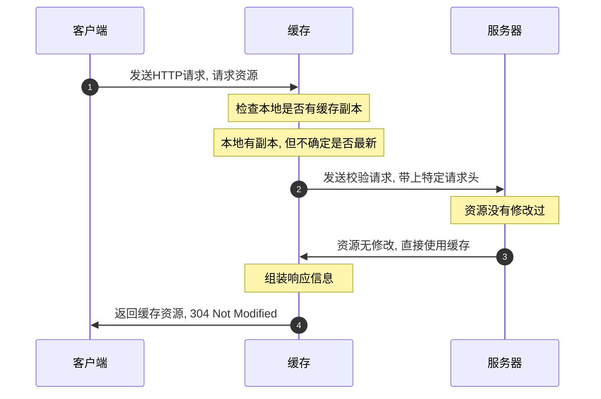
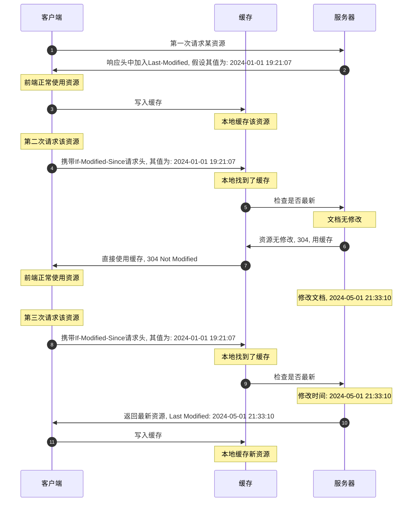
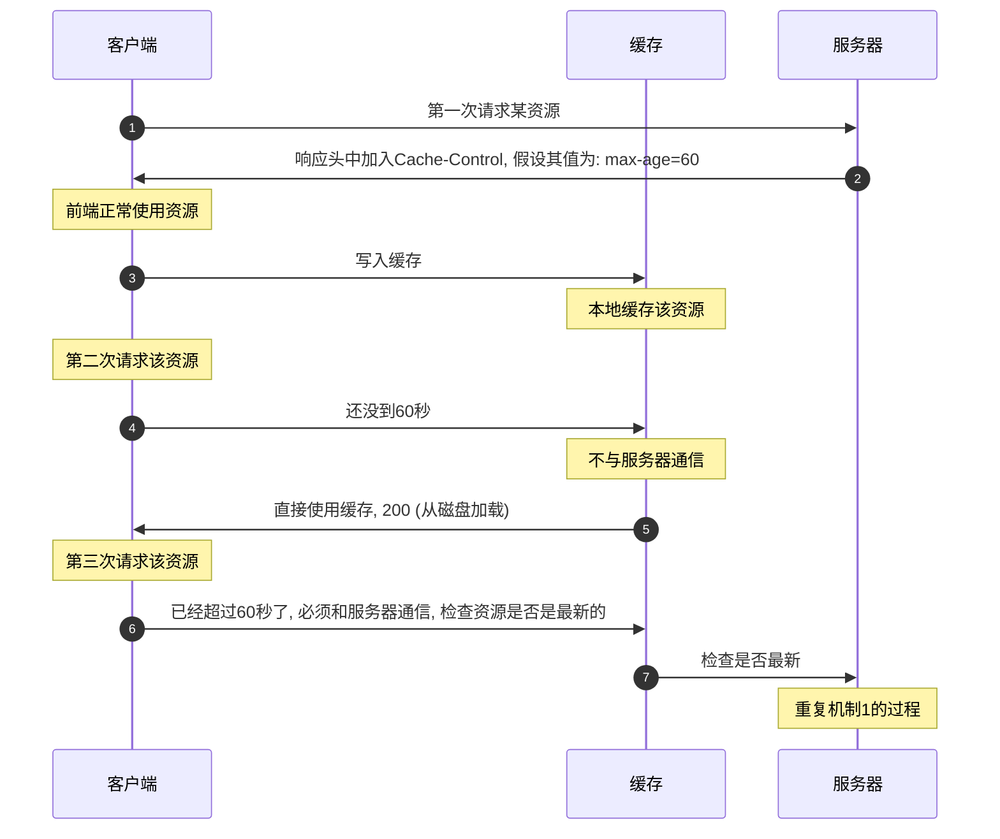

+ [总目录](../readme.md)
***
- [Web缓存](#web缓存)
- [性能](#性能)
***
#### Web缓存
+ 缓存的由来: 客户端内建的缓存会保存Web请求获取到的资源(文档, 图片等)
+ 使用`Content-Type`标记为`text/html`的响应头修饰的字符串响应也会应用缓存
```JavaScript
app.get('/', (_, res) => {
  res.setHeader('Content-Type', 'text/html');
  res.send('<p>Hello, World!</p>');
});

// 连续请求两次根路径, 第二次请求将使用缓存, 304
```
***
**注解:** 缓存有很多种, 私有缓存, 共享缓存等, 本文档只讨论私有缓存 (单个用户使用的缓存), 并且特指私有缓存下的浏览器缓存
***
+ 缓存的运作机制1: 常见的`304 Not Modified`
  - 客户端像服务器请求文档或资源, 请求首先到达缓存
  - 缓存检查到本地已经具有了缓存副本, 但不确定是否是最新的
  - 缓存向后台服务发送检查请求, 并带上特定的请求头
  - 服务器识别资源是否为最新, 资源没有被修改过, 因此返回304状态码
  - 缓存组装最终的响应信息, 发送给客户端
  - 客户端最终就看到了`304 Not Modified`状态信息

***
**注解1:** 有两点需要注意
+ `304`是服务器返回的, 说明即使是缓存, 依然也是和后端服务进行了通信的
+ 特定的请求头主要是`If-None-Match`和`If-Modified-Since`

**注解2:** `If-Modified-Since`请求头
+ 服务器需要配置`Last-Modified`响应头, 标记该资源的最后修改时间, 默认是该资源的最后编辑时间
+ 客户端第一次请求该资源后, 会缓存该资源, 以及响应头中的最后修改时间
+ 后续再次发送请求时, 客户端就会在请求头中写入`If-Modified-Since`, 其值为响应头返回的值
+ 服务器读取该请求头的值, 并与该资源的最新编辑时间进行比较
+ 若最新修改时间晚于请求头时间, 则资源有修改, 返回最新资源, 状态码为200
+ 若最新的修改时间和请求头时间一致, 则资源无修改, 返回304, 通知客户端使用缓存


**注解3:** `If-None-Match`请求头
+ 服务器需要配置`Etag`响应头, 标记该资源的标识符, 文件内容变化时, 标识符也会变
+ 客户端第一次请求该资源后, 会缓存该资源, 以及响应头中的标识符的值
+ 后续再次发送请求时, 客户端就会在请求头中写入`If-None-Match`, 其值为响应头返回的标识符
+ 服务器读取该请求头的值, 并与该资源的最新标识符进行比较
+ 若二者不匹配, 则资源有修改, 返回最新资源, 状态码为200
+ 若二者一致, 则资源无修改, 返回304, 通知客户端使用缓存
+ 流程图和上面的一致, 此处就省略了

**注解4:** 打开客户端F12, 查看请求信息
```bash
# 响应头
HTTP/1.1 304 Not Modified
Last-Modified: Mon, 17 Jun 2024 11:46:24 GMT
ETag: W/"15d-190260511ab"
Connection: keep-alive

# 请求头
GET / HTTP/1.1
If-Modified-Since: Mon, 17 Jun 2024 11:46:24 GMT
If-None-Match: W/"15d-190260511ab"
```

**注解5:** `Etag`的优先级高于`Last-Modified`
***
+ 缓存的运作机制2: 常见的`200 (从磁盘加载)`
  - 客户端像服务器请求文档或资源, 请求首先到达缓存
  - 缓存检查到本地已经具有了缓存副本, 并且不关心是否最新
  - 缓存直接将资源返回客户端, 设置状态码为200
  - 客户端最终就看到了`200 (从磁盘加载)`状态信息
***
**注解1:** 该种缓存机制的实现: 方案1
+ 服务器需要配置`Cache-Control`响应头, 并设置其值为`max-age=<seconds>`
+ 客户端第一次请求该资源后, 会缓存该资源, 以及记录响应头中的`max-age`的值
+ 后续再次发送请求时, 时间没有超过`max-age`的值, 则不与服务器通信, 直接使用缓存
+ 超过`max-age`的值后, 再次请求则重复机制1的逻辑, 与服务器通信检查资源是否最新

```JavaScript
const app = express();
app.use(express.static('static', {
  setHeaders: res => {
    res.setHeader('Cache-Control', 'max-age=60');
  }
}));
app.listen(8000, () => {
  console.log('Server is running...');
});

// 在60秒内请求两次, 第二次将直接从磁盘加载
```

**注解2:** 该种缓存机制的实现: 方案2
+ 服务器需要配置`Expires`响应头, 表示资源的过期时间
+ 客户端第一次请求该资源后, 会缓存该资源, 以及记录响应头中的`Expires`的值
+ 后续再次发送请求时, 如果没有超过过期时间, 则不与服务器通信, 直接使用缓存
+ 超过过期时间后, 再次请求则重复机制1的逻辑, 与服务器通信检查资源是否最新
+ 流程图和上面的一致, 此处就省略了
+ **PS:** `Cache-Control`会覆盖`Expires`的配置, 因此使用`Expires`时必须禁用`Cache-Control`
```JavaScript
const app = express();
app.use(express.static('static', {
  cacheControl: false,
  setHeaders: res => {
    res.setHeader('Expires', 'Mon, 15 Jun 2025 14:08:56 GMT');
  }
}));
app.listen(8000, () => {
  console.log('Server is running...');
});

// 在2025-6-15 14:08:56前请求资源, 将直接从磁盘加载
```
***
+ 前端缓存问题可能出现的原因: 
  - `Expires`和`Cache-Control`设置不合理, 导致直接从磁盘加载资源
  - `Etag`和`Last-Modified`设置不合理, 导致服务器异常返回304状态码
+ 解决方案: 缓存问题通常必须由服务器介入
  - 打包资源使用文件哈希值, 即`index.html`引入资源如js, css等使用哈希命名
  - 针对`index.html`本身, 则通过合理的配置`Cache-Control`和`Expires`来解决
  - 针对静态资源文件图片等, 同样通过合理的配置`Expires`或者`Cache-Control`
***
**注解1:** 遇到缓存问题时, 要学会打开F12, 分析请求的加载情况
+ 是否是从缓存直接加载
+ 是否是反复304状态码
+ 分析上述的请求头和响应头, 是否有不合理的情况

**注解2:** 以下的操作通常不会遇到缓存问题
+ 点击地址栏左侧的刷新按钮, 这会强制与服务器通信
+ 通过Shift+F5或者F5刷新页面, 这会强制与服务器通信
+ 通过`reload()`方法刷新页面, 这会强制与服务器通信

**注解3:** 以下的操作通常会遇到缓存问题
+ 在地址栏输入地址后, 按下回车键访问
+ 点击保存的书签进行访问
+ 在页面内通过a链接访问当前URL
***
+ 一些杂项
  - `max-age`默认值为0, 表示永远不会直接从磁盘加载
  - 如果服务器移除了`Etag`和`Last-Modified`响应头, 则资源永远不缓存, 请求永远都是200
  ```JavaScript
  app.use(express.static('static', {
    cacheControl: false,
    etag: false,
    lastModified: false
  }));
  ```
  - 服务器配置`Cache-Control`响应头为`no-store`资源将永远不会缓存
  ```JavaScript
  app.use(express.static('static', {
    setHeaders: res => {
      res.set('Cache-Control', 'no-store');
    }
  }));
  ```
  - 服务器配置`Cache-Control`响应头为`no-cache`资源缓存, 但每次使用都必须和服务器验证
  ```JavaScript
  app.use(express.static('static', {
    setHeaders: res => {
      res.set('Cache-Control', 'no-cache');
    }
  }));
  ```
  - 服务器可以配置`Cache-Control`响应头为`private`或`public`, 表示私有/共享缓存
  ```JavaScript
  app.use(express.static('static', {
    setHeaders: res => {
      res.set('Cache-Control', 'private, max-age=60');
    }
  }));
  ```
  - HTML页面配置的`http-equive`, 毫无用处, 别用
  ```HTML
  <meta http-equive="Cache-Control" content="max-age=60">
  <meta http-equive="Cache-Control" content="no-store, no-cache">
  <meta http-equive="Expires" content="Mon, 15 Jun 2025 14:08:56 GMT">
  <!-- ... -->
  ```
***
**注解1:** 重要需要掌握缓存的由来, 以及缓存的控制手段, 最后是遇到缓存问题的分析手段

**注解2:** 缓存是HTTP网络技术的延伸, 两篇文档远远不足以描述完整个网络技术, 需要深入学习
***


#### 性能
