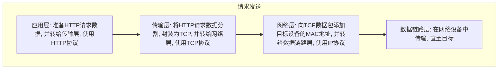
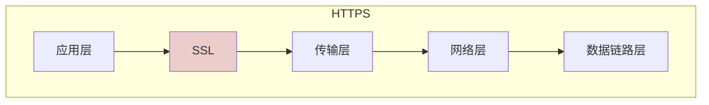
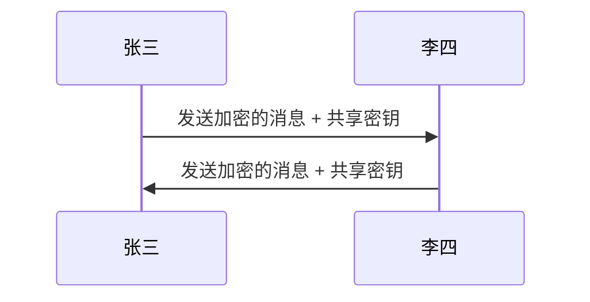
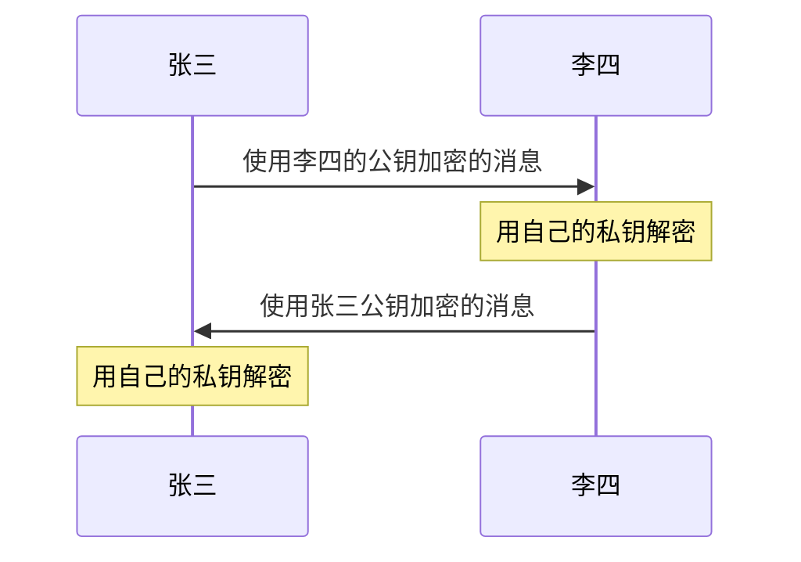
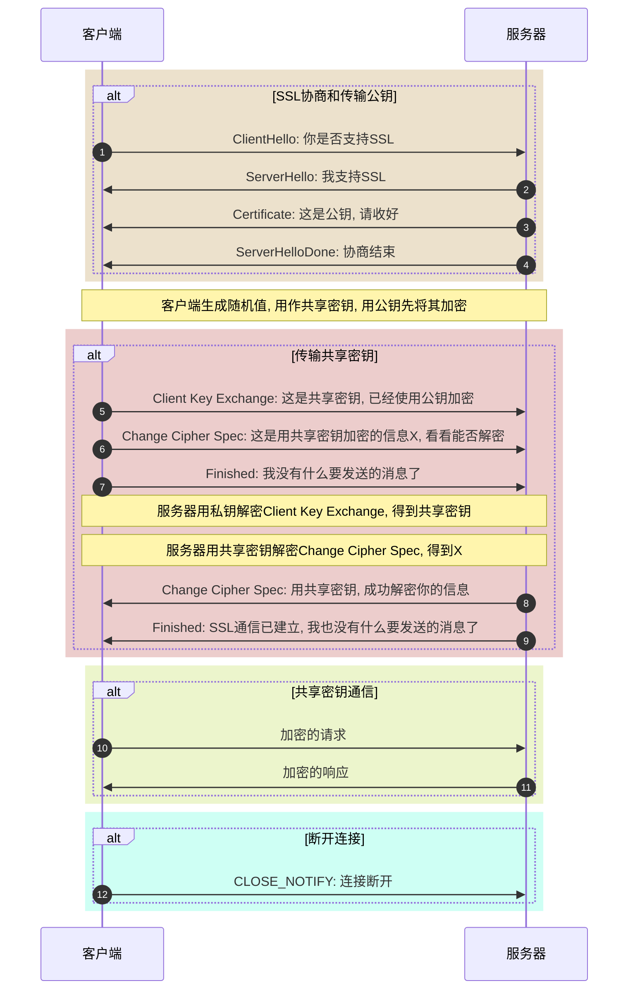

+ [总目录](../readme.md)
***
- [浏览器访问](#浏览器访问)
- [TCP/IP协议族](#tcpip协议族)
- [HTTP](#http)
- [HTTPS](#https)
- [XMLHTTPRequest](#xmlhttprequest)
- [fetch](#fetch)
- [Beacon](#beacon)
- [WebSocket](#websocket)
***
#### 浏览器访问
+ 浏览器地址栏输入URL
  - 协议: 访问的方式和规则
  - 域名/端口: 对应了服务器的地址
  - 路径: 对应了服务器地址下的目录
  - 资源名称: 对应了目录下的文件名称
  - 未指定资源名称: 默认访问`index.html`
  - HTTP的默认端口是80, HTTPS默认端口是443
```bash
http://www.fc.com:8080/static/documents/js-learning.html

http://www.fc.com  #等价于http://www.fc.com:80/index.html
```
+ 域名解析:
  - 检索本地hosts文件, 取出和域名匹配的ip地址
  - 如hosts不匹配, 则访问DNS服务器获取ip地址
+ 通过ip地址再次访问, 获取服务器资源(HTML文档, 文件等)
  - 获取的是文件资源: 由浏览器决定处理方式(保存或预览)
  - 获取的是HTML文档: 浏览器将其渲染为页面
+ HTML文档接口调用:
  - 与文档同源: 接口正常处理并返回响应
  - 与文档不同源: 接口正常处理, 返回的响应被浏览器拦截
***
**重点1:** 浏览器地址栏发送的都是`GET`请求, 且没有跨域的概念, 默认以HTML方式进行文档渲染加载

**重点2:** 同源策略是浏览器才有的限制, 会导致服务器响应被拦截, 而不同的服务器之间发送请求, 则没有限制
```JavaScript
// server.js
app.get("/test", async (req, res) => {
  console.log('Receive request...');
  res.send('Response');
});

// index.js 开发服务地址 localhost:5173
const xhr = new XMLHttpRequest();
xhr.open('GET', 'http://localhost:8000/test');
xhr.onload = () => {
  console.log('done')
}
xhr.send();

// server.js会正常打印出Receive request..., 但页面会报错
```
***

#### TCP/IP协议族
+ `TCP/IP`协议族规定了互联网上进行通信的所有规则和协议
+ `TCP/IP`协议族将互联网划分成了不同的层次:
  - 应用层: 向用户提供应用服务时的通信协议, 如FTP, HTTP等
  - 传输层: 将应用层的数据分割为更细小的报文, 如TCP, UDP等
  - 网络层: 将传输层的报文增加MAC地址, 在网络中传输, IP协议
  - 数据链路层: 在两个网络设备之间传输网络层的数据
***
**注解1:** TCP/IP协议也可以被理解为单独的TCP协议和IP协议, 对应了传输层和网络层

**注解2:** ISO网络分层如果细分可以分为七层: 应用层, 表示层, 会话层, 传输层, 网络层, 数据链路层, 物理层
***
+ HTTP通信的层模型解析:

***
**注解1:** 如果客户端和服务器之间存在多个中转路由, 则会反复重复上述过程, 直至数据传输至目标

**注解2:** 在不同的网络中传输数据, 使用到的是网络层数据

**注解3:** `ARP`协议: 用于根据IP地址, 查询出MAC地址
***

#### HTTP
+ HTTP的通信信息被称为报文: 请求报文 & 响应报文
+ HTTP报文是由多行数据构成的字符串文本: 报文首部 & 报文主体
  - 报文首部: 服务器/客户端需要处理的请求/响应的内容和属性
  - 报文主体: 发送的数据
+ 请求报文首部:
```bash
POST /login HTTP/1.1
Accept: application/json, text/plain, */*
Accept-Language: zh-CN,zh;q=0.9
Cookie: ...
Host: localhost:8000
Referer: http://localhost:8000/
User-Agent: Chrome/120.0.0.0 ...
```
+ 响应报文首部:
```bash
HTTP/1.1 200 OK
Accept-Ranges: bytes
Content-Type: text/html; charset=UTF-8
Content-Length: 430
Date: Tue, 11 Jun 2024 07:08:01 GMT
Connection: keep-alive
Keep-Alive: timeout=5
```
+ 首部的常见字段:
  - `Accept`：浏览器可以处理的内容类型。
  - `Accept-Charset`：浏览器可以显示的字符集。
  - `Accept-Encoding`：浏览器可以处理的压缩编码类型。
  - `Accept-Language`：浏览器使用的语言。
  - `Connection`：浏览器与服务器的连接类型。
  - `Content-Type`: 发送的数据的类型
  - `Cookie`：页面中设置的Cookie。
  - `Host`：发送请求的页面所在的域。
  - `Referer`：发送请求的页面的URI。
  - `User-Agent`：浏览器的用户代理字符串。
+ HTTP使用不加密明文传输, 内容可能遭遇窃听
  - HTTP报文本身不加密, 而非HTTP报文的内容不加密
  - 示例如下:
```bash
# 不加密HTTP报文内容
POST /login HTTP/1.1
Accept: application/json, text/plain, */*
Accept-Language: zh-CN,zh;q=0.9
Cookie: ...
Host: localhost:8000
Referer: http://localhost:8000/
User-Agent: Chrome/120.0.0.0 ...

{ 'user': 'admin', 'password': 'admin' }

# 加密HTTP报文内容
POST /login HTTP/1.1
Accept: application/json, text/plain, */*
Accept-Language: zh-CN,zh;q=0.9
Cookie: ...
Host: localhost:8000
Referer: http://localhost:8000/
User-Agent: Chrome/120.0.0.0 ...

{ 'user': '678KJGHKJH...', 'password': '678KJGHKJH...' }
```
+ HTTP不验证通信方的身份, 身份可能遭遇伪装
  - 服务器可能遭遇伪装的客户端
  - 客户端可能遭遇伪装的服务器
  - 服务器会处理所有HTTP请求(DoS)
+ HTTP无法验证数据完整性, 内容可能遭遇篡改

#### HTTPS
+ HTTPS指的是: 添加了通信加密, 身份认证及数据完整性保护的HTTP
+ 通信加密, 身份认证及数据完整性保护使用`SSL`协议

***
**注解:** SSL有一个继承者: TLS, 二者类似, SSL可指代SSL和TLS两种协议
***
+ 共享密钥加密(**对称加密**): 加密和解密使用同一个密钥

***
**注解:** 传输信息需要将共享密钥一起传输, 否则对方无法解密, 但传输过程中容易被拦截
***
+ 公开密钥加密(**非对称加密**)
  - 通信双方都使用一对密钥: 公钥和私钥, 公钥交给别人, 私钥自己保护
  - 发送方使用对方的公钥进行加密, 接受方使用自己的私钥进行解密

***
**注解:** 通信双方在建立通信之前, 首先要交换彼此的公钥, 且非对称加密性能消耗极大
***
+ HTTPS使用上述两种方式混合的加密机制
  - 共享密钥加密的缺陷在于: 共享密钥容易被拦截
  - 公开密钥加密的缺陷在于: 加密解密性能开销大
  - 使用公开密钥加密方式传输共享密钥
  - 服务器获得共享密钥后, 双方使用共享密钥加密方式进行通信

***
**注解:** 在SSL协商过程中, 服务器会向客户端发送公钥, 该过程容易被拦截, 一旦公钥被盗, 安全通信将形同虚设, 而且客户端也无法判断收到的公钥是否就是服务器真正的公钥
***
+ HTTPS证书: 解决上述公钥存在的安全隐患
  - 组织或个人向证书机构申请公钥
  - 证书机构审核后, 会将公钥进行数字签名, 并放入公钥证书, 颁发给该组织或个人
  - 公钥证书中的必要信息: 组织或个人名称, 过期时间, 公钥, 站点名称和主机名称等
  - 服务器将该公钥证书发送至客户端, 客户端向证书机构校验数字签名并从中取得公钥
  - 校验通过, 则继续后续的流程; 校验不通过, 则HTTPS页面访问会出现异常
***
**注解:** 证书想要安全的从服务器发送至客户端也并不容易, 始终存在被拦截的可能, 因此多数浏览器厂商会直接将常用的证书机构的证书内置在发布版本中
***
+ 补充知识:
  - 客户端证书: 服务器用于确保客户端是预期之内的客户端, 如网上银行证书
  - 自签名证书: 使用OpenSSL开源程序自行构建的认证机构, 给自己的服务器颁发证书

#### XMLHTTPRequest
+ 使用`new XMLHTTPRequest`创建实例
+ 使用实例的`open`方法创建请求, 包含三个参数: 方法/路径/是否异步
+ 使用实例的`setRequestHeader`方法, 配置请求的头部
+ 使用实例的`send`方法, 发送请求, 传参为要发送的数据
***
**注解:** 如需发送JSON数据, 必须注意两点:
+ 必须设置请求头部的`Content-Type`为`application/json`
+ `send`方法必须传入`JSON.stringify`序列化后的字符串
```JavaScript
const xhr = new XMLHttpRequest();
xhr.open('POST', '/login');

// 使用setRequestHeader设置头部
xhr.setRequestHeader('Content-Type', 'application/json');
xhr.send(JSON.stringify({ user: 'admin', pass: 'admin' }));
```
***
+ 请求的状态: 使用实例的`status`(状态码)和`statusText`(状态描述)属性
+ 请求完成: 使用实例的`readyState`属性和`onreadystatechange`事件
  - `readyState`属性标识了当前的请求/响应正处于哪个阶段
  - `readyState`属性变化时会触发`onreadystatechange`事件
  - `readyState`属性为`0`: 未初始化, 尚未调用`open`方法
  - `readyState`属性为`1`: 已初始化, 已调用`open`, 尚未`send`
  - `readyState`属性为`2`: 已发送, 已调用`send`, 尚未收到响应
  - `readyState`属性为`3`: 接收中, 已收到部分响应
  - `readyState`属性为`4`: 已完成, 收到所有响应
```JavaScript
const xhr = new XMLHttpRequest();
xhr.open('POST', '/login');
xhr.send();
xhr.onreadystatechange = () => {
  if (xhr.readyState === 4) {
    if (xhr.status === 200) {
      console.log('请求成功完成')
    }
  }
}
```
+ 请求终止: 使用实例的`abort()`方法
```JavaScript
xhr.abort();
```
+ 超时设置: 使用实例的`timeout`属性和`ontimeout`事件
```JavaScript
const xhr = new XMLHttpRequest();
xhr.open('POST', '/login');
xhr.timeout = 1000;
xhr.ontimeout = () => { /** */ }
xhr.send();
```
+ 请求进度: 使用多个属性精细化控制请求从开始到完成的每一个步骤
  - `loadstart`: 收到响应的第一个字节时触发
  - `progress`: 接收响应期间反复触发
  - `error`: 请求出错时触发
  - `abort`: 调用`abort()`终止请求时触发
  - `load`: 接收完所有的响应时触发
  - `loadend`: 通信完成时触发, 包括出错/终止等
```JavaScript
const xhr = new XMLHttpRequest();
xhr.open('POST', '/login');
xhr.addEventListener('load', event => {
  // 使用event.target.response获取相应结果
  const res = event.target.response;
  // ...
});
xhr.addEventListener('progress', event => {
  // 使用event的loaded属性和total属性, 获取总数和已传输数
  const percent = event.loaded / event.total
});
xhr.send();
```
+ 使用`XMLHTTPRequest`发送CORS跨源请求: xhr指定其他源的绝对URL, 但有如下限制
  - 服务器必须设置`Access-Control-Allow-Origin`响应头, 指定允许的访问源
  - 不允许使用`setRequestHeader`设置自定义响应头
  - 不允许携带Cookie
```JavaScript
// express server.js
import express from "express";
const app = express();
app.post("/test", (_, res) => {
  res.setHeader('Access-Control-Allow-Origin', '*');
  res.json({ result: 'OK' })
});
app.listen(9000, () => {
  console.log("server running....");
});

// index.js localhost:5173
const xhr = new XMLHttpRequest();
xhr.open('POST', 'http://localhost:9000/test', true);
xhr.onload = event => {
  console.log(event.target.response); // { result: 'OK' }
}
xhr.send();
```
+ 预检请求: 跨源请求发出之前, 首先发出的一个校验判断请求
  - 如果跨源请求使用了自定义头部, 预检请求会自动发送
  - 预检请求方法是`OPTIONS`
  - 服务器将本地的配置, 和传入的预检请求信息进行判断是否匹配
  - 预检通过: 服务器正常处理跨源请求; 预检不通过: 服务器不会处理该请求
+ 预检请求会发送如下的内容:
  - `Origin`, 标明了文档当前的源地址
  - `Access-Control-Request-Method`, 跨源请求希望使用的方法
  - `Access-Control-Request-Headers`, 跨源请求希望使用的自定义头部
+ 服务器用于判断是否匹配的配置项:
  - `Access-Control-Allow-Origin`, 指明允许的源
  - `Access-Control-Allow-Methods`, 指明允许的方法
  - `Access-Control-Allow-Headers`, 指明允许的自定义头部
```JavaScript
// server.js
import express from "express";
const app = express();
app.use((_, res, next) => {
  res.setHeader('Access-Control-Allow-Headers', 'Content-Type');
  res.setHeader('Access-Control-Allow-Origin', '*');
  res.setHeader('Access-Control-Allow-Methods', 'GET, POST');
  next();
});
app.post("/test", (_, res) => {
  res.json({ status: true })
});
app.listen(9000, () => {
  console.log("server running....");
});

// index.js
const xhr = new XMLHttpRequest();
xhr.open('POST', 'http://localhost:9000/test', true);
xhr.setRequestHeader('Content-Type', 'application/json');
xhr.addEventListener('load', event => {
  console.log(event.target.response); // { status: true }
})
xhr.send(JSON.stringify({ user: 'admin' }));
```

#### fetch
+ fetch只能发送异步请求, 其结果基于Promise
+ 接口500或者其他的错误状态码, `不会`导致Promise被拒绝
```JavaScript
// 以下代码不能正常工作
aysnc () => {
  try {
    const res = await fetch('/getInfo'); // 假设接口500
  } catch {
    console.log('Failed');
  }
}
```
+ 只有违反CORS, 无网络连接, HTTPS错配, 及其他浏览器/网络策略问题会导致Promise被拒绝
```TypeScript
// 构建通用的http访问层
export class HttpService {
  public static async get<T>(url: string): Promise<T> {
    const res = await fetch(url);
    if (res.status === 200) {
      return res.text() as T;
    }
    if (res.status === 500) {
      return Promise.reject(res.statusText);
    }
    // ...
  } 
}
```
+ fetch的Cookie设置: 使用`credentials`配置项
  - `omit`: 不发送Cookie
  - `same-origin`: 同源请求才允许发送Cookie
  - `include`: 始终发送Cookie
```JavaScript
fetch('url', {
  credentials: 'include'
})
```
+ fetch的跨源设置: 使用`mode`配置项
  - `cors`: 允许遵守CORS协议的跨源请求
  - `no-cors`: 允许跨源请求, 但不能读取响应内容, 服务器不会返回响应
  - `same-origin`: 任何跨源请求都不允许发送
```JavaScript
// server.js
import express from "express";
const app = express();
app.post("/test", (_, res) => {
  res.json({ status: true })
});
app.listen(9000, () => {
  console.log("server running....");
});

// index.js
fetch('http://localhost:9000/test', {
  method: 'POST',
  headers: {
    'Content-Type': 'application/json',
  },
  body: JSON.stringify({ user: 'admin' }),
  mode: 'no-cors'
});

// 请求能够正常发出, 服务器可以处理, 但是不会返回任何响应
```
+ fetch的一般用法集合
```JavaScript
// 发送json
fetch('url', {
  method: 'post',
  headers: {
    'Content-Type': 'application/json'
  },
  body: JSON.stringify({ user: 'admin' })
});

// 发送文件
const form = new FormData();
form.append('file', file);
fetch('/upload', {
  method: 'post',
  body: form
});

// 获取文件
fetch('/xxx.mp4')
  .then(response => response.blob())
  .then(blob => URL.createObjectURL(blob))
  .then(url => fileSaver.save(url, 'xxx.mp4'));
```
+ fetch中断请求, 必须指定`signal`配置项
```JavaScript
const abortSignal = new AbortController();
fetch('url', {
  signal: abortSignal.signal
});
setTimeout(() => abortSignal.abort(), 1000);
```
+ fetch流式传输
  - 服务器必须返回流式数据, 响应头`Content-Type`必须是流式类型
  - fetch请求的结果, 其`body`属性就是可读流, 可以直接进行流式读取
```JavaScript
// 服务端: 逐字符读取一本小说, 流失返回
app.get('/read', (_, res) => {
  res.setHeader('Content-Type', 'text/event-stream');
  const reader = fs.createReadStream('./深夜书屋.txt', {
    highWaterMark: 1,
    encoding: 'utf8'
  });
  reader.on('data', chunk => {
    res.write(new TextEncoder().encode(chunk));
    reader.pause();
    setTimeout(() => {
      reader.resume();
    }, 20);
  });
  reader.on('end', () => {
    res.end();
  })
});

// 客户端: 使用fetch结果的body进行流式读取
const read = async () => {
  const decoder = new TextDecoder();
  const content = document.querySelector('textarea');
  const http = await fetch('http://localhost:8080/read');
  const reader = http.body.getReader();
  while (true) {
    const { value, done } = await reader.read();
    if (done) {
      break;
    }
    const text = decoder.decode(value) || '<br>';
    content.innerHTML += text;
  }
};
read();
```

#### Beacon
+ 某些情况下, 需要在页面的生命周期末尾, 发送一些统计数据到服务器
+ 页面生命周期末尾通常是`unload`事件
+ `unload`事件中创建的xhr或者fetch异步请求都会被取消, 无法发送
+ `unload`事件中创建的同步xhr可以正常工作, 但会导致用户体验问题
+ 使用`navigator.sendBeacon`方法, 在`unload`事件中发送异步请求
```JavaScript
window.addEventListener('unload', () => {
  navigator.sendBeacon('/statistic', JSON.stringify({ data: anyData }));
});
```
***
**注解:** `navigator.sendBeacon`方法也可以在其他时候调用, 不必非要在`unload`事件中, 但前端无法编程控制接口调用的结果, 包括响应, 状态等
***

#### WebSocket
+ WebSocket是用于在服务器和客户端进行长时连接和双向通信的
+ WebSocket使用自定义协议: `ws://`和`wss://`
+ 使用`new WebSocket`创建实例, 其参数是ws服务的绝对URL
+ WebSocket不受同源策略限制
+ 创建WebSocket, 必须首先运行一个ws协议的服务
  - 服务端监听`message`事件, 接收来自连接用户的消息
  - 服务端使用`send`方法, 向连接用户发送消息
```JavaScript
// 创建ws服务: npm i ws
const WebSocket = require('ws');

// 创建w服务
const server = new WebSocket.Server({ port: 8888 });

// 创建一个房间, 所有连接到该服务的用户, 都加入这个房间
const room = [];

// 监听连接
server.on('connection', user => {

  // 将连接用户推入房间
  room.push(user);

  // 监听用户发来的消息
  user.on('message', msg => {
    const text =  new TextDecoder().decode(msg);

    // 广播消息
    room.forEach(u => user.send(text));
  });
});
```
+ 客户端, 向`new WebSocket()`传入ws服务的地址, 连接ws服务
  - 客户端使用`send`方法, 向服务端发送消息
  - 客户端监听`message`事件, 接收来自服务端的消息
```html
<!DOCTYPE html>
<html lang="en">
<head>
  <title>WS</title>
</head>

<body>
  <input>
  <button>发送</button>
  <textarea></textarea>
  <script>
    const container = document.querySelector('textarea');
    const sendBtn = document.querySelector('button');
    const sendMessage = document.querySelector('input');

    const ws = new WebSocket('ws://192.168.0.200:8888');
    ws.addEventListener('message', message => {
      container.innerHTML += `${message.data}\n`;
    });

    sendBtn.addEventListener('click', () => {
      ws.send(sendMessage.value);
    })
  </script>
</body>

</html>
```
+ WebSocket的其他事件和方法:
  - `open`: 事件, 连接到ws服务时触发
  - `error`: 事件, 出现错误时触发
  - `close`: 事件, 关闭连接时触发
  - `close()`: 方法, 关闭连接
+ WebSocket的实例属性: `readyState`
  - `0`: 正在建立连接, 常量: `WebSocket.OPENING`
  - `1`: 连接已建立, 常量: `WebSocket.OPEN`
  - `2`: 正在关闭连接, 常量: `WebSocket.CLOSING`
  - `3`: 连接已关闭, 常量: `WebSocket.CLOSE`
```JavaScript
const ws = new WebSocket('ws://localhost:8000');
ws.addEventListener('open', () => {
  console.log(ws.readyState === 1); // true
  console.log(ws.readyState === WebSocket.OPEN); // true
});
```