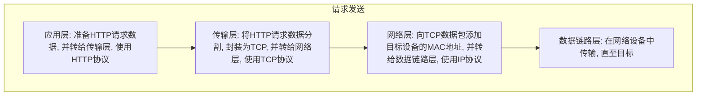
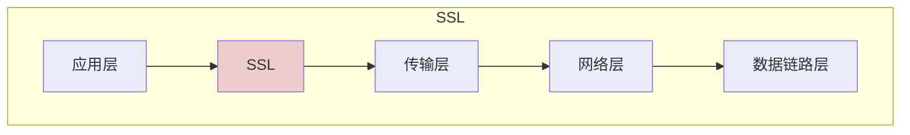
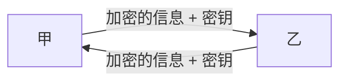
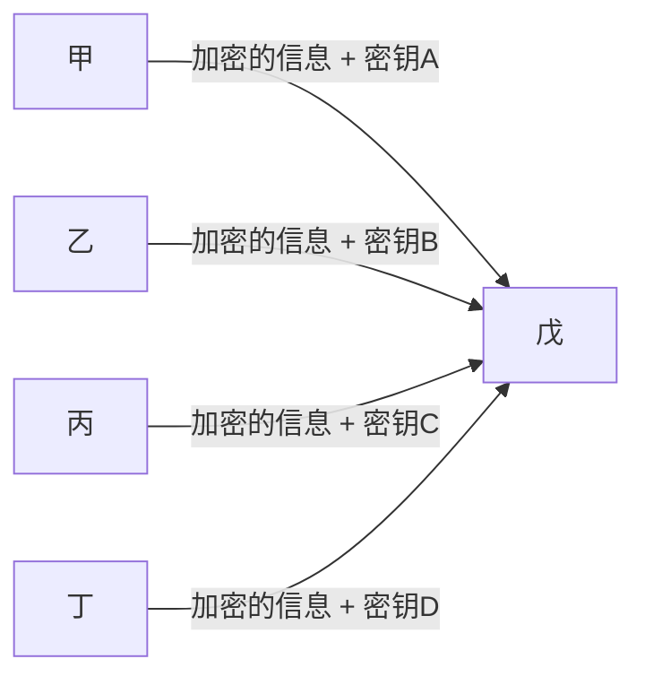
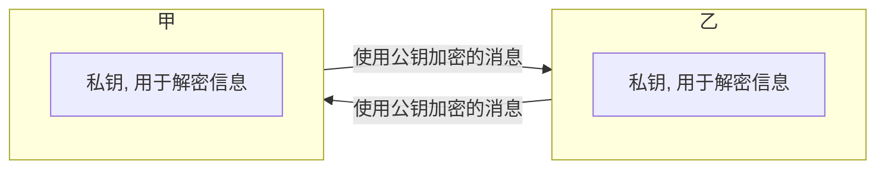
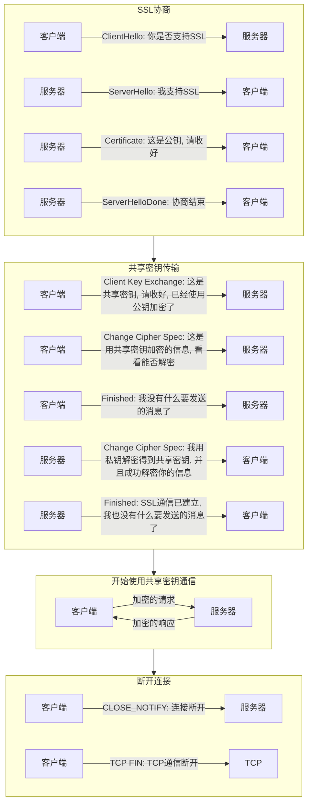

#### 浏览器访问
+ 浏览器地址栏输入URL
  - 协议: 访问的方式和规则
  - 域名/端口: 对应了服务器的地址
  - 路径: 对应了服务器地址下的目录
  - 资源名称: 对应了目录下的文件名称
  - 未指定资源名称: 默认访问`index.html`
  - HTTP的默认端口是80, HTTPS默认端口是443
```bash
http://www.fc.com:8080/static/documents/js-learning.html

http://www.fc.com  #等价于http://www.fc.com:80/index.html
```
+ 域名解析:
  - 检索本地hosts文件, 取出和域名匹配的ip地址
  - 如hosts不匹配, 则访问DNS服务器获取ip地址
+ 通过ip地址再次访问, 获取服务器资源(HTML文档, 文件等)
  - 获取的是文件资源: 由浏览器决定处理方式(保存或预览)
  - 获取的是HTML文档: 浏览器将其渲染为页面
+ HTML文档接口调用:
  - 与文档同源: 接口正常处理并返回响应
  - 与文档不同源: 接口正常处理, 返回的响应被浏览器拦截
***
**重点1:** 浏览器地址栏发送的都是`GET`请求, 且没有跨域的概念, 默认以HTML方式进行文档渲染加载

**重点2:** 同源策略是浏览器才有的限制, 会导致服务器响应被拦截, 而不同的服务器之间发送请求, 则没有限制
```JavaScript
// server.js
app.get("/test", async (req, res) => {
  console.log('Receive request...');
  res.send('Response');
});

// index.js 开发服务地址 localhost:5173
const xhr = new XMLHttpRequest();
xhr.open('GET', 'http://localhost:8000/test');
xhr.onload = () => {
  console.log('done')
}
xhr.send();

// server.js会正常打印出Receive request..., 但页面会报错
```
***
+ URL和URI:
  - URI: 使用字符串标识的某个互联网资源
  - URL: 标识资源在互联网上的位置
  - URL是URI的子集

#### TCP/IP协议族
+ `TCP/IP`协议族规定了互联网上进行通信的所有规则和协议
+ `TCP/IP`协议族将互联网划分成了不同的层次:
  - 应用层: 向用户提供应用服务时的通信协议, 如FTP, HTTP等
  - 传输层: 将应用层的数据分割为更细小的报文, 如TCP, UDP等
  - 网络层: 将传输层的报文增加MAC地址, 在网络中传输, IP协议
  - 数据链路层: 在两个网络设备之间传输网络层的数据
***
**注解1:** TCP/IP协议也可以被理解为单独的TCP协议和IP协议, 对应了传输层和网络层

**注解2:** ISO网络分层如果细分可以分为七层: 应用层, 表示层, 会话层, 传输层, 网络层, 数据链路层, 物理层
***
+ HTTP通信的层模型解析:

***
**注解1:** 如果客户端和服务器之间存在多个中转路由, 则会反复重复上述过程, 直至数据传输至目标

**注解2:** 在不同的网络中传输数据, 使用到的是网络层数据

**注解3:** `ARP`协议: 用于根据IP地址, 查询出MAC地址
***

#### HTTP
+ HTTP的通信信息被称为报文: 请求报文 & 响应报文
+ HTTP报文是由多行数据构成的字符串文本: 报文首部 & 报文主体
  - 报文首部: 服务器/客户端需要处理的请求/响应的内容和属性
  - 报文主体: 发送的数据
+ 请求报文首部:
```bash
POST /login HTTP/1.1
Accept: application/json, text/plain, */*
Accept-Language: zh-CN,zh;q=0.9
Cookie: ...
Host: localhost:8000
Referer: http://localhost:8000/
User-Agent: Chrome/120.0.0.0 ...
```
+ 响应报文首部:
```bash
HTTP/1.1 200 OK
X-Powered-By: Express
Accept-Ranges: bytes
Content-Type: text/html; charset=UTF-8
Content-Length: 430
Date: Tue, 11 Jun 2024 07:08:01 GMT
Connection: keep-alive
Keep-Alive: timeout=5
```
+ 首部的常见字段:
  - `Accept`：浏览器可以处理的内容类型。
  - `Accept-Charset`：浏览器可以显示的字符集。
  - `Accept-Encoding`：浏览器可以处理的压缩编码类型。
  - `Accept-Language`：浏览器使用的语言。
  - `Connection`：浏览器与服务器的连接类型。
  - `Content-Type`: 发送的数据的类型
  - `Cookie`：页面中设置的Cookie。
  - `Host`：发送请求的页面所在的域。
  - `Referer`：发送请求的页面的URI。
  - `User-Agent`：浏览器的用户代理字符串。
+ HTTP使用不加密明文传输, 内容可能遭遇窃听
  - HTTP报文本身不加密, 而非HTTP报文的内容不加密
  - 示例如下:
```bash
# 不加密HTTP报文内容
POST /login HTTP/1.1
Accept: application/json, text/plain, */*
Accept-Language: zh-CN,zh;q=0.9
Cookie: ...
Host: localhost:8000
Referer: http://localhost:8000/
User-Agent: Chrome/120.0.0.0 ...

{ 'user': 'admin', 'password': 'admin' }

# 加密HTTP报文内容
POST /login HTTP/1.1
Accept: application/json, text/plain, */*
Accept-Language: zh-CN,zh;q=0.9
Cookie: ...
Host: localhost:8000
Referer: http://localhost:8000/
User-Agent: Chrome/120.0.0.0 ...

{ 'user': '678KJGHKJH...', 'password': '678KJGHKJH...' }
```
+ HTTP不验证通信方的身份, 身份可能遭遇伪装
  - 服务器可能遭遇伪装的客户端
  - 客户端可能遭遇伪装的服务器
  - 服务器会处理所有HTTP请求(DoS)
+ HTTP无法验证数据完整性, 内容可能遭遇篡改

#### HTTPS
+ HTTPS指的是: 添加了通信加密, 身份认证及数据完整性保护的HTTP
+ 使用SSL进行通信加密, 身份认证及数据完整性保护:
  - HTTP报文先经过SSL加密, 再交付给传输层进行TCP封装
  - 详细的通信过程在后文讲述, 在此之前首先介绍加密方法

***
**注解:** SSL有一个继承者: TLS, 二者类似, 多数情况下, 可以单独使用SSL术语, 用以不严谨的指代SSL和TLS两种协议, 不加以区分
***
+ 共享密钥加密
  - 加密和解密使用同一个密钥, 也称为对称密钥加密
  - 共享密钥加密信息时, 必须将密钥也一同发送出去

***
**注解1:** 共享密钥在传输过程中容易被拦截, 获取到了密钥, 加密就失去了意义

**注解2:** 通信方可以使用自己的密钥, 这就意味着复杂的密钥管理

***
+ 公开密钥加密
  - 使用一对密钥: 公钥和私钥, 也称为非对称加密
  - 公钥可以随意传播, 私钥不能被任何人知道
  - 发送方使用对方的公钥进行加密, 接受方使用自己的私钥进行解密

***
**注解:** 通信双方在建立通信之前, 首先要交换彼此的公钥
***
+ HTTPS使用上述两种方式混合的加密机制
  - 共享密钥加密的缺陷在于: 共享密钥容易被拦截
  - 公开密钥加密的缺陷在于: 加密解密性能开销大
  - 使用公开密钥加密方式传输共享密钥
  - 服务器获得共享密钥后, 双方使用共享密钥加密方式进行通信

***
**注解:** 在SSL协商过程中, 服务器会向客户端发送公钥, 该过程容易被拦截, 一旦公钥被盗, 安全通信将形同虚设, 而且客户端也无法判断收到的公钥是否就是服务器真正的公钥
***
+ HTTPS证书: 解决上述公钥存在的安全隐患
  - 组织或个人向证书机构申请公钥
  - 证书机构审核后, 会将公钥进行数字签名, 并放入公钥证书, 颁发给该组织或个人
  - 公钥证书中的必要信息: 组织或个人名称, 过期时间, 公钥, 站点名称和主机名称等
  - 服务器将该公钥证书发送至客户端, 客户端向证书机构校验数字签名并从中取得公钥
  - 校验通过, 则继续后续的流程; 校验不通过, 则HTTPS页面访问会出现异常
***
**注解:** 证书想要安全的从服务器发送至客户端也并不容易, 始终存在被拦截的可能, 因此多数浏览器厂商会直接将常用的证书机构的证书内置在发布版本中
***
+ 补充知识:
  - 客户端证书: 服务器用于确保客户端是预期之内的客户端, 如网上银行证书
  - 自签名证书: 使用OpenSSL开源程序自行构建的认证机构, 给自己的服务器颁发证书

#### XMLHTTPRequest
+ 使用`new XMLHTTPRequest`创建实例
+ 使用实例的`open`方法, 创建需要发送的请求, 包含三个参数
  - 方法: `GET/POST...`
  - URL: 请求路径
  - 是否异步: 默认`true`
+ 使用实例的`setRequestHeader`方法, 配置请求的头部
+ 使用实例的`send`方法, 发送请求, 传参为要发送的数据
***
**注解:** 如需发送JSON数据, 必须注意两点:
+ 必须设置请求头部的`Content-Type`为`application/json`
+ `send`方法必须传入`JSON.stringify`的JSON
```JavaScript
const xhr = new XMLHttpRequest();
xhr.open('POST', '/login');
xhr.setRequestHeader('Content-Type', 'application/json');
xhr.send(JSON.stringify({ user: 111, pass: 222 }));
```
***
+ 请求的状态: 使用实例的`status`和`statusText`属性
  - `status`: 状态码
  - `statusText`: 状态描述
+ 请求完成: 使用实例的`readyState`属性和`onreadystatechange`事件
  - `readyState`属性标识了当前的请求/响应正处于哪个阶段
  - `readyState`属性变化时会触发`onreadystatechange`事件
  - `readyState`属性为`0`: 未初始化, 尚未调用`open`方法
  - `readyState`属性为`1`: 已初始化, 已调用`open`, 尚未`send`
  - `readyState`属性为`2`: 已发送, 已调用`send`, 尚未收到响应
  - `readyState`属性为`3`: 接收中, 已收到部分响应
  - `readyState`属性为`4`: 已完成, 收到所有响应
```JavaScript
const xhr = new XMLHttpRequest();
xhr.open('POST', '/login');
xhr.send();
xhr.onreadystatechange = () => {
  if (xhr.readyState === 4) {
    if (xhr.status === 200) {
      console.log('请求成功完成')
    }
  }
}
```
+ 请求终止: 使用实例的`abort()`方法
```JavaScript
xhr.abort();
```
+ 超时设置: 使用实例的`timeout`属性和`ontimeout`事件
```JavaScript
const xhr = new XMLHttpRequest();
xhr.open('POST', '/login');
xhr.timeout = 1000;
xhr.ontimeout = () => { /** */ }
xhr.send();
```
+ 请求进度: 使用多个属性精细化控制请求从开始到完成的每一个步骤
  - `loadstart`: 收到响应的第一个字节时触发
  - `progress`: 接收响应期间反复触发
  - `error`: 请求出错时触发
  - `abort`: 调用`abort()`终止请求时触发
  - `load`: 接收完所有的响应时触发
  - `loadend`: 通信完成时触发, 包括出错/终止等
```JavaScript
const xhr = new XMLHttpRequest();
xhr.open('POST', '/login');
xhr.addEventListener('load', event => {
  // 使用event.target.response获取相应结果
  const res = event.target.response;
  // ...
});
xhr.addEventListener('progress', event => {
  // 使用event的loaded属性和total属性, 获取总数和已传输数
  const percent = event.loaded / event.total
});
xhr.send();
```
+ 使用`XMLHTTPRequest`发送CORS跨源请求: xhr指定其他源的绝对URL, 但有如下限制
  - 服务器必须设置`Access-Control-Allow-Origin`响应头, 指定允许的访问源
  - 不允许使用`setRequestHeader`设置自定义响应头
  - 不允许携带Cookie
```JavaScript
// express server.js
import express from "express";
const app = express();

app.post("/test", (_, res) => {
  res.setHeader('Access-Control-Allow-Origin', '*');
  res.json({ result: 'OK' })
});

app.listen(9000, () => {
  console.log("server running....");
});

// index.js localhost:5173
const xhr = new XMLHttpRequest();
xhr.open('POST', 'http://localhost:9000/test', true);
xhr.onload = event => {
  console.log(event.target.response); // { result: 'OK' }
}
xhr.send();
```
+ 预检请求: CORS通过预检请求, 从而允许请求使用自定义头部, 以及使用`GET/POST`以外的方法
  - 如果发送的跨源请求, 使用了自定义头部, 且使用了GET/POST以外的方法, 预检请求会自动发送
  - 预检请求会在跨源请求发送之前, 先发送, 并和服务器进行沟通, 预检请求方法是`OPTIONS`
  - 预检通过: 服务器正常处理跨源请求; 预检不通过: 服务器不会处理该请求
+ 预检请求发送的内容, 以及服务器返回的内容:
  - 客户端发送: `Origin`, 标明了文档当前的源地址
  - 客户端发送: `Access-Control-Request-Method`, 跨源请求希望使用的方法
  - 客户端发送: `Access-Control-Request-Headers`, 跨源请求希望使用的自定义头部
  - 服务器返回: `Access-Control-Allow-Origin`, 服务器允许的源
  - 服务器返回: `Access-Control-Allow-Methods`, 服务器允许的请求方法
  - 服务器返回: `Access-Control-Allow-Headers`, 服务器允许的自定义头部
***
**注解:** 服务器返回的内容可以理解为:
+ 服务器不能处理该跨源请求, 详细信息请看预检请求返回值
+ 服务器将会处理该跨源请求, 详细信息请看预检请求返回值
***
+ 如果想要让带有自定义头部, 和GET/POST以外方法的请求能够被服务器处理, 则:
  - 服务器必须配置`Access-Control-Allow-Origin`, 指明允许的源
  - 服务器必须配置`Access-Control-Allow-Methods`, 指明允许的方法
  - 服务器必须配置`Access-Control-Allow-Headers`, 指明允许的自定义头部
  - 以上配置必须和发送的跨源请求所使用的自定义头部, 请求方法相匹配
```JavaScript
// server.js
import express from "express";
const app = express();

app.use((_, res, next) => {
  res.setHeader('Access-Control-Allow-Headers', 'Content-Type');
  res.setHeader('Access-Control-Allow-Origin', '*');
  res.setHeader('Access-Control-Allow-Methods', 'GET, POST');
  next();
});

app.post("/test", (_, res) => {
  res.json({ status: true })
});

app.listen(9000, () => {
  console.log("server running....");
});

// index.js
const xhr = new XMLHttpRequest();
xhr.open('POST', 'http://localhost:9000/test', true);
xhr.setRequestHeader('Content-Type', 'application/json');
xhr.addEventListener('load', event => {
  console.log(event.target.response); // { status: true }
})
xhr.send(JSON.stringify({ user: 'admin' }));
```

#### fetch
+ fetch只能发送异步请求, 其结果基于Promise
+ 接口500或者其他的错误状态码, `不会`导致Promise被拒绝
```JavaScript
// 以下代码不能正常工作
aysnc () => {
  try {
    const res = await fetch('/getInfo'); // 假设接口500
  } catch {
    console.log('Failed');
  }
}
```
+ 只有违反CORS, 无网络连接, HTTPS错配, 及其他浏览器/网络策略问题会导致Promise被拒绝
```TypeScript
// 构建通用的http访问层
export class HttpService {
  public static async get<T>(url: string): Promise<T> {
    const res = await fetch(url);
    if (res.status === 200) {
      return res.text() as T;
    }
    if (res.status === 500) {
      return Promise.reject(res.statusText);
    }
    // ...
  } 
}
```
+ fetch的Cookie设置: 使用`credentials`配置项
  - `omit`: 不发送Cookie
  - `same-origin`: 同源请求才允许发送Cookie
  - `include`: 始终发送Cookie
```JavaScript
fetch('url', {
  credentials: 'include'
})
```
+ fetch的跨源设置: 使用`mode`配置项
  - `cors`: 允许遵守CORS协议的跨源请求
  - `no-cors`: 允许跨源请求, 但不能读取响应内容, 服务器不会返回响应
  - `same-origin`: 任何跨源请求都不允许发送
```JavaScript
// server.js
import express from "express";
const app = express();
app.post("/test", (_, res) => {
  res.json({ status: true })
});
app.listen(9000, () => {
  console.log("server running....");
});

// index.js
fetch('http://localhost:9000/test', {
  method: 'POST',
  headers: {
    'Content-Type': 'application/json',
  },
  body: JSON.stringify({ user: 'admin' }),
  mode: 'no-cors'
});

// 请求能够正常发出, 服务器可以处理, 但是不会返回任何响应
```
+ fetch的一般用法集合
```JavaScript
// 发送json
fetch('url', {
  method: 'post',
  headers: {
    'Content-Type': 'application/json'
  },
  body: JSON.stringify({ user: 'admin' })
});

// 发送文件
const form = new FormData();
form.append('file', file);
fetch('/upload', {
  method: 'post',
  body: form
});

// 获取文件
fetch('/xxx.mp4')
  .then(response => response.blob())
  .then(blob => URL.createObjectURL(blob))
  .then(url => fileSaver.save(url, 'xxx.mp4'));
```
+ fetch中断请求, 必须指定`signal`配置项
```JavaScript
const abortSignal = new AbortController();
fetch('url', {
  signal: abortSignal.signal
});
setTimeout(() => abortSignal.abort(), 1000);
```
+ fetch流式传输
