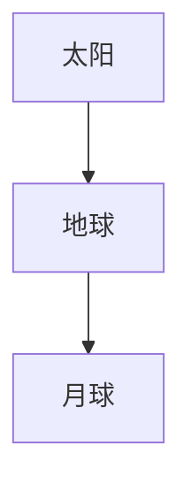
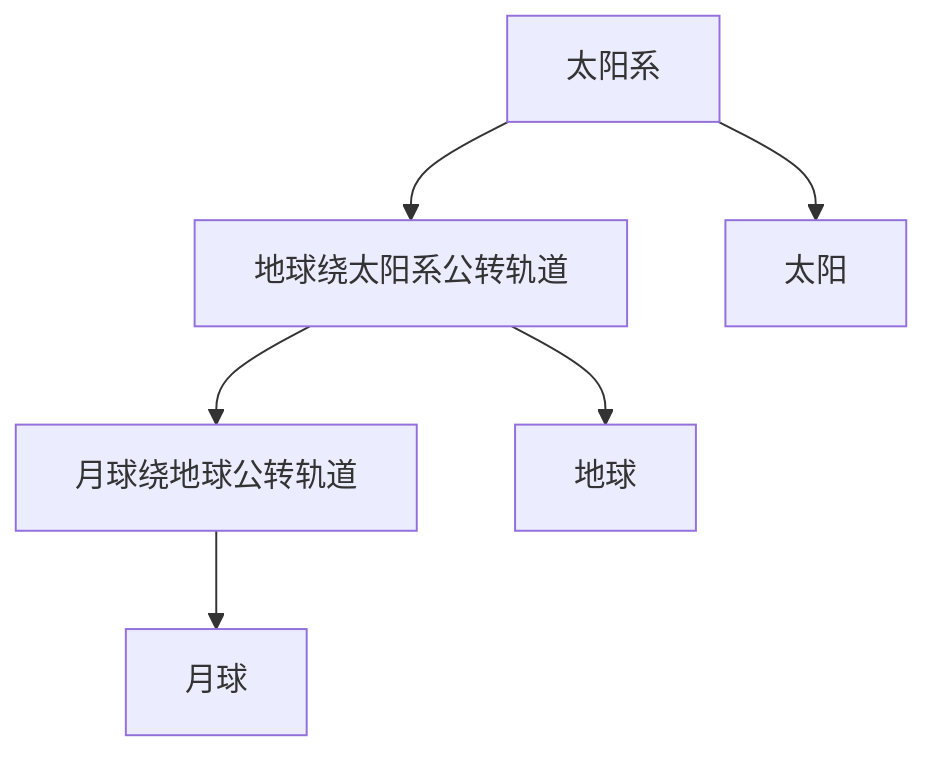
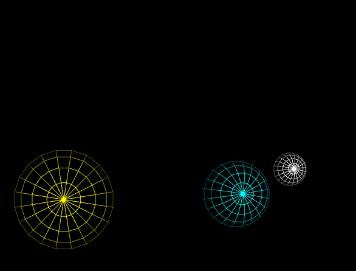
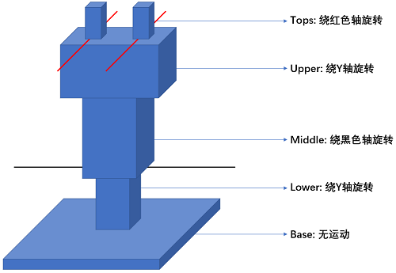
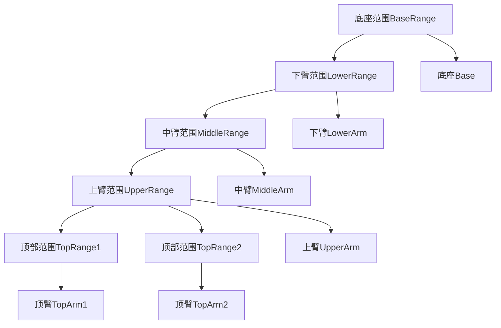

# WebGL 场景图(层次模型)

**[返回主目录](../readme.md)**

#### 复杂的运动
+ 我们用一个简单的示例来描述本篇笔记讲了什么: `太阳系的运动`, 为了保持简单, 我们只考虑太阳, 地球, 月球
+ 太阳, 地球, 月球, 都在自转, 自转的周期不同, 同时, 地球在围绕太阳旋转, 月球在围绕地球旋转, 我们给出以下的一些数据, 并假设不考虑星球的大小和距离, 请给出这三个星球的`运行轨迹图`
  | 星球  | 自转周期 | 公转周期 |          备注          |
  | :---: | :------: | :------: | :--------------------: |
  | 太阳  |   25天   |    NA    |    不考虑太阳的公转    |
  | 地球  |   1天    |  360天   |   360天比较方便计算    |
  | 月球  |   30天   |   30天   | 月球和地球有`潮汐锁定` |
+ 我们要如何将轨迹图绘制出来呢?
+ 你可能会想, 那我就分别计算三个星球的实时位置, 旋转角度等, 然后分别绘制出来, 这个想法不错, 但是在计算`月球轨道`的时候, 可能会遇上麻烦, 毕竟月球在自转和绕地球公转的同时, 还在和地球一起绕太阳旋转, 它的运行轨迹`并非圆环`, 你需要好好补充一些数学知识才行
+ 其次, 如果我们要绘制整个太阳系, 包含八大行星和主要的卫星, 这个运算量将会无比的巨大
+ 解决这个问题的方案, 就是`场景图`, 也叫`层次模型`
  
#### 场景图
+ 场景图, 是将绘制的物体合理的`划分层次`, 使得每个层次的物体, 只需要考虑自己的运动, 并且该层次物体的运动, 会直接影响到该层次下的所有`直系后代`, 而对该层次以上的物体无影响
+ 以太阳系为例, 划分太阳, 地球, 月球三个层次, 地球只需要考虑自己的运动, 即公转和自转, 这个矩阵很容易写出来, 月球也只需要这样考虑, 并且地球的运动会影响月球的运动, 但对太阳无影响
+ **重点来了:** 既然地球的运动会对月球的运动造成影响, 那么只要我们将地球的运动矩阵, 和月球的运动矩阵相乘, 就可以得到月球在整个太阳系中的运动矩阵(太阳不考虑其运动, 因此不用乘), 即:
  $$M_{moon} = M_{earth} \times M_{moonSelf}$$
***
**TIPS1:** $M_{moon}$ 表示最终要传给WebGL绘制的矩阵, 它代表了月球在场景中真实的运行轨迹, 我们将这个矩阵称为`世界矩阵`, $M_{earth}$ 表示地球的世界矩阵, $M_{moonSelf}$ 表示月球只需要考虑自身运动的时候的矩阵, 我们将这个矩阵称之为`自身矩阵`  

**TIPS2:** 地球的世界矩阵怎么来的呢? 当然是`递归`的思维, 即地球的`父节点`的世界矩阵和地球的自身矩阵相乘得到的, 再往上, 也是这个过程, 后续在编写代码时还会讲到, 这里地球的父节点是太阳, 太阳暂时不考虑运动
***
+ **发散一下:** 如果太阳围绕银河系在公转, 那我们只要将月球的运动矩阵, 地球的运动矩阵, 以及太阳的运动矩阵三者相乘, 就可以得到月球在银河系中的运动轨迹
+ 是个好主意, 现在可以开始考虑下一个问题了, `如何划分层次`? 以上面的讲解为例, 大多数人可能都会这么干:  

+ 我们来分别写出三个星球的主要运动矩阵, 看看这样划分是否合理, `T`代表平移, `R`代表旋转, `平移`是因为WebGL初始化球体时, 中心都在`原点`, 这段平移是为了代表星球之间的距离
  | 星球  | 运动矩阵 |           备注           |
  | :---: | :------: | :----------------------: |
  | 太阳  |    R1    |       太阳只有自转       |
  | 地球  |  R2T1R3  | 地球自转, 同时绕太阳旋转 |
  | 月球  |  R4T2R5  | 月球自转, 同时绕地球旋转 |
+ 地球和月球运动矩阵的第一个`R`代表自转(绕 $Y$ 轴), 如何表示公转呢, 很简单, 先平移再绕 $Y$ 轴旋转, 因此后面的`TR`代表了公转
+ 按照前面的结论, 想要知道月球在太阳系的运行轨迹, 只需要这样
  $$WorldMatrix = R1 \cdot R2 \cdot T1 \cdot R3 \cdot R4 \cdot T2 \cdot R5$$ 
+ 是不是觉得有问题?
  - 星球的自转矩阵, 也会影响后面子节点中的运动矩阵, 这不合理, 自转明显不应该影响后续节点的运动!
  - 如果给前面的任意一个星球加上一个缩放矩阵, 这也会影响到后面的子节点, 造成一起缩放, 这不应该!
  - 也就是说, 这种划分, 会造成星球自身的一些运动和变化, 也会对后续节点产生影响, 而这种影响是我们不需要的!
+ **TIPS:** 一个合理的划分, 应该将自身的运动, 和会影响子节点的运动分开
+ 这是一个参考的场景图划分:

+ 通过上面的层次结构, 我们可以发现, 影响月球在太阳系中的运行轨迹的, 只有月球公转和地球公转, 而太阳和地球的自身的运动, 对月球的影响不用考虑
+ 同理, 影响地球在太阳系中的运行轨迹的, 只有地球绕太阳的公转, 太阳和月球的自身运动, 对地球没有影响

#### 太阳系的运行轨迹
+ 现在我们来按照上面的设计, 编写代码
+ 首先, 我们需要一个数据结构, 能够保存我们的场景结构, 我们称之为`场景节点`, 它能够保存父节点, 子节点, 和自身的矩阵, 以及最终的世界矩阵
***
**TIPS:** 前面说过, 自身矩阵指`只考虑自身行为`的矩阵, 如`缩放`, `自转`, `公转`就是自身行为; 而世界矩阵, 是WebGL`最终绘制所需要`的矩阵, 反映了星球在场景结构中真实的运行轨迹, 世界矩阵是由父节点的世界矩阵和自己的自身矩阵相乘得到, 即
$$Node.worldMatrix = Node.parent.worldMatrix \times Node.localMatrix$$
***
+ 以下是我们定义的结构, 我们将其称为`SceneNode`, 我们不考虑最后一个字段, `renderInfo`, 这是保存最终给WebGL着色器的数据的, 此字段保存了所有的绘制数据, 包括顶点坐标, 法向量, 模型矩阵等, 代码太多, 就省略了
```TypeScript
export interface SceneNode {
    parent: SceneNode | undefined; // 父节点
    children: SceneNode[]; // 子节点数组
    localMatrix: number[]; // 自身矩阵
    worldMatrix: number[]; // 世界矩阵

    // 这个字段在笔记中不考虑, 实际使用需要传值并更新值!
    renderInfo?: RenderingInformation
}
```
+ 有了结构, 当然就要提供一些基础的方法, 这里提供了两个基础方法:  `设置父节点`, 和`递归更新世界矩阵`
```TypeScript
export class SceneNodeService {

    /**
     * 设置父节点
     * @param parent 
     */
    public static setParent(son: SceneNode, parent: SceneNode): void {
        // 如果son已经有父节点了, 需要在父节点的子节点数组中先删除
        if (son.parent) {
            const index = son.parent.children.indexOf(son);
            index > -1 && (son.parent.children.splice(index, 1));
        }
        if (parent) {
            // 子节点数组中需要推入子节点
            parent.children.push(son);
        }
        son.parent = parent;
    }

    /**
     * 更新世界矩阵
     */
    public static updateWorldMatrix(node: SceneNode): void {
        // 如果节点有父节点, 就将父节点的世界矩阵和当前节点的自身矩阵相乘
        if (node.parent) {
            node.worldMatrix = MatrixHelper.multiply(node.localMatrix, node.parent.worldMatrix);
        // 如果没有父节点, 就将当前节点的世界矩阵设置为自身矩阵
        } else {
            node.worldMatrix = MatrixHelper.copy(node.localMatrix);
        }

        // 这里省略了更新renderInfo中的数据的代码
        // 我们需要将世界矩阵同步更新到renderInfo中, WebGL才能使用

        // 递归更新所有的子节点
        node.children.forEach(child => {
            SceneNodeService.updateWorldMatrix(child);
        })
    }
}
```
+ 有了结构和方法, 我们就可以开始创建我们的场景节点了, 按照层次图, 我们的结构分为6个, 分别是`太阳系`, `太阳`, `地球公转轨道`, `地球`, `月球公转轨道`, `月球`, 同样, 这里省略了每个节点中的`renderInfo`的数据定义, 主要是球体的坐标数据, 法向量数据, 和顶点颜色设置
```TypeScript
// 太阳系
const solarSystem: SceneNode = {
    parent: undefined,
    children: [],
    localMatrix: MatrixHelper.setIdentity(),
    worldMatrix: MatrixHelper.setIdentity()
};

// 地球轨道
const earthOrbit: SceneNode = {
    parent: undefined,
    children: [],
    localMatrix: MatrixHelper.setIdentity(),
    worldMatrix: MatrixHelper.setIdentity()
};

// 月球轨道
const moonOrbit: SceneNode = {
    parent: undefined,
    children: [],
    localMatrix: MatrixHelper.setIdentity(),
    worldMatrix: MatrixHelper.setIdentity()
};

// 太阳
const sun: SceneNode = {
    parent: undefined,
    children: [],
    localMatrix: MatrixHelper.setIdentity(),
    worldMatrix: MatrixHelper.setIdentity(),
};

// 地球
const earth: SceneNode = {
    parent: undefined,
    children: [],
    localMatrix: MatrixHelper.setIdentity(),
    worldMatrix: MatrixHelper.setIdentity(),
};

// 月球
const moon: SceneNode = {
    parent: undefined,
    children: [],
    localMatrix: MatrixHelper.setIdentity(),
    worldMatrix: MatrixHelper.setIdentity(),
};

// 设置父子关系, 如下
SceneNodeService.setParent(moon, moonOrbit);

SceneNodeService.setParent(moonOrbit, earthOrbit);
SceneNodeService.setParent(earth, earthOrbit);

SceneNodeService.setParent(earthOrbit, solarSystem);
SceneNodeService.setParent(sun, solarSystem);
```
+ 至此, 基本的数据已经创建好了, 并且已经设置好了节点的父子关系, 可以开始准备绘制了
```TypeScript
// 获取上下文
const gl = WebGLHelper.getWebGLContext('.cs');

// 编译着色器程序
const program = WebGLHelper.linkProgram(gl, V_SOURCE, F_SOURCE);

// 设置初始角度
let degree = 0;

const render = () => {
  // 清空背景色, 和深度信息, 设置Canvas尺寸
  WebGLHelper.ready(gl, [0, 0, 0]);

  // 设置旋转角度, 这里根据上表的周期, 设置星球的旋转速度

  // 太阳自转角度
  let sunRotation: number = degree / 25;

  // 地球公转角度
  let earthRevolution: number = degree / 360;

  // 地球自转角度, 以此为基准
  let earthRotation: number = degree; 

  // 月球公转角度
  let moonRevolution: number = degree / 30;

  // 月球自转角度
  let moonRotation: number = degree / 30;

  // 设置自身矩阵

  // 太阳系, 位于原点, 除此之外无其他运动信息
  solarSystem.localMatrix = MatrixHelper.setTranslate(0, 0, 0);

  // 太阳, 首先设置尺寸, 其次自转, 两个矩阵相乘
  sun.localMatrix = MatrixHelper.multiply(
    MatrixHelper.setScale(8, 8, 8),
    MatrixHelper.setRotateY(sunRotation)
  );

  // 地球公转轨道, 距离太阳系20, 绕太阳系旋转
  earthOrbit.localMatrix = MatrixHelper.multiply(
    MatrixHelper.setTranslate(20, 0, 0),
    MatrixHelper.setRotateY(earthRevolution)
  );

  // 地球, 设置尺寸, 并消除公转误差, 同时自转, 三个矩阵相乘
  earth.localMatrix = MatrixHelper.multiply(
    MatrixHelper.setScale(4, 4, 4),

    // 消除公转误差, 不然会被地球公转轨道的矩阵影响
    MatrixHelper.setRotateY(-earthRevolution),
    MatrixHelper.setRotateY(earthRotation)
  );

  // 月球公转轨道, 距离地球7, 绕地球旋转 
  moonOrbit.localMatrix = MatrixHelper.multiply(
    MatrixHelper.setTranslate(7, 0, 0),
    MatrixHelper.setRotateY(moonRevolution)
  );

  // 月球, 设置尺寸, 消除公转误差, 同时自转, 三个矩阵相乘
  moon.localMatrix = MatrixHelper.multiply(
    MatrixHelper.setScale(2, 2, 2),

    // 消除公转误差, 不然会被月球公转轨道的矩阵影响
    MatrixHelper.setRotateY(-moonRevolution),
    MatrixHelper.setRotateY(moonRotation)
  );

  // 从太阳系开始, 递归更新所有节点的世界矩阵
  SceneNodeService.updateWorldMatrix(solarSystem);

  // 绘制, 只需要绘制三个星球即可, 轨道无需绘制 
  [sun, earth, moon].forEach(object => {
    WebGLHelper.render(gl, program, object.renderInfo!, gl.LINES);
  });

  degree = degree + 10;
  requestAnimationFrame(render);
}
render();
```
+ 呈现效果, 为了方便观测到自转, 我们以`gl.LINES`模式绘制, 我们可以清楚的观测到`潮汐锁定`现象, 即月球永远把同一个地方面对着地球   
  
+ 有一点需要说明, 这个层次划分是否是最完美的, 我也不知道, 这只是我自己的想法, 可以探索还有没有其他的划分, 这里就不再赘述了
***
**TIPS:** 这个例子, 告诉我们一个比较有用的`层次划分`方案: 将物体的运动, 分为两类, 一类`不会影响`子节点的运动, 一类`会影响`, 这两类需要分开定义节点(这两个节点一定是`父子关系`), 接下来笔记给出了机械臂的示例, 这个例子比太阳系复杂很多, 需要仔细理解层次划分    

**TIPS:** 机械臂的示例灵感来源于`WebGL编程指南`这本书的第`9`章, 不过我并没有去看它的源码实现, 而是自己根据太阳系的例子, 独立编码出来的, 采用了`TypeScript + Angular`的实现
***

#### 机械臂的示例
+ 这里给出了一个机械臂的示例, 通过键盘按键可以旋转机械臂的各个部分
+ 这是机械臂的示意图, 描述了机械臂的形态和工作能力   
  
+ 我们根据机械臂的各个部件, 及其运动, 划分层次模型
+ 这是我给出的一个层次划分

+ 以下是效果图    
  
+ 键盘交互说明
  |        按键         |     操纵部件      | 旋转范围  |
  | :-----------------: | :---------------: | :-------: |
  | 左方向键 / 右方向键 |     LowerArm      | $[0, 90]$ |
  | 上方向键 / 下方向键 |     MiddleArm     | $[0, 12]$ |
  |        A / D        |     UpperArm      | $[0, 90]$ |
  |        W / S        | TopArm1 / TopArm2 | $[0, 90]$ |

#### 机械臂的源代码(包含完整的数据定义)
+ 数据定义, 单独文件存放, 机械臂的各组件和各层次的顶点, 法向量, 颜色数据
```TypeScript
// 机械臂数据定义文件
import {
    AttributeDataType,
    SceneNode,
    UniformDataType
} from "./webgl.model";

import { MatrixHelper } from "./matrix.helper";
import { SceneNodeService } from "./scene.node.helper";

// ====================================范围定义=======================================

// 底座范围
const BaseRange: SceneNode = {
    parent: undefined,
    children: [],
    localMatrix: MatrixHelper.setIdentity(),
    worldMatrix: MatrixHelper.setIdentity()
};

// 下臂范围
const LowerRange: SceneNode = {
    parent: undefined,
    children: [],
    localMatrix: MatrixHelper.setIdentity(),
    worldMatrix: MatrixHelper.setIdentity()
};

// 中臂范围
const MiddleRange: SceneNode = {
    parent: undefined,
    children: [],
    localMatrix: MatrixHelper.setIdentity(),
    worldMatrix: MatrixHelper.setIdentity()
};

// 上臂范围
const UpperRange: SceneNode = {
    parent: undefined,
    children: [],
    localMatrix: MatrixHelper.setIdentity(),
    worldMatrix: MatrixHelper.setIdentity()
};

// 顶臂范围1
const TopRange1: SceneNode = {
    parent: undefined,
    children: [],
    localMatrix: MatrixHelper.setIdentity(),
    worldMatrix: MatrixHelper.setIdentity()
};

// 顶臂范围2
const TopRange2: SceneNode = {
    parent: undefined,
    children: [],
    localMatrix: MatrixHelper.setIdentity(),
    worldMatrix: MatrixHelper.setIdentity()
};

// ====================================部件定义=======================================

// 所有的部件都是同一个法向量, 因为都是柱体
const normals: Float32Array = new Float32Array([
    // 正面
    0, 0, 1, 0, 0, 1, 0, 0, 1, 0, 0, 1, 0, 0, 1, 0, 0, 1,
    // 背面
    0, 0, -1, 0, 0, -1, 0, 0, -1, 0, 0, -1, 0, 0, -1, 0, 0, -1,
    // 上面
    0, 1, 0, 0, 1, 0, 0, 1, 0, 0, 1, 0, 0, 1, 0, 0, 1, 0,
    // 下面
    0, -1, 0, 0, -1, 0, 0, -1, 0, 0, -1, 0, 0, -1, 0, 0, -1, 0,
    // 左面
    -1, 0, 0, -1, 0, 0, -1, 0, 0, -1, 0, 0, -1, 0, 0, -1, 0, 0,
    // 右面
    1, 0, 0, 1, 0, 0, 1, 0, 0, 1, 0, 0, 1, 0, 0, 1, 0, 0
]);

// 所有的部件使用同一套顶点数据, 因为都是柱体, 在各自部件的自身矩阵中使用缩放
const points: Float32Array = new Float32Array([
    // 正面
    -1, -1, 1, 1, -1, 1, 1, 1, 1, 1, 1, 1, -1, 1, 1, -1, -1, 1,
    // 背面
    -1, -1, -1, 1, -1, -1, 1, 1, -1, 1, 1, -1, -1, 1, -1, -1, -1, -1,
    // 上面
    -1, 1, 1, 1, 1, 1, 1, 1, -1, 1, 1, -1, -1, 1, -1, -1, 1, 1,
    // 下面
    -1, -1, 1, 1, -1, 1, 1, -1, -1, 1, -1, -1, -1, -1, -1, -1, -1, 1,
    // 左面
    -1, -1, -1, -1, -1, 1, -1, 1, 1, -1, 1, 1, -1, 1, -1, -1, -1, -1,
    // 右面
    1, -1, -1, 1, -1, 1, 1, 1, 1, 1, 1, 1, 1, 1, -1, 1, -1, -1,
]);

// 顶点颜色
const vertexColor: number[] = [0.89, 0.47, 0.20];

// 底座
const base: SceneNode = {
    parent: undefined,
    children: [],
    localMatrix: MatrixHelper.setIdentity(),
    worldMatrix: MatrixHelper.setIdentity(),
    renderInfo: {
        attributes: [
            { type: AttributeDataType.Points, name: 'a_Position', data: points, count: 3, stride: 0, offset: 0 },
            { type: AttributeDataType.Normals, name: 'a_Normal', data: normals, count: 3, stride: 0, offset: 0 },
        ],
        uniforms: [
            { type: UniformDataType.Vec3, name: 'u_Color', data: vertexColor }
        ]
    }
};

// 下臂
const lower: SceneNode = {
    parent: undefined,
    children: [],
    localMatrix: MatrixHelper.setIdentity(),
    worldMatrix: MatrixHelper.setIdentity(),
    renderInfo: {
        attributes: [
            { type: AttributeDataType.Points, name: 'a_Position', data: points, count: 3, stride: 0, offset: 0 },
            { type: AttributeDataType.Normals, name: 'a_Normal', data: normals, count: 3, stride: 0, offset: 0 },
        ],
        uniforms: [
            { type: UniformDataType.Vec3, name: 'u_Color', data: vertexColor }
        ]
    }
};

// 中臂
const middle: SceneNode = {
    parent: undefined,
    children: [],
    localMatrix: MatrixHelper.setIdentity(),
    worldMatrix: MatrixHelper.setIdentity(),
    renderInfo: {
        attributes: [
            { type: AttributeDataType.Points, name: 'a_Position', data: points, count: 3, stride: 0, offset: 0 },
            { type: AttributeDataType.Normals, name: 'a_Normal', data: normals, count: 3, stride: 0, offset: 0 },
        ],
        uniforms: [
            { type: UniformDataType.Vec3, name: 'u_Color', data: vertexColor }
        ]
    }
};

// 上臂
const upper: SceneNode = {
    parent: undefined,
    children: [],
    localMatrix: MatrixHelper.setIdentity(),
    worldMatrix: MatrixHelper.setIdentity(),
    renderInfo: {
        attributes: [
            { type: AttributeDataType.Points, name: 'a_Position', data: points, count: 3, stride: 0, offset: 0 },
            { type: AttributeDataType.Normals, name: 'a_Normal', data: normals, count: 3, stride: 0, offset: 0 },
        ],
        uniforms: [
            { type: UniformDataType.Vec3, name: 'u_Color', data: vertexColor }
        ]
    }
};

// 顶臂1
const top1: SceneNode = {
    parent: undefined,
    children: [],
    localMatrix: MatrixHelper.setIdentity(),
    worldMatrix: MatrixHelper.setIdentity(),
    renderInfo: {
        attributes: [
            { type: AttributeDataType.Points, name: 'a_Position', data: points, count: 3, stride: 0, offset: 0 },
            { type: AttributeDataType.Normals, name: 'a_Normal', data: normals, count: 3, stride: 0, offset: 0 },
        ],
        uniforms: [
            { type: UniformDataType.Vec3, name: 'u_Color', data: vertexColor }
        ]
    }
};

// 底座
const top2: SceneNode = {
    parent: undefined,
    children: [],
    localMatrix: MatrixHelper.setIdentity(),
    worldMatrix: MatrixHelper.setIdentity(),
    renderInfo: {
        attributes: [
            { type: AttributeDataType.Points, name: 'a_Position', data: points, count: 3, stride: 0, offset: 0 },
            { type: AttributeDataType.Normals, name: 'a_Normal', data: normals, count: 3, stride: 0, offset: 0 },
        ],
        uniforms: [
            { type: UniformDataType.Vec3, name: 'u_Color', data: vertexColor }
        ]
    }
};


// 设置节点父子关系
SceneNodeService.setParent(top1, TopRange1);
SceneNodeService.setParent(top2, TopRange2);

SceneNodeService.setParent(TopRange1, UpperRange);
SceneNodeService.setParent(TopRange2, UpperRange);
SceneNodeService.setParent(upper, UpperRange);

SceneNodeService.setParent(UpperRange, MiddleRange);
SceneNodeService.setParent(middle, MiddleRange);

SceneNodeService.setParent(MiddleRange, LowerRange);
SceneNodeService.setParent(lower, LowerRange);

SceneNodeService.setParent(LowerRange, BaseRange);
SceneNodeService.setParent(base, BaseRange);

export {
    BaseRange,
    LowerRange,
    MiddleRange,
    UpperRange,
    TopRange1,
    TopRange2,

    base,
    lower,
    middle,
    upper,
    top1,
    top2
}
```
+ 主要绘制代码, 单独文件, 包含键盘事件监听
```TypeScript
import {
  BaseRange,
  LowerRange,
  MiddleRange,
  TopRange1,
  TopRange2,
  UpperRange,
  base,
  lower,
  middle,
  top1,
  top2,
  upper
} from 'src/webgl.service.pack/robotic.arm.data';
import { F_SOURCE, V_SOURCE, WebGLHelper } from 'src/webgl.service.pack/webgl.helper';

import { MatrixHelper } from 'src/webgl.service.pack/matrix.helper';
import { SceneNodeService } from 'src/webgl.service.pack/scene.node.helper';

class Render {

  // 旋转角度定义
  private roboticArmRotateDegreeConfig = {
    lowerArm: 0,
    middleArm: 0,
    upperArm: 0,
    topArm: 0
  };

  constructor() {
    this.render();
  }

  /**
   * 绘制
   */
  private render(): void {
    const gl = WebGLHelper.getWebGLContext('.cs');
    const program = WebGLHelper.linkProgram(gl, V_SOURCE, F_SOURCE);

    const render = () => {
      WebGLHelper.ready(gl, [0, 0, 0]);

      BaseRange.localMatrix = MatrixHelper.setTranslate(0, 0, 0);
      base.localMatrix = MatrixHelper.setScale(3, 0.4, 3);

      // 注意, 这里是先旋转, 再平移, 这和太阳系的示例不同
      // 太阳系是要体现公转, 因此需要先平移, 再旋转
      // 而机械臂是原地旋转, 因此需要先旋转, 再平移 
      LowerRange.localMatrix = MatrixHelper.multiply(
        MatrixHelper.setTranslate(0, 2, 0),
        MatrixHelper.setRotateY(this.roboticArmRotateDegreeConfig.lowerArm)
      );
      lower.localMatrix = MatrixHelper.setScale(0.6, 2.5, 0.6);

      MiddleRange.localMatrix = MatrixHelper.multiply(
        MatrixHelper.setRotateX(this.roboticArmRotateDegreeConfig.middleArm),
        MatrixHelper.setTranslate(0, 3, 0)
      );
      middle.localMatrix = MatrixHelper.setScale(1.2, 1.7, 1.2);

      UpperRange.localMatrix = MatrixHelper.multiply(
        MatrixHelper.setTranslate(0, 2.7, 0),
        MatrixHelper.setRotateY(this.roboticArmRotateDegreeConfig.upperArm)
      );
      upper.localMatrix = MatrixHelper.setScale(1.8, 1, 1.2);

      TopRange1.localMatrix = MatrixHelper.multiply(
        MatrixHelper.setRotateZ(this.roboticArmRotateDegreeConfig.topArm),
        MatrixHelper.setTranslate(-0.8, 1, 0)
      );
      top1.localMatrix = MatrixHelper.setScale(0.2, 1, 0.2);

      TopRange2.localMatrix = MatrixHelper.multiply(
        MatrixHelper.setRotateZ(-this.roboticArmRotateDegreeConfig.topArm),
        MatrixHelper.setTranslate(0.8, 1, 0)
      );
      top2.localMatrix = MatrixHelper.setScale(0.2, 1, 0.2);

      SceneNodeService.updateWorldMatrix(BaseRange);

      [base, lower, middle, upper, top1, top2].forEach(object => {
        WebGLHelper.render(gl, program, object.renderInfo!, gl.TRIANGLES);
      });

      requestAnimationFrame(render);
    }
    render();
    this.installKeyboardEvent();
  }

  private installKeyboardEvent(): void {
    document.addEventListener('keydown', (event: KeyboardEvent) => {
      switch (event.code) {
        case 'ArrowLeft':
          this.roboticArmRotateDegreeConfig.lowerArm >= 1 && (this.roboticArmRotateDegreeConfig.lowerArm -= 1);
          break;
        case 'ArrowRight':
          this.roboticArmRotateDegreeConfig.lowerArm <= 90 && (this.roboticArmRotateDegreeConfig.lowerArm += 1);
          break;
        case 'ArrowUp':
          this.roboticArmRotateDegreeConfig.middleArm >= 0 && (this.roboticArmRotateDegreeConfig.middleArm -= 1);
          break;
        case 'ArrowDown':
          this.roboticArmRotateDegreeConfig.middleArm <= 12 && (this.roboticArmRotateDegreeConfig.middleArm += 1);
          break;
        case 'KeyA':
          this.roboticArmRotateDegreeConfig.upperArm >= 1 && (this.roboticArmRotateDegreeConfig.upperArm -= 1);
          break;
        case 'KeyD':
          this.roboticArmRotateDegreeConfig.upperArm <= 90 && (this.roboticArmRotateDegreeConfig.upperArm += 1);
          break;
        case 'KeyW':
          this.roboticArmRotateDegreeConfig.topArm >= 1 && (this.roboticArmRotateDegreeConfig.topArm -= 1);
          break;
        case 'KeyS':
          this.roboticArmRotateDegreeConfig.topArm <= 45 && (this.roboticArmRotateDegreeConfig.topArm += 1);
          break;
        default:
          break
      }
    });
  }
}
```
****
**[返回主目录](../readme.md)**