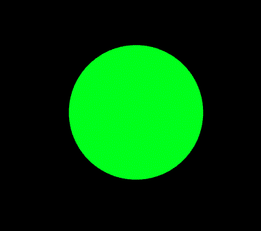
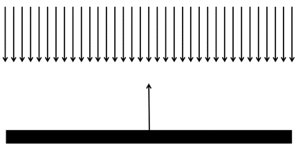
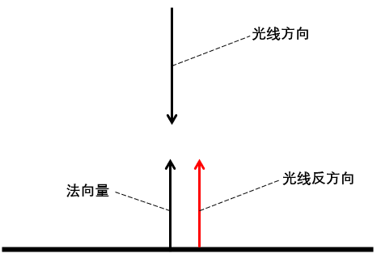
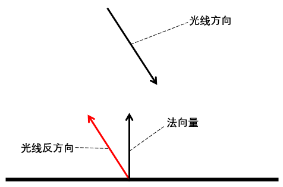
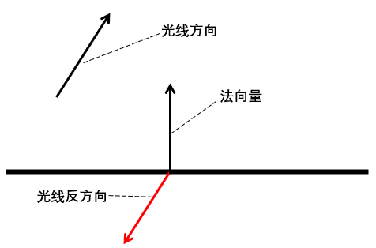
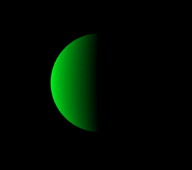
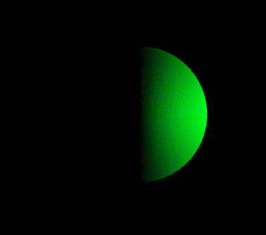
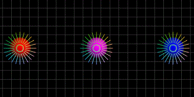
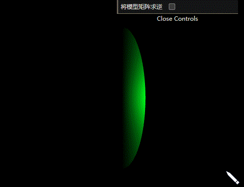

# WebGL 平行光

**[返回主目录](../readme.md)**

#### 光照的用处
+ 我们绘制一个球体, 并让它按照一定的速度绕Y轴旋转  
  
+ 这就是问题, 我们根本无法察觉出球体在旋转, 因为颜色是一样的
+ 静态绘制也有一样的问题, 没有立体感, 缺乏3D效果
+ 光照是解决问题的方案之一, 因为光照带来了`阴影`, 和`明暗面`, 因此产生了立体感
+ 阴影后面会有笔记专门介绍, 本节主要讨论光照

#### 平行光
+ 平行光被视为所有的光线都是互相平行, 具有`共同的方向`
+ 要想指定平行光, 我们只需要指定一个`方向向量`即可(光线也可以有颜色, 这个会在后续讨论)
+ 平行光的示意图如图所示   
  
+ 平面上, 具有一个`法向量`, 法向量标识了该平面的`朝向`
+ 对于平面上所有的点, 法向量都相同, 而对于复杂的曲面, 每个点的法向量或许都不同
+ 知道了光线的方向, 和法向量的方向, 就可以通过一些数学知识, 来定义光照了
+ 本篇笔记中, 我们都假定光线是`没有颜色`的, 四周处于完全黑暗
+ 为了简化数学计算, 我们需要将光线方向`反向`, 这样方便引入余弦计算, 反向后的光线方向设为`reverseLight`
+ **情况1**: 直射, `reverseLight`和法向量方向平行, 这种情况下, 该点的颜色就是其`顶点颜色`, 因为直射光反映出了最真实的颜色, 示意图如下:   
  
+ **情况2**: 斜射, `reverseLight`和法向量方向具有夹角, 且角度处于 $(0, 90)$ 之间, 这种情况下, 该点的颜色比本身的颜色要浅, 示意图如下:   
  
+ **情况3:** 不着色, `reverseLight`和法向量方向夹角大于 $90$ 度, 这种情况下, 由于光线没有照射到该点, 因此该点没有颜色, 示意图如下:  
   

#### 夹角和颜色的关系
+ 我们已经知道了光线和法向量具有夹角, 夹角位于 $[0, 180]$ 之间
+ 现在的问题就是, 知道了夹角, 如何计算出该点的颜色值
+ 假设将`reverseLight`和法向量都归一化为单位向量, 根据向量点乘公式可知, `reverseLight`和法向量点乘结果就是`夹角的余弦值`
  $$\overrightarrow{a} \cdot \overrightarrow{b}=|a||b|cos\theta=cos\theta$$
+ 由于直射光, 夹角为0, 余弦值为1, 我们可以直接将顶点颜色值和余弦值相乘, 这样就实现了`直射是本来颜色, 斜射会变浅`的效果, 当大于 $90$ 度时, 余弦值为负, 会被处理为0, 是黑色, 这正是我们想要的
  $$\overrightarrow{lightColor}=\overrightarrow{color} \cdot cos\theta$$
+ 由于颜色值和余弦值都在 $[0, 1]$ 之间, 相乘的结果也在 $[0, 1]$ 之间, 一切都刚刚好

#### 给旋转的球体加上平行光照
+ 我们需要指定一个光照的方向, 同时还需要球体上每一点的法向量
+ 对于球体来说, 球面上任意一点的`坐标向量`即为该点的法向量, 因为和球面是`垂直`的
+ 因此我们直接将球体坐标数据作为法向量传入顶点着色器, 再通过`varying`变量传给片元着色器
  ```glsl
  attribute vec3 a_Position;
  attribute vec3 a_Normal;
  varying vec3 v_Normal;

  void main() {
    v_Normal = a_Normal;
  }
  ```
+ 片元着色器中, 我们需要计算法向量和`光线反方向`的夹角余弦值, 先将其单位化, 然后直接点乘, 单位化和点乘在WebGL中都有内置的方法
  ```glsl
  // 定义光线的方向, 方向是指, 光线从原点指向该点
  vec3 lightDirection = vec3(-5.0, -5.0, -5.0);

  // 定义顶点颜色, 没有光线的情况下, 这个颜色就是最终的顶点颜色
  vec3 vertexColor = vec3(0.0, 1.0, 0.11);

  void main() {
    // -1是为了得到光线向量的反方向
    vec3 light = dot(normalize(v_Normal), -1 * normalize(lightDirection));
    vec3 color = vertexColor.rgb * light;
    gl_FragColor = vec4(color, 1.0);
  }
  ```
+ 以上只是给出了必要的代码, 大部分的数据当然也可以设为uniform变量, 从外部传入, 完成上述代码后, 我们就会得到一个添加了光线并且在旋转的球体   
  
+ 如果你仔细一点, 就会发现, 这个效果是有问题的, 因为光线是不变的, 对于球体来说, 不管怎么旋转, `被照亮的地方`应该是`一样的`, 也就是说, 这个球看起来就和没有旋转是一样的视觉效果
+ 问题出在`法向量`, 当球体旋转时, 任一点的法向量也跟着在变化, 但我们没有在每次绘制前更新这种变化, 出问题的代码在这里: 
  ```glsl
  v_Normal = a_Normal;
  ```

#### 法向量纠正
+ 其实我们可以将`法向量`和`球体`看作一个`整体`, 因此, 法向量和球体本身遵循了`同样的变化`
***
**重点知识:** 法向量`只和模型有关`, 无论你从哪个角度, 什么投影系去观察, 法向量都不会改变, 只有发生了`旋转`和`缩放`时, 法向量才会变化, 因此, 法向量的更新只需要在每次绘制前, 应用模型矩阵即可  

**TIPS:** `平移`不会导致法向量变化, 这个是很显然的
***
+ 所以我们将作用在顶点上的`模型变换矩阵`, 原模原样应用在法向量上
+ 代码可以写成如下样子:
  ```glsl
  gl_Position = u_Projection * u_View * u_RotateY * vec4(a_Position, 1.0);

  // 这里使用mat3转成3阶矩阵, 因为传入的法向量和顶点只有3个分量
  v_Normal = mat3(u_RotateY) * a_Normal;
  ```
+ 修改后的代码, 效果如下图所示:  
  
+ 效果就正确了

#### 缩放对法向量的影响(仅作了解)
+ 有一个问题, 当顶点发生了缩放变换的时候, 将同样的`模型变换矩阵`应用到法向量上, 法向量并不会保持和顶点垂直, 下面这张图是一个示意   
  
+ 注意看左边的视图, 当伸缩时, 法向量不再和所在的表面保持垂直了, 这会对光照计算造成一定的影响
+ 这里我也不知道为什么, 资料中提供了一个解决方案, 将模型视图矩阵, `求逆再转置`, 就可以得到正确的结果, 如右边的图所示, 再缩放过程中, 法向量保持了和所在表面的垂直
+ 这个解决方案, 在代码中如下图所示
  ```JavaScript
  const VERTEX_SHADER_SOURCE = `
    uniform mat4 u_ModelMatrix;
    void main() {
        v_Normal = mat3(u_ModelMatrix) * a_Normal;
    }
  `

  // 将模型矩阵求逆, 再转置后, 传入uniform变量
  const modelMatrix = Matrix.tranpose(Matrix.inverse(modelMatrix));
  this.setUniformMatrix4(gl, program, 'u_ModelMatrix', modelMatrix);
  ```
+ 我们来观察一下, 两种方式的细微差别, 分别是直接传入模型矩阵, 和传入求逆转置后的模型矩阵   
  
+ 可以看出, 有着明显的区别, 传入求逆并转置的矩阵后, 更符合光线照射下的颜色
***
**TIPS:** 为什么传入`求逆并转置`的矩阵, 就可以得到正确的结果, 这个我也不清楚, 但因为其`更符合光照情况`, 因此, 在后续的光照案例中, 我们应该始终使用这种解决方案
***

#### 补充知识1: 求矩阵的逆矩阵
+ 求矩阵的逆矩阵, 需要用到`伴随矩阵`的知识
+ 矩阵 $A$ 的逆矩阵 $A^{-1}$ 和其伴随矩阵 $A^{\star}$ 的关系是:
  $$A^{-1}=\frac{1}{|A|}A^{\star}$$
+ 什么是伴随矩阵, 伴随矩阵是矩阵每个元素的`代数余子式`所构成的矩阵的转置矩阵
+ 设有 $n$ 阶矩阵 $M$ , 对于第 $i$ 行, 第 $j$ 列的元素 $a_{ij}$ , 将矩阵的第 $i$ 行, 第 $j$ 列全部`划掉删除`, 剩余的元素按照其原有排布构成一个 $n-1$ 阶行列式, 该行列式的值被称为元素 $a_{ij}$ 的`余子式`, 记为 $M_{ij}$
+ 而 $(-1)^{i+j}M_{ij}$ 则叫做元素 $a_{ij}$ 的`代数余子式`, 注意, 这里的 $i, j$ 是数学意义上的序号, 从1开始, 而不是从0开始
+ 明白了以上含义, 我们就可以求出矩阵每个元素的代数余子式, 并将其组合成一个新矩阵, 该矩阵的转置矩阵, 就叫做原矩阵的`伴随矩阵`
+ 这里面还有一个知识点, 以4阶矩阵为例, 我们需要计算出4阶矩阵的`秩`, 同时在计算伴随矩阵的时候, 还需要计算3阶行列式的值
+ 3阶行列式求值无需多言, 直接给出代码实现, `对角线相乘相加再相减`
  ```JavaScript
  /**
    * 获取3阶矩阵的秩
    * @param {Array} m 
    */
  function getMatrix3Rank(m) {
    return [
        m[0] * m[4] * m[8] + m[1] * m[5] * m[6] + m[2] * m[3] * m[7]
      - m[2] * m[4] * m[6] - m[1] * m[3] * m[8] - m[0] * m[5] * m[7]
    ]
  }
  ```
+ 4阶矩阵的秩计算比较麻烦, 这里直接给出公式, 将`某一行`(或者`某一列`)的4个元素, 和其对应的代数余子式相乘, 再求和, 即为该矩阵的秩, 注意, `只需要展开一行或一列`, 不是全部, 以第 $i$ 行展开为例, 公式如下:
  $$|A| = a_{i1}M_{i1} + a_{i2}M_{i2} + a_{i3}M_{i3} + a_{i4}M_{i4}$$

#### 补充知识2: 着色器内部和外部的矩阵相乘顺序
+ 假设我们有如下矩阵:
  - `缩放矩阵`: sMatrix
  - `旋转矩阵`: rMatrix
  - `平移矩阵`: tMatrix
  - `视图矩阵`: vMatrix
  - `投影矩阵`: pMatrix
+ 在着色器中, 很明显, 我们的代码应该写成如下形式
  ```glsl
  gl_Position = pMatrix * vMatrix * tMatrix * rMatrix * sMatrix * a_Position; 
  ```
+ 顶点在最右侧, 依次是缩放, 旋转, 平移, 视图, 投影, 这样的顺序才能得出正确的结果
***
**TIPS:** 在模型矩阵的笔记中, 我们曾经讲述过, 一个比较自然的模型变换是, 先`缩放`, 再`旋转`, 最后再`平移`
***
+ 我们当然可以把这些矩阵放在JavaScript中, 提前先乘好, 然后在传入着色器, 就像这样
  ```glsl
  gl_Position = MVPMatrix * a_Position;
  ```
+ 假设`*`可以实现矩阵相乘, 那我们的JavaScript代码应该如何写?
  ```JavaScript
  // 是这样
  MVPMatrix = sMatrix * rMatrix * tMatrix * vMatrix * pMatrix

  // 还是这样的? 这个顺序和着色器中是一致的
  MVPMatrix = pMatrix * vMatrix * tMatrix * rMatrix * sMatrix
  ```
+ 正确答案是第一种写法, 理由很简单, 我们是以`矩阵左乘为基础`来推导所有的矩阵的, 但由于WebGL需要`列主序`传入, 矩阵库在返回矩阵时进行了转置, 因此在JavaScript中相乘时, 我们应该遵循`右乘`原则
+ **简单一句话:** 以`左乘`原则推导矩阵, 但进行了转置, 因此JavaScript中应该使用`右乘`原则进行相乘 
****
**[返回主目录](../readme.md)**