# WebGL 投影矩阵

**[返回主目录](../readme.md)**

#### 超出裁剪空间的顶点和投影矩阵
+ 在上一篇笔记`WebGL 裁剪空间及坐标`中, 有个例子, 当顶点的坐标值不在 $[-1, 1]$ 的范围内的时候, WebGL将无法绘制, 无法看到
+ 但在实际情况中, 很多时候都会出现这种情况, 比如使用canvas像素坐标来描述顶点位置, 或者从3D建模软件导出的顶点数据, 其坐标都可能是任意值
+ 如何能够正常的将这些顶点坐标绘制出来呢?
+ 设想这样一种情况, 如果我们`自定义`一个裁剪空间, 这个空间可以任意大, 大到足够`包含住`那些超过默认裁剪空间的坐标点
+ 紧接着, 我们将这个自定义裁剪空间, 压缩到默认裁剪空间的大小, 即 $[-1, 1]$ 范围, 里面的顶点坐标也被相应的压缩, 从而得到新的坐标值
+ 由于自定义裁剪空间被压缩到 $[-1, 1]$ 范围, 因此新的坐标值也必然被压缩到该范围内, 将其传递给WebGL, 就可以绘制并看到了
+ 和相机一样, WebGL没有真正的自定义裁剪空间, 一切都是顶点坐标的变化, 根据自定义裁剪空间的参数, 构造出一个矩阵 $P$ , 使得如下公式
  $$压缩至[-1, 1]的坐标 = P \times 原始顶点坐标$$
  成立, 则矩阵 $P$ 就被称之为`投影矩阵`
***
**一句话总结:** 投影矩阵, 是用于将`自定义裁剪空间`内的顶点坐标, 变换成位于`默认裁剪空间`内的坐标, 使得WebGL能够绘制并展示出来
***
+ 投影矩阵, 分为两种, `正射投影矩阵`和`透视投影矩阵`

#### 长方体可视空间 & 正射投影矩阵
+ 长方体可视空间, 是一个`长方体`的盒子, 其特点是, 无论多近多远, 看上去大小都不变, 这里就不画图了, 长方体大家都知道
+ 长方体可视空间和默认裁剪空间一样, 有六个面, 分别为`左边界`, `右边界`,`上边界`,`下边界`,`近边界`, 以及`远边界`, 且视点位于近边界侧, 视线指向远边界, 示意图如下  
  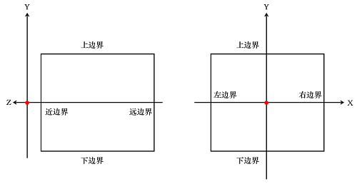
+ 上一篇笔记说过, 自定义裁剪空间和默认裁剪空间具有相同的`方向约束`, 即`近边界`的 $Z$ 坐标值, 要小于`远边界`的 $Z$ 坐标值, 和WebGL坐标系的 $Z$ 轴是反向的!
+ 有了这些知识, 我们可以做一些数学处理了, 现假设, 长方体可视空间的六个边界分别为`left`, `right`, `top`, `bottom`, `near`, 和`far`, 就不解释了, 看单词就知道什么意思了, 值得一提的是, 它们的值, 分别代表着该边界在WebGL坐标系下的坐标
+ 举个例子, 假设 $right=5$ , 即说明右边界就是 $x=5$ 的这个平面, 其他类似, 唯一需要注意的是, `near`的值必须小于`far`的值, 因为裁剪空间和WebGL坐标空间, $Z$ 是反向的!
+ 现在我们可以开始进行坐标转换了, 假设自定义裁剪空间中有一点 $P(x, y, z)$ , 将自定义裁剪空间压缩至默认裁剪空间大小后, 其对应的点 $P_1$ 的坐标为 $(x_1, y_1, z_1)$ , 我们来推导 $P$ 和 $P_1$ 的关系
+ 画出示意图, 我们将首先推导 $x$ 和 $y$ 坐标的变换关系, 因为它们的方向和WebGL坐标轴的方向一致, 稍后我们再来处理 $z$ 这个特殊的情况   
  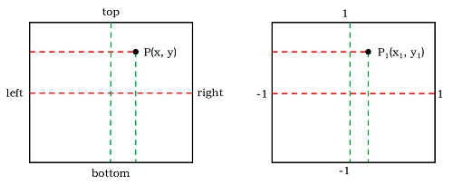
+ **推导 $x$ 坐标的变换**
  - 从左图到右图, `left`到`right`的这段距离, 被变换到了 $[-1, 1]$ , 但由于是`线性变换`, 因此, 比例关系不变, 即图中`红`色的虚线对应的比值应该是相等的, 即有公式
  $$\frac{x-left}{right-left}=\frac{x_1-(-1)}{1-(-1)}$$
  - 再整理一下公式, 即有
  $$x_1=\frac{2}{right-left}x-\frac{right+left}{right-left}$$

+ **推导 $y$ 坐标的变换**
  - 从左图到右图, `bottom`到`top`的这段距离, 被变换到了 $[-1, 1]$ , 但由于是`线性变换`, 因此, 比例关系不变, 即图中`绿`色的虚线对应的比值应该是相等的, 即有公式
  $$\frac{y-bottom}{top-bottom}=\frac{y_1-(-1)}{1-(-1)}$$
  - 再整理一下公式, 即有
  $$y_1=\frac{2}{top-bottom}y-\frac{top+bottom}{top-bottom}$$
+ 现在我们来处理 $z$ 坐标的情况, 先画出示意图, 问题的关键在于, `near`小, `far`大, 最终会被分别转换为 $-1$ 和 $1$ ,这与 $Z$ 轴的方向相反     
  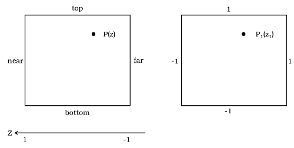
+ 为了解决这个问题, 让方向统一, 我们将 $Z$ 轴反转, 即将 $z$ 坐标值乘上 $-1$ , 这样, WebGL坐标就与裁剪空间的方向一致了
+ **推导 $z$ 坐标的变换**
  - 从左图到右图, `near`到`far`的这段距离, 被变换到了 $[-1, 1]$ , 但由于是`线性变换`, 因此, 比例关系不变, 和 $x, y$ 一样建立比例公式, 但注意, $z$ 要乘上 $-1$ , 即有公式
  $$\frac{-z-near}{far-near}=\frac{z_1-(-1)}{1-(-1)}$$
  - 再整理一下公式, 即有
  $$z_1=-\frac{2}{far-near}z-\frac{far+near}{far-near}$$
+ 汇总上述几个公式, 即有
  $$
  \begin{cases}
    x_1=\frac{2}{right-left}x-\frac{right+left}{right-left} \\\\
    y_1=\frac{2}{top-bottom}y-\frac{top+bottom}{top-bottom} \\\\
    z_1=-\frac{2}{far-near}z-\frac{far+near}{far-near}
  \end{cases}
  $$
+ 将其改写为矩阵形式(就不讲教程了, 自己去翻线性代数!), 即有
  $$
  \begin{Bmatrix}
    x_1 \\\\
    y_1 \\\\
    z_1 \\\\
    1
  \end{Bmatrix}=
  \begin{Bmatrix}
    \frac{2}{right-left} & 0 & 0 & -\frac{right+left}{right-left} \\\\
    0 & \frac{2}{top-bottom} & 0 & -\frac{top+bottom}{top-bottom} \\\\
    0 & 0 & -\frac{2}{far-near} & -\frac{far+near}{far-near} \\\\
    0 & 0 & 0 & 1
  \end{Bmatrix} \times
  \begin{Bmatrix}
    x \\\\
    y \\\\
    z \\\\
    1
  \end{Bmatrix}
  $$
+ 最终我们就得到了正射投影矩阵, 矩阵 $Orth$ 为:
  $$
  Orth=
  \begin{Bmatrix}
    \frac{2}{right-left} & 0 & 0 & -\frac{right+left}{right-left} \\\\
    0 & \frac{2}{top-bottom} & 0 & -\frac{top+bottom}{top-bottom} \\\\
    0 & 0 & -\frac{2}{far-near} & -\frac{far+near}{far-near} \\\\
    0 & 0 & 0 & 1
  \end{Bmatrix}
  $$
***
**TIPS:** 在观看正射投影矩阵的示例之前, 我们再次巩固几点小提示:  
1. 正射投影矩阵是将超出默认裁剪空间的顶点绘制出来, 矩阵来自于一个自定义裁剪空间, 该空间的`近裁剪面`和`远裁剪面`的方向和WebGL坐标系的 $Z$ 轴是方向相反的! 
2. 正因如此, 正射投影矩阵和原始顶点坐标相乘后, 会导致原始顶点的 $z$ 坐标值被反转, 即`深度信息`被反转!  
3. 但由于WebGL本身会再做一次到默认裁剪空间的坐标转换, $z$ 坐标值再次被反转, 因此原始顶点的深度信息得以保留
4. 因此, 如果想保留原始顶点的深度信息, 你必须使用一个投影矩阵, 包括正射投影矩阵, 或者即将讲述的`透视投影矩阵`
***
+ 正射投影矩阵的示例程序, 本例绘制了三个三角形, 颜色分别为红绿蓝, 其顶点坐标值如下所示, 同时设置裁剪空间边界`左右下上近远`依次为: -10, 10, -10, 10, -10, 10
  ```JavaScript
    const triangleVertex = new Float32Array([
        // 红色
        -5, -5, 0,
         5, -5, 0,
         0,  5, 0,

        // 绿色
        -4, -5, 5,
         6, -5, 5,
         1,  5, 5,

        // 蓝色
        -3, -5, -5,
         7, -5, -5,
         2,  5, -5
    ]);
  ```
+ 猜测一波, 由于使用了投影矩阵, 且裁剪空间包含了三个三角形的坐标, 因此三个三角形都会被绘制, 且深度信息和原顶点一致, 即最终的绘制效果是, 从里到外: `红绿蓝`(未开启深度测试), `蓝红绿`(开启深度测试)   
  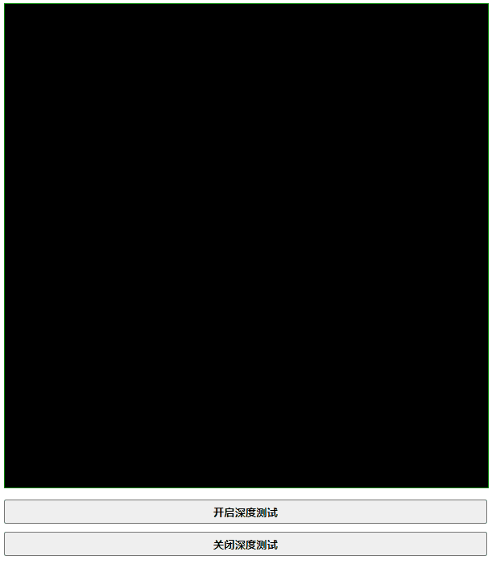
+ 结果完全一致! 如果你还记得`深度测试`的内容的话, 那么正射投影你就已经掌握了, 接下来将讲述`透视投影矩阵`, 如果不记得, 你可能要好好读一下上一篇笔记了

#### 棱台可视空间 & 透视投影矩阵
+ 棱台可视空间, 是一个棱台体, 其特点是, 符合人眼的视觉效果, 对于同样大的物体, 离视点越远, 则看上去越小, 示意图如下  
  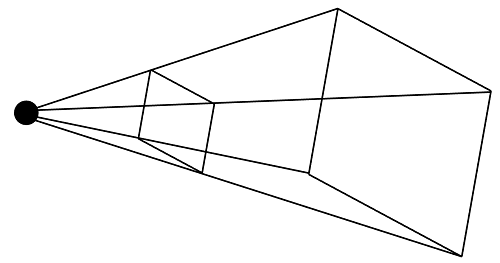
+ 棱台可视空间和长方体可视空间的定义方式不同, 棱台可视空间使用三个参数来定义: `垂直视角`, `裁剪面宽高比`, 以及`近/远裁剪面`, 示意图如下   
  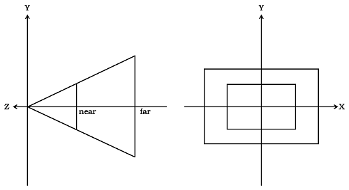
+ 如上图所示, `垂直视角`指的的是顶面和底面的夹角, `宽高比`指的是裁剪面的宽度和高度之比, `近/远裁剪面`和正射投影的定义相同, 但又有着本质的不同
  - `near`不仅标识了近裁减面的位置, 同时也代表着`到视点的距离`
  - 透视投影是棱台形状, 因此`近裁减面`不能和`视点`重合!!! 近裁减面没有高度会导致什么都看不到
  - `近裁减面`和`远裁减面`不能将视点`夹在中间`!! 视线不可能到达近裁减面后, 再反向前往远裁减面, 这也会导致什么都看不到
  - 综合以上三点, 我们可以得出结论: 近裁减面和远裁减面都必须位于视点的同一侧, `近裁减面离视点更近`
  - 由于最终的图像都会绘制在WebGL坐标系下, 因此, 默认视点在原点, 视线指向 $-Z$ , 因此近远裁减面的位置都在 $-Z$ 上
  - **最终结论:** `near`和`far`都必须大于0, 且 $near$ 小于 $far$
***
**正射投影允许负数的裁减面:** 正射投影中, 近远裁减面不仅允许负数, 还允许一正一负, 这是因为正射投影是长方体可视空间, 将其变换为 $[-1, 1]$ 的裁减空间只是简单的线性缩放和平移, 只要最终的顶点坐标在默认裁减空间内, 即可绘制, 而透视投影因为其特殊的形状, 如果传入了不合适的参数, 最终的矩阵将会出现问题  
  
**永远都不嫌烦的提示:** WebGL下所有的模型/视图矩阵, 最终都是修改了原始顶点坐标, 得到了新的坐标值, 用于实现各种模型变换, 和模拟出相机视角下的呈现效果, 因此`近远裁减面`的位置都是按照WebGL默认视点来作为参照的
***
+ 有了上述的描述, 我们可以开始准备推导透视投影矩阵, 推导过程比起正射投影矩阵要复杂不少, 我们一步一步来, 在此之前, 先讲述一个小知识点
***
**齐次坐标:** 空间三维坐标只有三个分量 $(x, y, z)$ , 但我们通常会传入一个第四维分量, 即 $(x, y, z, 1)$ , 这是为了使用各种矩阵计算, $4 \times 4$ 矩阵在应用变换上具有天然的优势, 这样加入第四维的坐标被称之为齐次坐标   

**WebGL处理齐次坐标:** 如果齐次坐标的第四维分量不为1, 如 $(x, y, z, w)$ , WebGL在处理时, 会将所有分量除以第四维分量的值, 将其转化为1, 即 $(x/w, y/w, z/w, 1)$ , 因此, 有如下需要记住的点: 
$$顶点(x, y, z, w)和顶点(x/w, y/w, z/w, 1)是一样的$$
***
+ 推导透视投影矩阵, 需要一个思维转换的过程, 即, 将棱台状的可视空间, 首先压缩为一个长方体可视空间, 再在长方体可视空间上使用正射投影矩阵, 即可得到透视投影矩阵, 示意图如下:  
  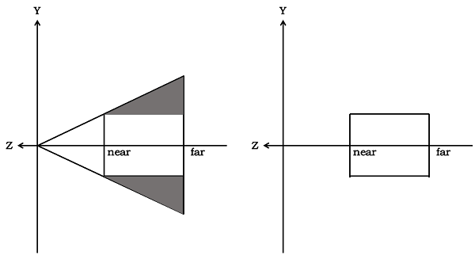
+ 基本思维如下, 将棱台压缩为长方体, 我们可以求出这样一个转换矩阵 $Temp$ , 既然已经转换成了长方体, 那就可以直接应用正射投影矩阵了, 因此最终要求的透视投影矩阵 $Pers$ 为:   
  $$Pers = Orth \times Temp$$
+ 我们开始推导矩阵 $Temp$ , 压缩方式为: 将`远裁剪面`高度压缩到和`近裁剪面`一致, 来看下面这张图, 假设近裁剪面的 $Y$ 坐标为 $y$ ,在 $z$ 位置处的 $Y$ 坐标为 $y_z$   
  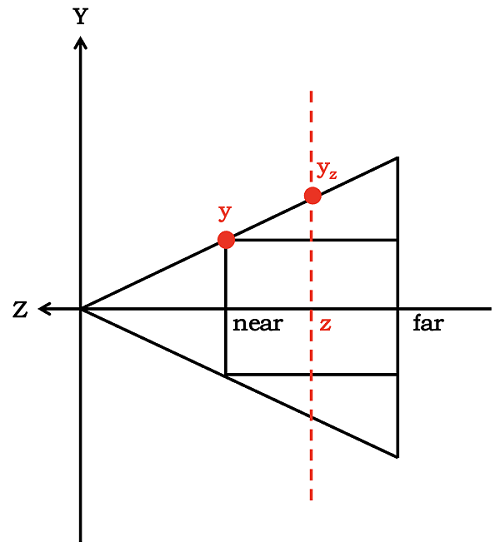
+ 根据相似三角形对应边长成比例, 很容易列出一个等比例公式:
***
**反复强调:** `near`和`far`的方向和 $Z$ 轴是相反的, 所以在推导矩阵之前, 我们将`near`和`far`都乘以-1, 将其和 $Z$ 轴对应起来, 即再WebGL坐标系下, 近/远裁剪面的坐标是 $-near$ 和 $-far$ 
***
  $$
  \frac{y}{y_z}=\frac{-near}{z},
  \quad即\quad
  y = \frac{-near}{z}y_z
  $$
+ 这个公式说明了什么呢, 说明了在任意的 $z$ 位置处的顶点 $P(x, y, z)$ , 只要将其 $y$ 坐标乘以 $\frac{-near}{z}$ , 就可以将其转换为压缩后的长方体可视空间内的对应 $y$ 坐标, 这一点很重要, 必须要理解
+ 使用相同的方式可以推出, $x$ 坐标也同样满足上述规律, 即将 $z$ 位置处的顶点 $P(x, y, z)$ 的 $x$ 坐标乘以 $\frac{-near}{z}$ , 就可以将其转换为压缩后的长方体可视空间内的对应 $x$ 坐标
+ 现在我们就可以列出一个 $Temp$ 矩阵的计算公式了, 注意: 后续`near`和`far`简写为`n`和`f`
  $$
  \begin{Bmatrix}
    -nx / z \\\\
    -ny / z \\\\
    unknow \\\\
    1
  \end{Bmatrix}=
  \begin{Bmatrix}
    A & B & C & D \\\\
    E & F & G & H \\\\
    I & J & K & L \\\\
    M & N & O & P
  \end{Bmatrix}
  \times
  \begin{Bmatrix}
    x \\\\
    y \\\\
    z \\\\
    1
  \end{Bmatrix}
  $$
***
**非常重要的问题:** 为什么压缩后的对应坐标, $z$ 坐标会是未知, 即 $unknow$ 呢? 难道不是应该不变吗? 理解这点非常重要, 因为这个压缩过程, 并不是`线性压缩`, 而是`非线性压缩`, 因此压缩之后, 原顶点和新的顶点并不一定在同一条竖线上!  

**TIPS:** 以上这个理由是我自己编的, 还需要再查阅一些资料加以佐证, 待定
***
+ 根据上面的公式, 怎么才能计算出 $Temp$ 矩阵呢, 需要借助上述讲到的`齐次坐标`, 将公式转换为如下形式:
  $$
  \begin{Bmatrix}
    -nx / z \\\\
    -ny / z \\\\
    unknow \\\\
    1
  \end{Bmatrix}=
  \begin{Bmatrix}
    nx \\\\
    ny \\\\
    unknow \\\\
    -z
  \end{Bmatrix}=
  \begin{Bmatrix}
    A & B & C & D \\\\
    E & F & G & H \\\\
    I & J & K & L \\\\
    M & N & O & P
  \end{Bmatrix}
  \times
  \begin{Bmatrix}
    x \\\\
    y \\\\
    z \\\\
    1
  \end{Bmatrix}
  $$
+ 根据矩阵相乘, 马上可以列出几个公式:
  $$
  Ax+By+Cz+D=nx \\\\
  Ex+Fy+Gz+H=ny \\\\
  Mx+Ny+Oz+P=-z
  $$
+ 可以解出: $B=C=D=E=G=H=M=N=P=0, A=n, F=n, O=-1$
+ 即我们可以得到 $Temp$ 矩阵的第1, 2, 4行, 如下, 这样我们只需要求出矩阵的第三行, $Temp$ 矩阵就算是求出来了
  $$
  \begin{Bmatrix}
    nx \\\\
    ny \\\\
    unknow \\\\
    -z
  \end{Bmatrix}=
  \begin{Bmatrix}
    n & 0 & 0 & 0 \\\\
    0 & n & 0 & 0 \\\\
    I & J & K & L \\\\
    0 & 0 & -1 & 0
  \end{Bmatrix}
  \times
  \begin{Bmatrix}
    x \\\\
    y \\\\
    z \\\\
    1
  \end{Bmatrix}
  $$
+ 那要如何才能求出 $Temp$ 矩阵的第三行呢? 要求未知数, 必须要有额外的条件, 根据压缩的过程, 我们可以给出如下两个条件:
  - **条件1:** `近裁剪面`上所有点的坐标, 在压缩过程中`保持不变`, 这点很好理解, 因为是将`远裁剪面`压缩到和`近裁剪面`一致, 因此近裁剪面的所有点坐标当然不变, 这些点坐标可表示为 $(x, y, -n)$
  - **条件2:** `远裁剪面`上所有点的 $z$ 坐标, 压缩之后保持不变, 这点也很好理解, 因为远裁剪面的位置不能移动, 要保证可视空间的前后距离不变, 因此远裁剪面的 $z$ 始终为 $-f$  
+ **利用条件1建立公式:**
  - 列出计算公式, 过程会用到齐次坐标, 后续不再言明
    $$
    \begin{Bmatrix}
      x \\\\
      y \\\\
      -n \\\\
      1
    \end{Bmatrix}=
    \begin{Bmatrix}
      nx \\\\
      ny \\\\
      -n^2 \\\\
      n
    \end{Bmatrix}=
    \begin{Bmatrix}
      n & 0 & 0 & 0 \\\\
      0 & n & 0 & 0 \\\\
      I & J & K & L \\\\
      0 & 0 & -1 & 0
    \end{Bmatrix}
    \times
    \begin{Bmatrix}
      x \\\\
      y \\\\
      -n \\\\
      1
    \end{Bmatrix}
    $$
  - 可写出公式:
    $$
    Ix+Jy-Kn+L=-n^2
    $$
  - 可求得: $I=J=0 \quad 及 \quad Kn-L=n^2$
+ **利用条件2建立公式:** 
  - 列出计算公式:
    $$
    \begin{Bmatrix}
      -nx/(-f) \\\\
      -ny/(-f) \\\\
      -f \\\\
      1
    \end{Bmatrix}=
    \begin{Bmatrix}
      nx \\\\
      nx \\\\
      -f^2 \\\\
      f
    \end{Bmatrix}=
    \begin{Bmatrix}
      n & 0 & 0 & 0 \\\\
      0 & n & 0 & 0 \\\\
      0 & 0 & K & L \\\\
      0 & 0 & -1 & 0
    \end{Bmatrix}
    \times
    \begin{Bmatrix}
      x \\\\
      y \\\\
      -f \\\\
      1
    \end{Bmatrix}
    $$
  - 可求得 $Kf-L=f^2$
  - 结合**条件1**的 $Kn-L=n^2$ , 可联立解得 $K=n+f \quad 及 \quad L=nf$
+ 至此, $Temp$ 矩阵就被求出来了, 即
  $$
  Temp=
  \begin{Bmatrix}
    n & 0 & 0 & 0 \\\\
    0 & n & 0 & 0 \\\\
    0 & 0 & n+f & nf \\\\
    0 & 0 & -1 & 0
  \end{Bmatrix}
  $$
+ 在将 $Temp$ 矩阵应用一个正射投影矩阵, 即可得到最后的透视投影矩阵, 写出公式
  $$
  Pers=Orth \times Temp=
  \begin{Bmatrix}
    \frac{2}{r-l} & 0 & 0 & -\frac{r+l}{r-l} \\\\
    0 & \frac{2}{t-b} & 0 & -\frac{t+b}{t-b} \\\\
    0 & 0 & -\frac{2}{f-n} & -\frac{f+n}{f-n} \\\\
    0 & 0 & 0 & 1
  \end{Bmatrix} \times
  \begin{Bmatrix}
    n & 0 & 0 & 0 \\\\
    0 & n & 0 & 0 \\\\
    0 & 0 & n+f & nf \\\\
    0 & 0 & -1 & 0
  \end{Bmatrix}
  $$
+ 最终的计算结果为:
  $$
  Pers=
  \begin{Bmatrix}
    \frac{2n}{r-l} & 0 & 0 & 0 \\\\
    0 & \frac{2n}{t-b} & 0 & 0 \\\\
    0 & 0 & -\frac{f+n}{f-n} & -\frac{2nf}{f-n} \\\\
    0 & 0 & -1 & 0
  \end{Bmatrix}
  $$
+ 还没结束, 我们发现矩阵中还有正射投影矩阵的相关参数, 现在我们想办法处理掉, 首先我们能够知道, $r-l$ 即为近裁剪面的宽度, $t-b$ 即为近裁剪面的高度
+ 我们设垂直视角为`fov`, 宽高比为`aspect`, 根据前面的示意图, 我们很容易得知, 如下关系
  $$
  \frac{r-l}{t-b} = aspect \quad 以及 \quad \frac{t-b}{2n} = tan(\frac{fov}{2})
  $$
+ 将其带入公式, 可以得到最终的透视投影矩阵, 即
  $$
  Pers =
  \begin{Bmatrix}
    \frac{1}{aspect * tan(\frac{fov}{2}) } & 0 & 0 & 0 \\\\
    0 & \frac{1}{tan(\frac{fov}{2})} & 0 & 0 \\\\
    0 & 0 & -\frac{f+n}{f-n} & -\frac{2nf}{f-n} \\\\
    0 & 0 & -1 & 0
  \end{Bmatrix}
  $$
+ 透视投影矩阵的示例, 本例绘制了6个三角形, 左右各3个, 左边的3个仅有 $z$ 坐标不同, $x, y$ 坐标完全相同, 右边的3个三角形也同样如此   
  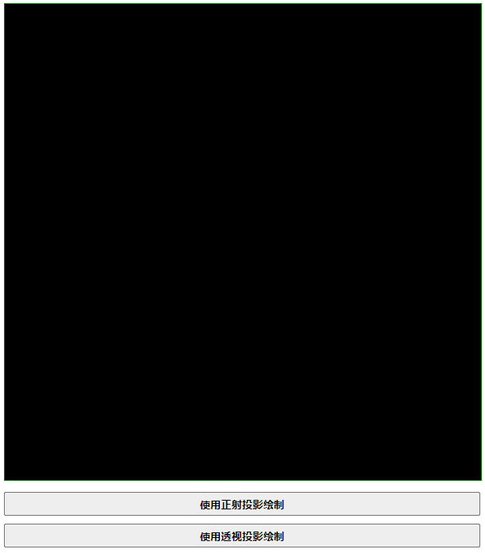
***
**TIPS1:** 透视投影矩阵和正射投影矩阵一样, 由于近远裁剪面和 $Z$ 轴反向的原因, 导致其深读信息被得以保存, 如果想要顶点的深度信息最终正确的反映在绘制结果中, 你必须使用这两个投影矩阵的其中一个, 并且在绘制函数中启用`深读测试`  

**TIPS2:** 如果原始顶点的 $Z$ 坐标值大于0, 即在 $+Z$ 方向绘制, 那么不要忘记使用`视图矩阵`修改相机位置, 否则使用透视矩阵后你将什么都看不到
***

#### 补充知识: 齐次坐标中的 $\omega$ 分量
+ 上面说到, WebGL在处理顶点坐标时, 会将 $x, y, z$ 都自动除以 $\omega$ 分量
+ 因此我们得出了一个结论, 如下
  $$顶点(x, y, z, w)和顶点(x/w, y/w, z/w, 1)是一样的$$
+ 为了确保这个结论没有问题, 我们作如下的示例, 使用3个顶点绘制三角形, 并且分别设置颜色为红绿蓝, 顶点坐标和颜色如下
  ```TypeScript
  const points: Float32Array = new Float32Array([
    // 第一个点
    -1, -1, 1, 1, 1, 0, 0,
    // 第二个点
     100, -100, 100, 100, 0, 1, 0,
    // 第三个点
     0,  1, 1, 1, 0, 0, 1
  ]);
  ```
+ 来看看效果, 提前猜测一下, 由于顶点会被除以第4个分量, 因此第二个顶点最终会被转成 $(1, -1, 1, 1)$ , 最终的效果是一个和第一篇笔记中的示例程序一致的三角形   
  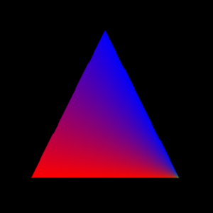
+ 出现了一点小意外, 顶点的`坐标位置`正如预期, 但是颜色却明显不对, 右下角第2个顶点的绿色只有一丁点, 这是为什么呢? 但不管怎样, 我们可以得出第一个结论:
***
**结论1:** 顶点 $(x, y, z, w)$ 和顶点 $(x/w, y/w, z/w, 1)$ 最终的`位置`坐标 (即在裁剪空间中的坐标) 是完全一样的
***
+ 既然颜色不对劲儿, 那就说明`插值过程`出现了问题, 也就是说, $\omega$ 分量影响了`varying`变量的插值方式, 从这里, 我们可能会产生两个问题:
  - WebGL为何要将 $(x, y, z)$ 分量都强制性除以 $\omega$ ?
  - $\omega$ 是如何控制插值过程的?
+ 我们来考虑这样一个场景: 假设将`所有的`顶点坐标的 $\omega$ 分量都设置为`5`, 表示为 $(x, y, z, 5)$ , WebGL会处理为 $(x/5, y/5, z/5, 1)$ , 即最终绘制到裁剪空间的顶点坐标是 $(x/5, y/5, z/5)$ , `缩小了5倍`!
+ 很明显, $\omega$ 越大, 绘制的结果就越小, 我们假设, $\omega$ 代表了物体的远近, 值越大, 表示越远, 这不就是`近大远小`吗? 这是一种`透视`的实现! 
+ 我们来验证一下这个猜想, 修改上述例子中的顶点坐标为:
  ```TypeScript
  const points: Float32Array = new Float32Array([
    // 第一个点
    -1, -1, 1, 1, 1, 0, 0,
    // 第二个点
     1, -1, 1, 10, 0, 1, 0,
    // 第三个点
     0,  1, 1, 1, 0, 0, 1
  ]);
  ```
+ 这是绘制的结果   
  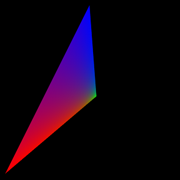
+ 右下角的顶点产生了透视效果, 因为它距离我们更远, 本身我们的顶点坐标的 $z$ 分量是 $1$ , 和另外两个顶点一样, 没有深度差异, 但正是因为强制除了 $\omega$ , 导致了透视效果的出现
+ 因此我们可以得出第二个结论: 
***
**结论2:** WebGL会利用 $\omega$ 的值进行`透视纠正`, $\omega$ 可以不正式的认为是`距离远近的表达`, WebGL通过将坐标分量除以 $\omega$, 以此产生`透视效果`
***
+ 现在就是最后一个问题了, 颜色效果变得不一样了, 绿色只有那么一丁点, 这是插值造成的结果, 说明 $\omega$ 对于`varying`变量的插值方式造成了影响
+ 通过上述的例子, 绿色因为只有很少一部分, 也会给人造成一种`这个顶点很遥远`的透视感
+ 这个插值公式我并没有推导出来, 先放在这里, 直接给出结论, 后面有机会再试试推导吧
***
**结论3:** WebGL根据 $\omega$ 的值, 来确定插值方式, 假设WebGL在 $a, b$ 间进行插值, a点对应的 $\omega$ 值为 $a_{\omega}$ , b点对应的 $\omega$ 值为 $b_{\omega}$, 则插值公式为:
$$ f(x)=\frac{(1-x) a/a_{\omega} + xb/b_{\omega}}{(1-x)/a_{\omega} + x/b_{\omega}} $$
$x$ 表示 $a, b$ 之间的位置, $0$ 表示在 $a$ 处, $1$ 表示在 $b$ 处
***
+ 我们通过这个公式, 来推导颜色的变化, 已知, 颜色是从 $(1, 0, 0)$ 变化到 $(0, 1, 0)$
+ 根据示例1, 左下顶点坐标是 $(-1, -1, 1, 1)$ , 右下顶点坐标是 $(100, -100, 100, 100)$
+ 首先看颜色的 $R$ 分量, 从 $1$ 到 $0$ , 因此 $a=1, b=0$ , 且 $a_{\omega}=1, b_{\omega}=100$, 代入公式, 有
$$f(x)=\frac{100-100x}{100-99x}$$
+ 同理可以写出 $G$ 分量的插值公式, $B$ 分量恒为 $0$
$$f(x)=\frac{x}{100-99x}$$
+ 因此, 我们可以试着计算几个关键位置的颜色, 见下表
  | 位置( $x$ 取值 ) |      颜色值       | 目测更靠近 |
  | :--------------: | :---------------: | :--------: |
  |        0         |    $(1, 0, 0)$    |    红色    |
  |       0.5        | $(0.99, 0.01, 0)$ |    红色    |
  |       0.8        | $(0.96, 0.04, 0)$ |    红色    |
  |       0.9        | $(0.92, 0.08, 0)$ |    红色    |
  |       1.0        |    $(0, 1, 1)$    |    绿色    |
+ 和效果图是一致的, 红色占据了几乎所有的范围, 只有最后一丁点显示为绿色
+ 值得一提的是, 如果将上述插值公式的 $\omega$ 值都设置为 $1$ , 我们将得到一个`线性插值`公式
$$f(x)=(1-x)a + bx$$
+ 最后一点: 插值方式的变化, 当然会影响`纹理坐标插值`, 也就会影响最终的纹理呈现效果, 这种处理方式会显得更有透视感

**总结**
***
1. WebGL会根据 $\omega$ 分量, 进行透视纠正, 并且改变插值方式, 这是为了得到正确的`透视场景下的映射坐标`, 这个映射坐标不仅用在颜色赋值上, 也会用在`纹理映射`上, 纹理将在后续讲述
2. 顶点坐标的 $x, y, z$ 分量, 除以 $\omega$ 分量后得到的值, 就是最终在裁剪空间中绘制的坐标值
3. 插值公式需要想办法试试能不能手动再推导出来, 不然记不住 
****
**[返回主目录](../readme.md)**