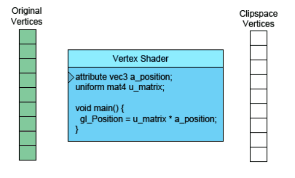
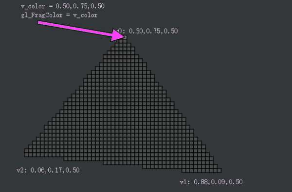
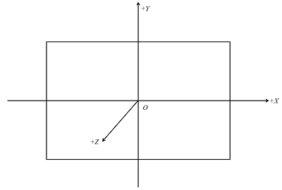
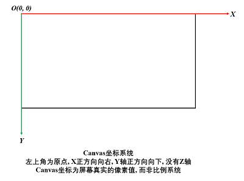
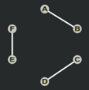
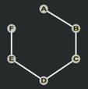
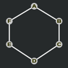
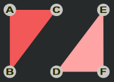
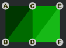
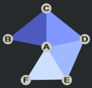

# WebGL 概念总览

**[返回主目录](../readme.md)**

#### 基础概念
- WebGL是一个光栅化引擎
- WebGL通过两个着色器: 顶点着色器和片元着色器协同工作
- WebGL只能绘制点, 线, 三角形, 任何复杂图形, 都是由点, 线, 三角形组成的
- WebGL逐顶点处理, 每处理一个, 就将其传入WebGL内置变量`gl_Position`保存起来
- 当顶点处理完毕后, WebGL会开始`图元装配`过程
- `图元装配`: 根据`绘制模式`, 将顶点组装为基本图形(这句话见下方**注解**), 并计算出顶点在屏幕上的实际像素值
- 顶点像素计算完毕后, WebGL会开始`光栅化`过程:
- `光栅化`: WebGL会用像素将基本图形充满(插值), 然后逐像素调用片元着色器上色
- 片元着色器会使用赋值给内置变量`gl_FragColor`的颜色值
- 逐顶点逐像素处理完毕后, 就看到了最终的图形
  
**顶点着色器的示意图**  


   
**片元着色器的示意图**  


***
**注解**: 如果是绘制点, 那么每个顶点都是独立的基本图形; 如果是绘制直线, 则会将两个点组装为直线; 同理, 当绘制的是三角形, WebGL就会将三个点组装为一个三角形, 稍后会开始光栅化过程  

**直线和三角形并不是随意的任取两个点或三个点来组装, 这取决于WebGL的`绘制模式`**  
***

#### WebGL坐标系统和Canvas坐标系统
- WebGL使用三维坐标系统, 原点在正中央, X, Y, Z轴正方向分别是`右`, `上`, `外`
- Canvas元素遵循HTML标准, 左上角为原点, 右方向为X轴正方向, 下方向为Y轴正方向
- **TIPS1:** WebGL顶点坐标可以任意取值, 但只能绘制坐标位于`可视空间`内的图形
- **TIPS2:** WebGL默认可视空间是[–1, 1]的立方体范围, 这部分内容会在后续笔记单独介绍
- **TIPS3:** WebGL会将可视空间充满canvas画布, 原点位于canvas画布中央

**WebGL坐标系统**  



**Canvas坐标系统**  



***

#### WebGL变量
- WebGL程序中主要使用四种变量:
- `attribute`: 存储`顶点相关`的数据, 如顶点坐标, 顶点颜色等
- `uniform`: 存储`顶点无关`的数据, 如变换矩阵, 光照向量等
- `varying`: 用于顶点着色器向片元着色器传值
- `Texture`: 纹理, 将会单独使用多篇文档来讲述WebGL纹理
- **TIPS1:** varying变量无法直接从外部传入, 需要在顶点着色器中定义attribute变量接收外部数据, 再将该数据赋值给varying变量
- **TIPS2:** 顶点着色器中的varying变量收到数据后, 会先进行`插值`, 再传递给片元着色器中`同名同类型`的varying变量, 并非原样传递
- **TIPS3:** 因此, 顶点着色器中的varying变量接收的只是顶点数据, 而传给片元着色器的是插值后所有片元的数据, 这也是被称为varying的原因

**attribute变量传值的固定样板代码**
```JavaScript
// 创建一个WebGL缓冲
const buffer = gl.createBuffer();

// 将创建的缓冲绑定到指定类型的缓冲区, 这里是gl.ARRAY_BUFFER类型
gl.bindBuffer(gl.ARRAY_BUFFER, buffer);

// 将数据绑定到该类型的缓冲区上, gl.STATIC_DRAW表示了数据的读取使用方式之一, WebGL会根据该值进行必要的优化
gl.bufferData(gl.ARRAY_BUFFER, data, gl.STATIC_DRAW);

// 从program中获取attribute变量的地址, name是变量的名称
const pointer = gl.getAttribLocation(program, name);

// 激活该attribute变量, 让其可以从gl.ARRAY_BUFFER类型的缓冲区中读取数据
gl.enableVertexAttribArray(pointer);

// 给该attribute变量指定数据的读取方式
// type: 读取数据的类型, 这个取决于创建的定型数组的类型, 如gl.FLOAT
// 关于size, offset, 以及stride的详细介绍, 会单独使用一节来讲解
gl.vertexAttribPointer(pointer, size, type, false, stride, offset);// 创建一个WebGL缓冲
```
***
**TIPS:**   
有这么一种可能, 某个attribute变量, 只需要接收一个顶点数据, 比如你要绘制一个点, 这就不需要大量的顶点, 这种情况下, 就不需要上述这种开辟缓冲区的方法, 可以像uniform变量传值的方式一样, 只需要`获取位置`, `传值`两个步骤
```JavaScript
// 将顶点数据(0.0, 0.0, 0.0)传递给attribute变量
const pointer = gl.getAttribLocation(program, name);
gl.vertexAttrib3f(pointer, 0.0, 0.0, 0.0);

// 或者使用矢量版本
gl.vertexAttrib3fv(pointer, [0.0, 0.0, 0.0]);
```
***

**uniform变量传值的样板代码**
```JavaScript
// 从program中获取uniform变量的地址, name是变量的名称
const pointer = gl.getUniformLocation(program, name);

// 给uniform变量传递数据
gl.uniform4fv(pointer, data);

/**
 * uniform有很多种传值方式, 如uniform4fv, uniform3f, uniformMatrix3fv, uniformMatrix4f等
 * 分别表示了: 4阶向量, 3阶向量, 3阶矩阵, 4阶矩阵等
 * v表示传值为ArrayBuffer类型, 没有v则表示将ArrayBuffer单个依次作为参数(有点类似于JavaScript的call/apply)
 */
```

***

#### WebGL绘制模式(**\***)
- 无论是`gl.drawArrays()`还是`gl.drawElements()`, 第一个参数都是绘制模式
- 绘制模式包括: `POINTS`, `LINES`, `LINE_STRIP`, `LINE_LOOP`, `TRIANGLES`, `TRIANGLE_STRIP`, `TRIANGLE_FAN`七种
- 假设顶点坐标为A, B, C, D, E, F...下表给出七种绘制模式下的结果

|    绘制模式    |                        解析                        |               备注               |
| :------------: | :------------------------------------------------: | :------------------------------: |
|     POINTS     |   绘制独立`点`, **TIPS:** 点并非圆形, 而是正方形   |  使用`gl_PointSize`可设置点尺寸  |
|     LINES      |    两点成一线, 不重叠, 即AB, CD, EF分别绘制直线    |           |
|   LINE_STRIP   |    ABCCDEF依次连起来, 不间断, 但是`收尾不相接`     |      |
|   LINE_LOOP    |     字面意思理解, ABCDEF依次连接, 收尾相接成环     |      |
|   TRIANGLES    |   三点成三角形, 不重叠, 即ABC, DEF分别绘制三角形   |       |
| TRIANGLE_STRIP |      对于一系列点, 使用`最后三个点`绘制三角形      |  |
|  TRIANGLE_FAN  | 对于一系列点, 使用`第一个`和`最后两个`点绘制三角形 |    |
***
**TRIANGLE_STRIP的解析:**
- 逐顶点处理, 首先处理顶点ABC, 绘制三角形`ABC`
- 紧接着处理顶点`D`, 最后三个点变成BCD, 绘制三角形`BCD`
- 紧接着处理顶点`E`, 最后三个点变成CDE, 绘制三角形`CDE`
- 以此类推
- 最终绘制出的三角形是: `ABC`, `BCD`, `CDE`, `DEF`  

**TRIANGLE_FAN的解析:**
- 逐顶点处理, 首先处理顶点ABC, 绘制三角形`ABC`
- 紧接着处理顶点`D`, 此时第一个点是A, 最后两个点是CD, 绘制三角形`ACD`
- 紧接着处理顶点`E`, 此时第一个点是A, 最后两个点是DE, 绘制三角形`ADE`
- 依次类推
- 最终绘制出的三角形是: `ABC`, `ACD`, `ADE`, `AEF`  

**使用`gl_lineWidth`可以设置线条宽度, 最大取决于WebGL的实现, 通常是1**
***

#### WebGL绘制方法: `gl.drawArrays()`和`gl.drawElements()`
- 上文已经说到, WebGL创建缓冲, 给attribute变量传值, 缓冲类型为`gl.ARRAY_BUFFER`
- WebGL常用的顶点数据缓冲有两种类型: `gl.ARRAY_BUFFER`和`gl.ELEMENT_ARRAY_BUFFER`
- gl.ARRAY_BUFFFER用于存储顶点坐标数据, 提供给gl.drawArrays()方法使用
- gl.ELEMENT_ARRAY_BUFFER用于存储顶点`索引`, 提供给gl.drawElements()方法使用
- gl.ARRAY_BUFFER配合gl.drawArrays()使用已经在上文中描述过, 现重点描述gl.drawElements()的用法:
- 以绘制一个矩形为示例:
```JavaScript
// 首先定义矩形的四个顶点的坐标
const recVertex = new Float32Array([
    -0.5, -0.5, 0.0, // 左下
     0.5, -0.5, 0.0, // 右下
     0.5,  0.5, 0.0, // 右上
    -0.5,  0.5, 0.0  // 左上
]);

// 将顶点数据传入attribute变量以供读取, 这里将会读取四个顶点, 索引分别为0, 1, 2, 3
setAttribute(gl, program, 'a_position', recVertex, 3, gl.FLOAT, 0, 0);

// 我们知道, WebGL最多只能绘制三角形, 无法直接绘制矩形, 四个点应该如何绘制矩形呢

// 方法之一是使用 gl.drawArrays(gl.TRIANGLE_FAN, ...), 即gl.TRIANGLE_FAN绘制模式

// 现在我们使用方法二: 顶点索引
const recVertexIndex = new Uint16Array([
    0, 1, 2,
    2, 3, 0
]);

// 创建ELEMENT_ARRAY_BUFFER类型的缓冲, 并绑定顶点索引的数据
const indexBuffer = gl.createBuffer();
gl.bindBuffer(gl.ELEMENT_ARRAY_BUFFER, indexBuffer);
gl.bufferData(gl.ELEMENT_ARRAY_BUFFER, recVertexIndex, gl.STATIC_DRAW);

gl.drawElements(gl.TRIANGLES, 6, gl.UNSIGNED_SHORT, 0);
```
***
**代码解析:**   
- 首先依然需要创建顶点坐标数组, 并传递给attribute变量使用
- 顶点坐标数组会和`ARRAY_BUFFER`类型的缓冲关联起来
- 顶点索引数组中的数字表示了`顶点坐标数组中的顶点的索引`
- 顶点索引数组需要和`ELEMENT_ARRAY_BUFFER`类型的缓冲关联起来
- ELEMENT_ARRAY_BUFFER类型的缓冲会自动从ARRAY_BUFFER类型的缓冲中取得对应的顶点(**重点**)
- 使用gl.drawElements()方法绘制图形时, 该方法会从ELEMENT_ARRAY_BUFFER缓冲中获取顶点索引

**总结:**   
gl.drawElements()方法, 从ELEMENT_ARRAY_BUFFER缓冲中获取顶点索引, 这里定义的是[0, 1, 2, 2, 3, 0], 顶点索引又会从ARRAY_BUFFER缓冲中获取对应的顶点坐标数据, 由于传入的绘制模式是gl.TRIANGLES, 因此代码会使用0, 1, 2三个点绘制一个三角形, 再使用2, 3, 0三个点绘制一个三角形, 最终的结果就是一个矩形
***

#### WebGL绘制中的`offset`和`stride`
- `offset`: 读取数据的偏移量, 默认为0
- `stride`: 相邻两个顶点之间的跨度(字节数), 默认为0, 这个用一个示例来说明

```JavaScript
// 将坐标和颜色数据写入同一个缓冲区
const vertice: ArrayBuffer = new Float32Array([
    // 前三个数据表示顶点坐标, 后三个数据表示顶点颜色
    -0.5, -0.5, 0.0, 1.0, 0.0, 0.0,
     0.5, -0.5, 0.0, 0.0, 1.0, 0.0,
     0.0,  0.5, 0.0, 0.0, 0.0, 1.0
]);
const ByteLength: number = Float32Array.BYTES_PER_ELEMENT;

// 由于同一个顶点, 连同坐标和颜色总共有6个值, 因此stride为6 * 单个值的字节长度
// 因此两个顶点数据之间的跨度为 6 * ByteLength

// 读取坐标数据, 由于前三个数据就是坐标, 因此偏移量offset是0
gl.vertexAttribPointer(vertex, 3, gl.FLOAT, false, 6 * ByteLength, 0);

// 读取颜色数据, 由于后三个数据才是颜色, 因此偏移量offset是3 * ByteLength
gl.vertexAttribPointer(colors, 3, gl.FLOAT, false, 6 * ByteLength, 3 * ByteLength);
```
****
**[返回主目录](../readme.md)**