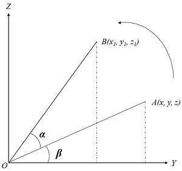
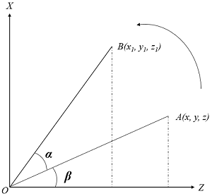
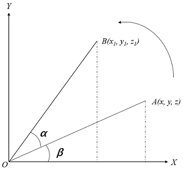
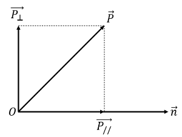
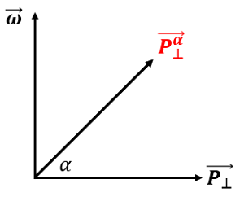
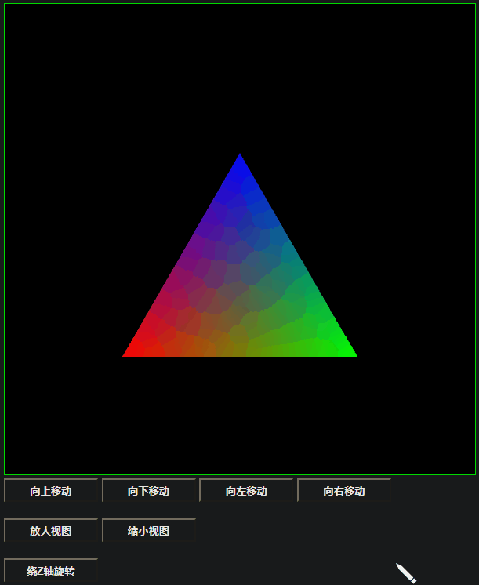
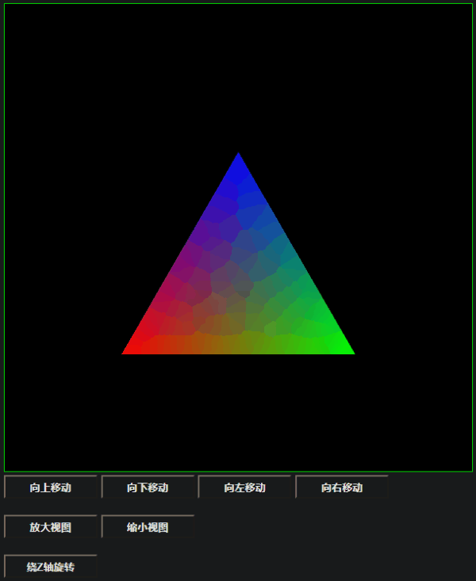

# WebGL 模型矩阵

**[返回主目录](../readme.md)**

#### WebGL模型变换: `平移`, `旋转`, `缩放`
- 所有的变换, 都是对当前的坐标点进行运算, 得出新的坐标点, 坐标点可以视为`3 x 1矩阵`
- 将变换规则记为`3 x 3矩阵`, 坐标矩阵与其相乘, 结果仍为`3 x 1矩阵`, 这就是矩阵变换的基础
- 由于WebGL中还有四阶矩阵的应用, 因此本文档都将使用`四阶矩阵`作为说明, 第四个分量固定为1
- **TIPS:** 本文档不专门讲述数学知识, 矩阵乘法的相关法则和计算方法不会对此进行太多说明
- WebGL矩阵需要注意: WebGL矩阵是`列主序`矩阵, 即需要将数学意义上的矩阵`转置`后传入WebGL着色器才能得到正确的效果

#### 列主序的含义
+ 列主序在在不同的地方, 所代表的含义是不同的, 需要注意区分
+ 传统数学意义上的行列主序矩阵(只限于坐标系中, 其他情况不涉及, 不讨论):
    + `行主序`: 矩阵的行代表`基底向量`, 如果要进行坐标变换, 则需要进行`右乘`变换矩阵, 即 $[x_1, y_1, z_1] = [x, y, z] \times M$
    + `列主序`: 矩阵的列代表`基底向量`, 如果要进行坐标变换, 则需要进行`左乘`变换矩阵, 即 $[x_1, y_1, z_1]^T = M \times [x, y, z]^T$
    + 在变换公式中, 所有的向量, 矩阵都应该使用同一套规则, 即要么都是列主序, 要么都是行主序
    + 这里的矩阵只和数学有关, 不要带入编程思维, 只会用到纯数学知识
+ WebGL中的行列主序矩阵(和存储有关)
    + 因为JavaScript没有多维数组, 只有一维数组, 因此使用定型数组存储矩阵数据时, 根据行列存储的不同, 分为行列主序矩阵, 假设有 $3 \times 3$ 矩阵, 第一行:  $[0, 1, 2]$ , 第二行: $[3, 4, 5]$ , 第三行: $[6, 7, 8]$
    + `行主序`, 采用逐行存储, 依次存入0, 1, 2, 3, 4, 5, 6, 7, 8, 代码如下
    ```JavaScript
    const m4 = new Float32Array([
        0, 1, 2,
        3, 4, 5,
        6, 7, 8
    ]);
    ```
    + `列主序`, 采用逐列存储, 依次存入0, 3, 6, 1, 4, 7, 2, 5, 8, 代码如下
    ```JavaScript
    const m4 = new Float32Array([
        0, 3, 6,
        1, 4, 7,
        2, 5, 8
    ]);
    ```
+ 这两个部分的行列主序含义不同, 不要搞混淆了
+ 因此我们要得到一个WebGL可用的变换矩阵, 就需要遵循以下要求:
    + 首先进行矩阵推导, 这里只会用到数学知识, 根据变换矩阵是左乘还是右乘, 确定行列主序, 并推导出矩阵, 如果用第三方库, 可以省略
    + `注意`: , 在WebGL着色器中的左乘右乘规则要和上面一致!
    + 确定好矩阵之后, 我们需要将矩阵使用定型数组存储, 并传入WebGL, 而WebGL只接受列主序存储, 因此需要将矩阵按照列存储, 并传入WebGL
+ 通用惯例:
    + WebGL着色器中通常使用左乘变换, 即 `modelMatrix * vec4(pos, 1)`
    + 因此矩阵推导时, 采用列主序矩阵来计算矩阵
    + 矩阵计算好之后, 需要采用列主序存储(即转置之后), 传入定型数组和WebGL

**TIPS:** 本文档中给出的变换矩阵均为数学意义上的矩阵, 如果要传入WebGL, 请转置后传入!

#### 平移
- 平移的实现是将坐标点的x, y, z值加上平移分量
- 将视图整体平移, 则视图上所有的点都遵循同一个计算规则
- 据此可以写出视图平移的矩阵:  
$$
T = \begin{Bmatrix}
    1 & 0 & 0 & t_x \\\\
    0 & 1 & 0 & t_y \\\\
    0 & 0 & 1 & t_z \\\\
    0 & 0 & 0 & 1
\end{Bmatrix}
$$

#### 缩放
- 缩放的实现是将坐标点的x, y, z值乘以缩放分量
- 将视图整体缩放, 则视图上所有的点都遵循同一个计算规则
- 据此可以写出视图缩放的矩阵:  
$$
S = \begin{Bmatrix}
    s_x &   0 &   0 & 0 \\\\
    0   & s_y &   0 & 0 \\\\
    0   &   0 & s_z & 0 \\\\
    0   &   0 &   0 & 1
\end{Bmatrix}
$$

#### 旋转
- 旋转是最为复杂的矩阵变换, 需要借助三角函数来进行矩阵推导
- 旋转分为四种: 绕 $X$ 轴, 绕 $Y$ 轴, 绕 $Z$ 轴, 绕`任意轴`旋转
- **旋转`右手定则`:** `右手`握住旋转轴, `大拇指`为正方向, 则`手指的朝向`为旋转正方向(即旋转角度大于 $0$ )

#### 绕 $X$ 轴旋转 $\alpha$ 角度

+ 假设 $OA=OB=R$ , 则有如下公式
$$
Rcos(\alpha + \beta)=y_1, \quad
Rsis(\alpha + \beta)=z_1, \quad
Rcos\beta = y, \quad
Rsin\beta = z, \quad
x = x_1
$$
+ 联解, 并消去 $\beta$ , 得到
$$
x_1 = x + 0y + 0z + 0\omega , \quad
y_1 = 0x + cos\alpha y - sin\alpha z + 0\omega , \quad
z_1 = 0x + sin\alpha y + cos\alpha z + 0\omega ,
$$
+ 转换为4阶矩阵, 即得到 $X$ 轴旋转矩阵
$$
R_x = \begin{Bmatrix}
    1 & 0 & 0 & 0 \\\\
    0 & cos\alpha & -sin\alpha & 0 \\\\
    0 & sin\alpha & cos\alpha & 0 \\\\
    0 & 0 & 0 & 1
\end{Bmatrix}
$$

#### 绕 $Y$ 轴旋转 $\alpha$ 角度

+ 假设 $OA=OB=R$ , 则有如下公式
$$
Rcos(\alpha + \beta)=z_1, \quad
Rsis(\alpha + \beta)=x_1, \quad
Rcos\beta = z, \quad
Rsin\beta = x, \quad
y = y_1
$$
+ 联解, 并消去 $\beta$ , 得到
$$
x_1 = cos\alpha x + 0y + sin\alpha z + 0\omega , \quad
y_1 = 0x + y + 0z + 0\omega, \quad
z_1 = -sin\alpha x + 0y + cos\alpha z + 0\omega
$$
+ 转换为4阶矩阵, 即得到 $Y$ 轴旋转矩阵
$$
R_y = \begin{Bmatrix}
    cos\alpha & 0 & sin\alpha & 0 \\\\
    0 & 1 & 0 & 0 \\\\
    -sin\alpha & 0 & cos\alpha & 0 \\\\
    0 & 0 & 0 & 1
\end{Bmatrix}
$$

#### 绕 $Z$ 轴旋转 $\alpha$ 角度

+ 假设 $OA=OB=R$ , 则有如下公式
$$
Rcos(\alpha + \beta)=x_1, \quad
Rsis(\alpha + \beta)=y_1, \quad
Rcos\beta = x, \quad
Rsin\beta = y, \quad
z = z_1
$$
+ 联解, 并消去 $\beta$ , 得到
$$
x_1 = cos\alpha x - sin\alpha y + 0z + 0\omega , \quad
y_1 = sin\alpha x + cos\alpha y + 0z + 0\omega , \quad
z_1 = 0x + 0y + 0z + 0\omega \\\\
$$
+ 转换为4阶矩阵, 即得到 $Z$ 轴旋转矩阵
$$
R_z = \begin{Bmatrix}
    cos\alpha & -sin\alpha & 0 & 0 \\\\
    sin\alpha & cos\alpha & 0 & 0 \\\\
    0 & 0 & 1 & 0 \\\\
    0 & 0 & 0 & 1
\end{Bmatrix}
$$

#### 绕任意轴轴旋转 $\alpha$ 角度
+ 首先画出示意图, 如下图, $P$ 是空间一点, $O$ 是原点, $\overrightarrow{n}$ 是旋转轴方向的`单位向量`
+ 将 $\overrightarrow{OP}$ 正交分解, 得到`平行于` $\overrightarrow{n}$ 的 $\overrightarrow{P_{\parallel}}$ , 以及`垂直于` $\overrightarrow{n}$ 的 $\overrightarrow{P_{\bot}}$  
  
+ 根据向量知识, 很明显有如下公式
$$
\overrightarrow{P_{\parallel}} +
\overrightarrow{P_{\bot}}
= \overrightarrow{P}
$$
+ 将 $\overrightarrow{OP}$ 绕 $\overrightarrow{n}$ 旋转 $\alpha$ 角度, 设旋转后的向量为 $\overrightarrow{P^{\alpha}}$ 
+ 依然对其做正交分解, 得到`平行于` $\overrightarrow{n}$ 的 $\overrightarrow{P_{\parallel}^{\alpha}}$ , 以及`垂直于` $\overrightarrow{n}$ 的 $\overrightarrow{P_{\bot}^{\alpha}}$ , 可得到公式
$$
\overrightarrow{P_{\parallel}^{\alpha}} +
\overrightarrow{P_{\bot}^{\alpha}}
= \overrightarrow{P^{\alpha}}
$$
+ 根据向量知识, 可知, 平行于  $\overrightarrow{n}$ 的向量, 旋转后不变, 即
$$
\overrightarrow{P_{\parallel}} = \overrightarrow{P_{\parallel}^{\alpha}}
$$
+ 因此, 只要我们求出 $\overrightarrow{P_{\bot}^{\alpha}}$ 向量, 即可利用如下公式, 求出旋转后的结果
$$
\overrightarrow{P_{\parallel}} +
\overrightarrow{P_{\bot}^{\alpha}}
= \overrightarrow{P^{\alpha}}
$$
+ 如何求出 $\overrightarrow{P_{\bot}^{\alpha}}$ 向量呢? 看上图, 我们构造一个新的向量, 使其`同时垂直于` $\overrightarrow{n}$ 和 $\overrightarrow{P_{\bot}}$ , 且`长度`和 $\overrightarrow{P_{\bot}}$ 相同, 将该向量设为 $\overrightarrow{\omega}$, 很明显, 同时垂直, 利用`叉乘`即可得到, 即
$$
\overrightarrow{\omega} =
\overrightarrow{n} \times
\overrightarrow{P_{\bot}} = 
\overrightarrow{n} \times
\overrightarrow{P}
$$
***
**TIPS1:** $\overrightarrow{n}$ 是单位向量, 因此直接和 $\overrightarrow{P_{\bot}}$ 叉乘就可以得到 $\overrightarrow{\omega}$, 满足同时垂直且长度和 $\overrightarrow{P_{\bot}}$ 相等  

**TIPS2:** $\overrightarrow{n} \times \overrightarrow{P_{\bot}}$ 和 $\overrightarrow{n} \times \overrightarrow{P}$ 的叉乘结果是相同的, 这个很容易推导, 这里就省略了
***
+ 我们换个角度来看上面那张图, 现在图中多了个 $\overrightarrow{\omega}$ 向量, 明白这么做的含义了吧, 通过下面这张图, 马上就可以求出 $\overrightarrow{P_{\bot}^{\alpha}}$ 向量   
  
+ 直接写出公式
$$
\overrightarrow{P_{\bot}^{\alpha}} =
cos\alpha \overrightarrow{P_{\bot}} +
sin\alpha \overrightarrow{\omega} = 
cos\alpha(\overrightarrow{P} - \overrightarrow{P_{\parallel}}) +
sin\alpha(\overrightarrow{n} \times \overrightarrow{P})
$$
+ 根据向量`投影公式`, 有 $\overrightarrow{P_{\parallel}} =(\overrightarrow{P} \cdot \overrightarrow{n}) \cdot \overrightarrow{n}$ ,因此最终的结果就是
$$
\overrightarrow{P^{\alpha}} = 
(\overrightarrow{P} \cdot \overrightarrow{n}) \cdot \overrightarrow{n} + 
cos\alpha(\overrightarrow{P}-(\overrightarrow{P} \cdot \overrightarrow{n}) \cdot \overrightarrow{n}) + 
sin\alpha(\overrightarrow{n} \times \overrightarrow{P})
$$
+ 假设 $\overrightarrow{n}=(a, b, c)$ , $\overrightarrow{P}=(x, y, z)$ , $\overrightarrow{P^{\alpha}}=(x_1, y_1, z_1)$, 慢慢计算上面这个公式, 并将结果转为矩阵形式, 得到如下结果
$$
\begin{Bmatrix} x_1 \\\\ y_1 \\\\ z_1 \\\\ 1 \end{Bmatrix} = 
\begin{Bmatrix}
    a^2+(1-a^2)cos\alpha & ab(1-cos\alpha)-csin\alpha & ac(1-cos\alpha)+bsin\alpha & 0 \\\\
    ab(1-cos\alpha)+csin\alpha & b^2+(1-b^2)cos\alpha & bc(1-cos\alpha)-asin\alpha & 0 \\\\
    ac(1-cos\alpha)-bsin\alpha & bc(1-cos\alpha)+asin\alpha & c^2+(1-c^2)cos\alpha & 0 \\\\
    0 & 0 & 0 & 1
\end{Bmatrix} \times 
\begin{Bmatrix} x \\\\ y \\\\ z \\\\ 1 \end{Bmatrix}
$$
+ 最终我们得到了绕任意轴旋转的矩阵
$$
R_{\alpha} = 
\begin{Bmatrix}
    a^2+(1-a^2)cos\alpha & ab(1-cos\alpha)-csin\alpha & ac(1-cos\alpha)+bsin\alpha & 0 \\\\
    ab(1-cos\alpha)+csin\alpha & b^2+(1-b^2)cos\alpha & bc(1-cos\alpha)-asin\alpha & 0 \\\\
    ac(1-cos\alpha)-bsin\alpha & bc(1-cos\alpha)+asin\alpha & c^2+(1-c^2)cos\alpha & 0 \\\\
    0 & 0 & 0 & 1
\end{Bmatrix}
$$
***
**TIPS:** 向量叉乘公式, 向量 $a$ 和 $b$ 叉乘结果还是向量, 方向同时垂直于 $a, b$ ,长度为 $|a|b|sin\alpha$ , $\alpha$ 是 $a, b$ 的夹角 
$$\overrightarrow{a} \times \overrightarrow{b} = (l, m, n) \times (o, p, q) = (mq - np, no - lq, lp - mo)$$
***

#### WebGL矩阵变换

**加入了变换矩阵的WebGL示例(只给出核心代码)**   
```TypeScript
const vertexShaderSource = `
    attribute vec3 a_position;

    // 定义三个4阶矩阵变量, 分别是平移, 缩放, 旋转
    uniform mat4 u_translateMatrix;
    uniform mat4 u_scaleMatrix;
    uniform mat4 u_rotateMatrix;

    void main() {
        // 在顶点上, 先应用平移矩阵, 再应用缩放矩阵, 最后应用旋转矩阵
        gl_Position = u_rotateMatrix * u_scaleMatrix * u_translateMatrix * vec4(a_position, 1.0);
    }
`;
```

**示例效果:**   



***
What the fuck! 示例出现了问题, 当操作了旋转后, 再执行向上平移, 结果并不是参照屏幕的上, 而是初始三角形的上, 初始三角形已经左旋了90度, 因此向上平移实际上在向左平移, 这是为什么呢?
- 参考上述代码: `a_rotateMatrix * a_scaleMatrix * a_translateMatrix * vec4(a_position, 1.0)`
- 代码是先处理平移, 再处理旋转, 因此即使是先执行旋转操作, 再执行平移操作, 代码依然是先处理好平移, 然后再旋转平移后的视图
***

+ 一个比较`自然`的变换融合: 先`缩放`, 再`旋转`, 最后`平移`
```TypeScript
const vertexShaderSource = `
    attribute vec3 a_position;

    // 定义三个4阶矩阵变量, 分别是平移, 缩放, 旋转
    uniform mat4 u_translateMatrix;
    uniform mat4 u_scaleMatrix;
    uniform mat4 u_rotateMatrix;

    void main() {
        // 在顶点上, 先应用缩放矩阵, 再应用旋转矩阵, 最后应用平移矩阵
        gl_Position = u_translateMatrix * u_rotateMatrix * u_scaleMatrix * vec4(a_position, 1.0);
    }
`;
```

**示例效果:**   



****
本文档讲述了WebGL`模型变换`矩阵, 在大多数WebGL程序中, 并非在着色器中定义三个矩阵来分别表示三种变换, 而是定义一个被称之为`模型矩阵`的矩阵, 我们需要做的, 就是在着色器外部, 使用JavaScript代码将三种变换计算好, 然后将最终矩阵, 传递给模型矩阵:
```JavaScript
const vertexShaderSource = `
    attribute vec3 a_position;

    // 定义模型矩阵
    uniform mat4 u_modelMatrix;

    void main() {
        // 在顶点上, 应用模型矩阵
        gl_Position = u_modelMatrix * vec4(a_position, 1.0);
    }
`;

// 在外部用矩阵库计算好平移旋转缩放的矩阵, 将其传入着色器
const modelMatrix = translateMatrix * rotateMatrix * scalematrix;
gl.uniformMatrix(gl.getUniformLocation(program, 'u_modelMatrix'), false, modelMatrix, 0, 16);
```
***
**[返回主目录](../readme.md)**