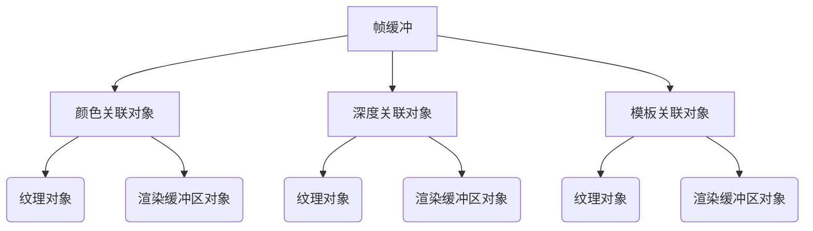
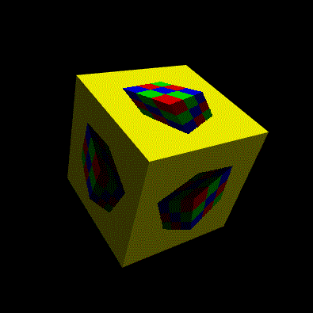
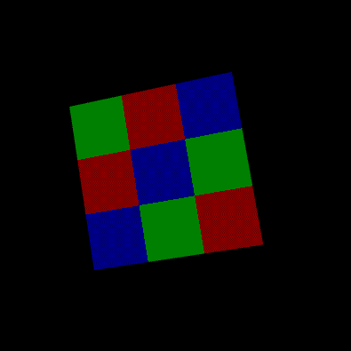
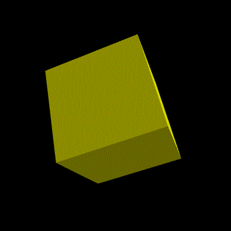

# WebGL 渲染到纹理

**[返回主目录](../readme.md)**

#### 渲染到纹理的含义
+ 在之前的笔记中, 我们都是将物体绘制到Canvas画布上
+ 设想这样一种场景, 有一张纹理, 我们将该纹理当成画布, 并在上面绘制
+ 在纹理上绘制物体, 就被称之为`渲染到纹理`
+ 在上手这部分内容的时候, 我们需要停下来, 对WebGL的一些必要概念进行了解

#### 帧缓冲(FrameBuffer)
+ 在Canvas中, WebGL提供了三个缓冲区: **颜色缓冲区**, **深度缓冲区**和**模板缓冲区**
  - **颜色缓冲区**: 保存了全部的绘制结果, 将其呈现在Canvas画布上就是最终的绘制效果
  - **深度缓冲区**: 如果开启了深度测试, 需要正确处理遮挡情况, 还会用到这个缓冲区, 深度缓冲区保存了离屏幕最近的图元的距离, 颜色缓冲区会根据这个信息, 进行`隐藏面剔除`
  - **模板缓冲区**: 暂时用不上, 先按下不表, 等需要的时候再来讨论
+ 默认的绘制流程: WebGL根据提供的顶点信息和其他信息, 通过着色器程序, 进行图元装配, 光栅化等过程后, 将绘制结果保存在`颜色缓冲区`中, 深度信息保存在`深度缓冲区`中, 并最终直接显示在Canvas上
+ **一句话描述**: WebGL在`颜色缓冲区`中绘制, 也可能用到`深度缓冲区`, 结果会直接呈现到Canvas上
***
**结论1:** WebGL在颜色缓冲区中绘制的结果会`直接`展示在Canvas上
***
+ WebGL中有一个叫做`帧缓冲`的东西, 它可以作为上述三个缓冲区的`替代品`, 也就是说, 帧缓冲中也有类似`颜色/深度/模板`缓冲区的替代品, 这使得你可以在帧缓冲中进行绘制, 就像在Canvas中绘制一样
+ 帧缓冲中绘制的结果, `并不会`直接显示到Canvas上, 你可以接管这个结果, 先做一些处理后再显示, 或者, 将结果作为纹理, 贴到其他物体上
***
**结论2:** WebGL在帧缓冲中绘制的结果`不会`展示在Canvas上, 并且可以在展示前进行操作和处理, 这种绘制也被称之为`离屏渲染`
***
+ 渲染到纹理, 其核心做法就是如下的步骤:
  - 创建一个指定大小的纹理, 该纹理记为 $A$ , 最终绘制到Canvas上
  - 创建一个帧缓冲对象, 在该对象上绘制任何东西, 假设记为 $B$
  - 将 $B$ 作为纹理, 贴到 $A$ 上
  - 最终的效果就是, Canvas中有 $A$ , $A$ 中有 $B$
  - 这就实现了`渲染到纹理`的主题, 将绘制结果, 展示在了`纹理`上
+ 这个步骤听起来不算难, 但在开始实现之前, 我们还是要进一步了解一个东西: **帧缓冲的关联对象**

#### 帧缓冲的关联对象
+ 上一点说到, 帧缓冲中也有类似`颜色/深度/模板`缓冲区的替代品, 使得可以在帧缓冲中绘制
+ 替代品就是替代品, 区别还是有的, 名称就不一样, 在帧缓冲中, 这被称为`关联对象`
+ 具体来说, 帧缓冲中有三个关联对象: **颜色关联对象**, **深度关联对象**和**模板关联对象**
  - **颜色关联对象**: 作为`颜色缓冲区`的替代品
  - **深度关联对象**: 作为`深度缓冲区`的替代品
  - **模板关联对象**: 作为`模板缓冲区`的替代品
+ 每一种关联对象又可以是两种类型的: `纹理对象`或`渲染缓冲区对象`
  - 纹理对象: 存储纹理图像
  - 渲染缓冲对象: 比纹理对象更通用一点, 可以写入更多的数据类型
+ 整个帧缓冲的关联对象的结构可以用下图表示

***
**结论:** 还记得上面的描述吗, WebGL是在`颜色缓冲区`中绘制, 并将结果呈现到Canvas上, 如果对比到帧缓冲, 那么就应该在`颜色关联对象`上绘制, 现在, 我们创建一个纹理 $A$ , 并将该纹理, 作为颜色关联对象, 绑定到帧缓冲上, 那么我们绘制的东西 $B$, 就自然而然的, 会展示在纹理 $A$ 上   

**TIPS:** 如果在纹理 $A$ 上绘制的东西, 也要考虑开启`深度测试`, 进行`隐藏面剔除`的话, 那就要记得还得用上`深度关联对象`, 这里就不需要使用纹理对象了, 可以使用`渲染缓冲区对象`
***
+ 有了这些结论, 我们现在就可以开始编码实现了

#### 渲染到纹理的步骤
+ 有了上面的结论, 这个步骤很容易写出来, 以下是实现渲染到纹理的核心步骤, 每个步骤也给出了关键的WebGL方法
+ **第1步:** 创建一个帧缓冲对象
  - 关键方法1: `gl.createFramebuffer()`, 创建帧缓冲对象
+ **第2步:** 创建一个纹理对象 $A$ , 并设置好尺寸和采样参数, 注意, 这里要使用`数据纹理`
  - 关键方法1: `gl.createTexture()`, 创建纹理 
  - 关键方法2: `gl.bindTexture()`, 绑定纹理
  - 关键方法3: `gl.texImage2D()`, 设置纹理数据
  - 关键方法4: `gl.texPamameteri()`, 设置采样参数
+ **第3步:** 创建一个渲染缓冲区对象 $B$ , 并完成绑定和设置尺寸
  - 关键方法1: `gl.createRenderBuffer()`, 创建渲染缓冲对象
  - 关键方法2: `gl.bindRenderBuffer()`, 绑定渲染缓冲对象
  - 关键方法3: `gl.renderBufferStorage()`, 设置渲染缓冲对象的参数
+ **第4步:** 将帧缓冲的颜色关联对象, 指定为纹理对象 $A$ 
  - 关键方法: `gl.framebufferTexture2D()` 将颜色关联对象设置为纹理
+ **第5步:** 将帧缓冲的深度关联对象, 指定为渲染缓冲区对象 $B$
  - 关键方法: `gl.framebufferRenderBuffer()`, 将深度关联对象设置为渲染缓冲
+ **第6步:** 检查帧缓冲对象是否正确配置
  - 关键方法: `gl.checkFramebufferStatus()`, 检测配置
+ **第7步:** 在帧缓冲中开始绘制
  - 关键方法1: `gl.bindFramebuffer()`, 绑定帧缓冲, 这样`gl.clear()`, `gl.drawArrays()`等方法就会作用在帧缓冲上
  - 关键方法2: `gl.bindTexture()`, 在不同的目标绘制时, 要注意纹理对象的绑定, 不然可能会读错纹理

#### 开始编码
+ 我们不考虑代码的组织和重构, 先实现示例
+ 示例的一些设定
  - 绘制一个立方体, 记为 $A$
  - 在 $A$ 的每个面上再绘制一个立方体, 记为 $B$
  - 在 $B$ 的每个面上使用数据纹理进行贴图
  - $A$ 和 $B$ 都在旋转
+ 一些关键的提示
  - 我们需要准备`两个`纹理, 一个是作为绘图区用的, 一个是给 $B$ 做贴图的
  - 在绘制的时候, 要注意切换绑定的纹理, 不然容易读取错误
+ 以下是源代码, 采用TypeScript编写, 我们分块来讲述
+ `第1步`: 创建帧缓冲对象, WebGL的创建总是和绑定是放在一起的
  ```TypeScript
  /**
   * 创建帧缓冲
   * @param gl 
   * @returns 
   */
  private createFrameBufferObject(gl: WebGLRenderingContext): WebGLFramebuffer {
    const frameBuffer: WebGLFramebuffer | null = gl.createFramebuffer();
    if (!frameBuffer) {
      throw new Error('Failed to create framebuffer!');
    }
    gl.bindFramebuffer(gl.FRAMEBUFFER, frameBuffer);

    return frameBuffer;
  }
  ```
+ `第2步`: 创建纹理对象, 并设置尺寸和采样参数, 我们还提供一个绑定到纹理单元并激活的方法, 后续在绘制的时候, 我们需要在不同的目标上重新绑定纹理并提供访问, 但不需要重复设置各种参数
  ```TypeScript
  /**
   * 创建数据纹理对象, 并设置尺寸和采样参数
   * @param gl 
   * @param width 纹理尺寸宽度
   * @param height 纹理尺寸高度
   * @param pixels 纹理数据
   * @returns 
   */
  private createTextureObject(
    gl: WebGLRenderingContext,
    width: number,
    height: number,
    pixels: ArrayBufferView | null
  ): WebGLTexture {
    const texture: WebGLTexture | null = gl.createTexture();
    if (!texture) {
      throw new Error('Failed to create texture!');
    }
    gl.bindTexture(gl.TEXTURE_2D, texture);
    gl.texImage2D(gl.TEXTURE_2D, 0, gl.RGBA, width, height, 0, gl.RGBA, gl.UNSIGNED_BYTE, pixels);

    gl.texParameteri(gl.TEXTURE_2D, gl.TEXTURE_MIN_FILTER, gl.NEAREST);
    gl.texParameteri(gl.TEXTURE_2D, gl.TEXTURE_MAG_FILTER, gl.NEAREST);
    gl.texParameteri(gl.TEXTURE_2D, gl.TEXTURE_WRAP_S, gl.CLAMP_TO_EDGE);
    gl.texParameteri(gl.TEXTURE_2D, gl.TEXTURE_WRAP_T, gl.CLAMP_TO_EDGE);

    return texture;
  }

  /**
   * 设置纹理, 绑定到纹理单元, 并激活纹理单元供着色器访问
   * @param gl 
   * @param program 
   * @param texture 
   * @param name 
   * @param index 
   */
  private setTextureAccess(
    gl: WebGLRenderingContext,
    program: WebGLProgram,
    texture: WebGLTexture,
    name: string,
    index: number
  ): void {
    gl.activeTexture(gl.TEXTURE0 + index);
    gl.bindTexture(gl.TEXTURE_2D, texture);

    const location: WebGLUniformLocation | null = gl.getUniformLocation(program, name);
    if (!location) {
      throw new Error('Failed to locate uniform!')
    }
    gl.uniform1i(location, index);
  }
  ```
+ `第3步`: 创建渲染缓冲区对象, 并设置尺寸参数, 这将作为深度缓冲区的替代
  ```TypeScript
  /**
   * 创建渲染缓冲区, 并设置尺寸参数等
   * @param gl 
   * @param width 渲染缓冲区的宽度 
   * @param height 渲染缓冲区的高度
   * @returns 
   */
  private createRenderBufferObject(
    gl: WebGLRenderingContext,
    width: number,
    height: number
  ): WebGLRenderbuffer {
    const renderBuffer: WebGLRenderbuffer | null = gl.createRenderbuffer();
    if(!renderBuffer) {
      throw new Error('Faled to create renderbuffer!');
    }
    gl.bindRenderbuffer(gl.RENDERBUFFER, renderBuffer);

    // gl.DEPTH_COMPONENT16 表示了这个渲染缓冲区将会替代深度缓冲区
    // 其他参数如gl.STENCIL_INDEX8和gl.RGBA4等就代表了会替代模板缓冲区或者颜色缓冲区
    gl.renderbufferStorage(gl.RENDERBUFFER, gl.DEPTH_COMPONENT16, width, height);

    return renderBuffer;
  }
  ```
+ `第4步`: 我们提供一个方法, 一并完成帧缓冲关联对象的设置, 和帧缓冲配置的检查, 关联对象设置是将帧缓冲的颜色关联对象, 设置为纹理, 将帧缓冲的深度关联对象,设置为渲染缓冲
  ```TypeScript
  /**
   * 创建帧缓冲, 并设置帧缓冲的关联对象
   * @param gl 
   * @param texture 
   * @param renderBuffer 
   * @returns 
   */
  private initFrameBuffer(
    gl: WebGLRenderingContext,
    texture: WebGLTexture,
    renderBuffer: WebGLRenderbuffer
  ): WebGLFramebuffer {

    // 创建帧缓冲
    const frameBuffer: WebGLFramebuffer = this.createFrameBufferObject(gl);

    /**
     * 将帧缓冲的颜色关联对象, 设置为纹理对象, 参数解释
     * 1. 帧缓冲对象
     * 2. 关联对象, 这里使用gl.COLOR_ATTACHMENT0表示将作为颜色关联对象
     * 3. 纹理目标, 我们都是使用gl.TEXTURE_2D纹理
     * 4. 纹理对象
     * 5, 层级, 暂时不管, 传入0即可, 猜测是给Mipmap纹理准备的
     */
    gl.framebufferTexture2D(gl.FRAMEBUFFER, gl.COLOR_ATTACHMENT0, gl.TEXTURE_2D, texture, 0);

    /**
     * 将帧缓冲的深度关联对象, 设置为渲染缓冲, 参数详解
     * 1. 帧缓冲对象
     * 2. 关联对象, 这里使用gl.DEPTH_ATTACHMENT表示将作为深度关联对象
     * 3. 渲染缓冲类型, 传入gl.RENDERBUFFER
     * 4. 渲染缓冲对象
     */
    gl.framebufferRenderbuffer(gl.FRAMEBUFFER, gl.DEPTH_ATTACHMENT, gl.RENDERBUFFER, renderBuffer);

    // 检查帧缓冲的配置项是否正确
    const sucess: number | string = gl.checkFramebufferStatus(gl.FRAMEBUFFER);
    if (sucess !== gl.FRAMEBUFFER_COMPLETE) {
      throw new Error('framebuffer is incomplete! ' + sucess.toString());
    }

    return frameBuffer;
  }
  ```
+ `第5步`: 准备立方体数据, 其实只准备一套数据即可, 因为都是立方体, 只是绘制目标不同, 唯一会有差异的是`透视投影矩阵`, 我们提前设置canvas的`宽高比`, 和帧缓冲的`宽高比`相等, 这样透视投影矩阵也是一样的了
  ```TypeScript
  /**
   * 获取绘制数据, Canvas中和帧缓冲中绘制的立方体
   * @param projection 
   * @param degree 旋转角度
   * @returns 
   */
  private getCubeRenderInformation(degree: number): RenderingInformation {
    const points: Float32Array = new Float32Array(GeometryHelper.getCubePoints(0.5));
    const texCoord: Float32Array = new Float32Array(GeometryHelper.getCubeTextureCoord());
    const normals: Float32Array = new Float32Array(GeometryHelper.getCubeNormals());
    return {
      attributes: [
        { type: AttributeDataType.Points, name: 'a_Position', data: points, count: 3, stride: 0, offset: 0 },
        { type: AttributeDataType.Normals, name: 'a_Normal', data: normals, count: 3, stride: 0, offset: 0 },
        { type: AttributeDataType.Texture, name: 'a_Tex', data: texCoord, count: 2, stride: 0, offset: 0 },
      ],
      uniforms: [
        { type: UniformDataType.Matrix4, name: 'u_Model', data: MatrixHelper.cubeRotateAnimation(degree) },
        { type: UniformDataType.Matrix4, name: 'u_View', data: MatrixHelper.setLookAt(0, 0, 3, 0, 0, -10, 0, 1, 0) },
        { type: UniformDataType.Matrix4, name: 'u_Projection', data: MatrixHelper.setPersective(45, 1, 1, 100) },
      ]
    }
  }
  ```
+ `胜利在望`: 至此我们的准备工作已经完成, 可以开始提供最终的绘制代码了, 在编码之前, 请注意两点: 1. 要借助`gl.bindFrameBuffer()`方法切换绘制目标; 2. 切换后要借助`gl.bindTexture()`处理纹理对象, 以便在正确的目标上访问到正确的纹理
+ 以下是绘制方法的实现, 注意, 在帧缓冲中绘制时, 我们给`gl.ready()`传入了 $256$ 作为宽度和高度, 这是因为我懒得再设置参数了, 本示例所创建的纹理对象和渲染缓冲, 都采用 $256$ 作为宽高, 直接写死
  ```TypeScript
  /**
   * 绘制方法
   * @param gl 上下文
   * @param program 着色器程序
   * @param frameBuffer 帧缓冲
   * @param renderInfo 绘制数据
   * @param canvasTexture 在canvas中绘制所需要的纹理对象
   * @param frameBufferTexture 在帧缓冲中绘制所需要的纹理对象
   */
  private render(
    gl: WebGLRenderingContext,
    program: WebGLProgram,
    frameBuffer: WebGLFramebuffer,
    renderInfo: RenderingInformation,
    canvasTexture: WebGLTexture,
    frameBufferTexture: WebGLTexture
  ): void {
    gl.useProgram(program);
    gl.enable(gl.DEPTH_TEST);

    // 先在帧缓冲中绘制, 绑定到创建的帧缓冲对象上
    gl.bindFramebuffer(gl.FRAMEBUFFER, frameBuffer);
    // 设置背景色, 设置视口, 并清除颜色和深度缓冲
    this.ready(gl, 256, 256, [1, 1, 0]);
    // 绑定正确的纹理
    this.setTextureAccess(gl, program, frameBufferTexture, 'u_Sampler', 0);
    // 绘制
    WebGLHelper.render(gl, program, renderInfo, gl.TRIANGLES);

    // ======================绘制目标分割线======================

    // 在canvas颜色缓冲中绘制, 通过传入null参数解绑帧缓冲
    gl.bindFramebuffer(gl.FRAMEBUFFER, null);
    // 设置背景色, 设置视口, 并清除颜色和深度缓冲
    this.ready(gl, gl.canvas.width, gl.canvas.height, [0, 0, 0]);
    // 绑定正确的纹理
    this.setTextureAccess(gl, program, canvasTexture, 'u_Sampler', 0);
    // 绘制
    WebGLHelper.render(gl, program, renderInfo, gl.TRIANGLES);
  }
  ``` 
+ 现在要做的就是, 准备好上面这个绘制方法所需要的`参数`, 然后传进去, 等待绘制结果即可, 我们使用Angular框架, 因此在`ngOnInit()`方法中完成这件事
  ```TypeScript
  /**
   * 主函数
   */
  public ngOnInit(): void {

    // 获取WebGL上下文和链接着色器程序
    const gl: WebGLRenderingContext = WebGLHelper.getWebGLContext('.cs');
    const program: WebGLProgram = WebGLHelper.linkProgram(gl, VERTEX_SHADER, FRAGMENT_SHADER);

    /**
     * 创建纹理对象, 这将作为帧缓冲的颜色关联对象, 我们设置宽度和高度均为256
     * 注意最后一个参数传入了null, 因为这个纹理会作为绘图区, 因此不需要传入纹理数据
     */
    const texture: WebGLTexture = this.createTextureObject(gl, 256, 256, null);

    /**
     * 创建渲染缓冲对象, 注意渲染缓冲对象的尺寸必须和纹理对象一致, 因此宽高都是256
     */
    const renderBuffer: WebGLRenderbuffer = this.createRenderBufferObject(gl, 256, 256);

    // 创建帧缓冲并设置关联对象
    const frameBuffer: WebGLFramebuffer = this.initFrameBuffer(gl, texture, renderBuffer);

    // 再准备一张纹理, 注意, 这个纹理是帧缓冲中绘制的立方体需要使用的贴图纹理
    // 我们创建的是一个 3X3 的类似魔方的纹理
    const frameBufferTexture: WebGLTexture = this.createTextureObject(gl, 3, 3, new Uint8Array([
      255, 0, 0, 255, 0, 255, 0, 255, 0, 0, 255, 255,
      0, 255, 0, 255, 0, 0, 255, 255, 255, 0, 0, 255,
      0, 0, 255, 255, 255, 0, 0, 255, 0, 255, 0, 255
    ]));

    // 初始旋转角度
    let angle: number = 0;

    // 定义绘制函数, 使用requestAnimationFrame实现动画
    const draw: () => void = () => {
      const renderInfo: RenderingInformation = this.createRenderInformation(angle);
      this.render(gl, program, frameBuffer, renderInfo, texture, frameBufferTexture);

      angle += 0.5;
      requestAnimationFrame(draw);
    }

    // 启动
    draw();
  }
  ```
+ 来看看最后的效果    
  
+ 效果很完美, 这里也将着色器源码附上来, 着色器源码非常简单, 仅仅只是加入了光照和纹理采样的逻辑而已
  ```TypeScript
  const VERTEX_SHADER: string = `
    attribute vec3 a_Position;
    attribute vec2 a_Tex;
    attribute vec3 a_Normal;

    varying vec2 v_Tex;
    varying vec3 v_Normal;

    uniform mat4 u_Model;
    uniform mat4 u_View;
    uniform mat4 u_Projection;

    void main() {
      v_Tex = a_Tex;
      v_Normal = mat3(u_Model) * a_Normal;
      gl_Position = u_Projection * u_View * u_Model * vec4(a_Position, 1.0);
    }
  `;
  const FRAGMENT_SHADER: string = `
    precision mediump float;

    varying vec2 v_Tex;
    varying vec3 v_Normal;

    uniform sampler2D u_Sampler;

    void main() {
      // 使用max()函数是为了不让背光面呈现为完全的黑色
      float light = max(0.4, dot(normalize(v_Normal), normalize(vec3(1.0, 1.0, 1.0))));
      gl_FragColor = vec4(texture2D(u_Sampler, v_Tex).rgb * light, 1.0);
    }
  `;
  ```

#### 总结
+ 渲染到纹理, 从逻辑上来说不算很难, 大多数也都是样板代码, 但需要明白以下的一些概念:
  ***
  - **3个缓冲区**: Canvas中有3个缓冲区, `颜色/深度/模板`缓冲区, 绘制默认是在`颜色缓冲区`中进行, 如果启用深度测试, 还会用到`深度缓冲区`, 颜色缓冲区中绘制的结果会`直接`展示在Canvas上
  ***
  - **帧缓冲**: WebGL提供的帧缓冲对象, 可以作为Canvas中3个缓冲区的替代, 具体来说, 帧缓冲有3个关联对象: `颜色/深度/模板`关联对象, 每个关联对象可以是两种类型: `纹理对象`或者`渲染缓冲对象`, 帧缓冲中绘制的结果并不会直接展示在Canvas上, 我们可以拦截/修改/任意使用绘制结果
  ***
  - **渲染到纹理**: 其实就是创建一个纹理, 将其作为帧缓冲的`颜色关联对象`, 这样就可以在里面绘制了, 由于本身是个纹理对象, 因此当然可以作为纹理`贴`到其他物体的表面, 而当绘制需要考虑深度信息时, 由于深度信息不需要用纹理来存储, 因此创建了一个渲染缓冲对象, 将其作为帧缓冲的`深度关联对象`即可
  ***
  - **绑定帧缓冲**: 在绘制时, 通过`gl.bindFramebuffer(gl.FRAMEBUFFER, frameBuffer)`, 可以将绘制目标切换到`frameBuffer`这个帧缓冲上, 这样我们的`gl.clear()`, `gl.enable()`, `gl.drawArrays()`和`gl.drawElements()`等方法, 都会作用在当前绑定的帧缓冲上, 而不是Canvas
  ***
  - **解绑帧缓冲**: 通过`gl.bindFramebuffer(gl.FRAMEBUFFER, null)`传入null参数, 可以解绑帧缓冲, 这样, 绘制目标又回到了默认环境, 即Canvas的颜色缓冲, 再调用绘制的方法, 就会作用在Canvas上了
  ***
  - **随时记得切换绑定纹理**: 不管在哪个目标上绘制, 采样器会默认读取 $0$ 号纹理单元, 如果不手动切换绑定的话, $0$ 号纹理单元中的纹理将会是你最后一个创建的纹理
  ***
+ 其实, canvas本身就是一个纹理, 我们做的任何的绘制, 都和渲染到纹理是一回事

#### 补充: 随时记得切换绑定纹理
+ 针对切换纹理绑定这个情况, 我们来做一个验证大家就明白了是怎么回事了
+ 首先, 我们注释掉`render()`方法中的设置纹理的代码
  ```TypeScript
  gl.bindFramebuffer(gl.FRAMEBUFFER, frameBuffer);
  this.ready(gl, 256, 256, [1, 1, 0]);
  // this.setTextureAccess(gl, program, frameBufferTexture, 'u_Sampler', 0);
  WebGLHelper.render(gl, program, renderInfo, gl.TRIANGLES);

  gl.bindFramebuffer(gl.FRAMEBUFFER, null);
  this.ready(gl, gl.canvas.width, gl.canvas.height, [0, 0, 0]);
  // this.setTextureAccess(gl, program, canvasTexture, 'u_Sampler', 0);
  WebGLHelper.render(gl, program, renderInfo, gl.TRIANGLES);
  ```
+ 运行代码, 将会看到如下效果    
  
+ 这是怎么回事呢? 道理很简单, 我们没有重新绑定纹理, 因此在Canvas上绘制的时候, 采样器默认去 $0$ 号纹理单元读取纹理信息
+ 仔细看上述的主函数, 即`ngOnInit()`代码, 魔方纹理是后创建的, 它使用了默认的 $0$ 号单元, 相当于把之前创建的`texture`纹理挤下线了, 因此最终的绘制效果就是使用了魔方纹理, 而不是帧缓冲
+ 我们将主函数中, 两行创建纹理的代码换个顺序, 我们先创建魔方纹理, 再创建帧缓冲纹理, 也就是说, 魔方纹理将会被挤下线, 代码如下
  ```TypeScript
  const frameBufferTexture: WebGLTexture = this.createTextureObject(gl, 3, 3, new Uint8Array([
    255, 0, 0, 255, 0, 255, 0, 255, 0, 0, 255, 255,
    0, 255, 0, 255, 0, 0, 255, 255, 255, 0, 0, 255,
    0, 0, 255, 255, 255, 0, 0, 255, 0, 255, 0, 255
  ]));

  const texture: WebGLTexture = this.createTextureObject(gl, 256, 256, null);
  ```
+ 再来运行代码, 猜想一下结果是什么? 帧缓冲纹理能够被读取到, 但是在帧缓冲中绘制的小立方体, 读取不到魔方纹理贴图, 效果如下    
  
+ 因此, 切换了绘制目标后, 一定要确保访问到正确的纹理, 通常是重新绑定纹理, 不过, 通过分配不同的纹理单元能够实现同样的效果, 可以留给大家试试
+ `创建纹理对象`, 和采样器`去纹理单元读取纹理信息`, 这是两码事, 纹理单元被挤下去了, 不代表纹理对象也没了, 别搞混淆了
****
**[返回主目录](../readme.md)**