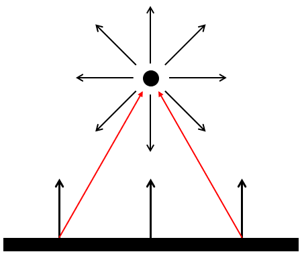
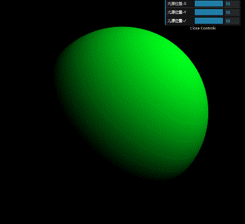
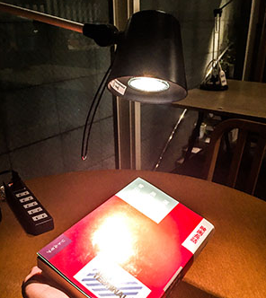
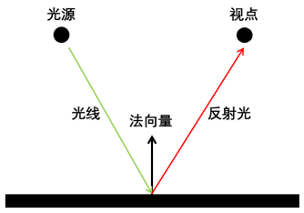
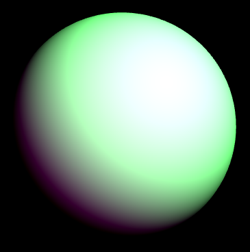
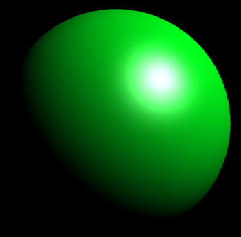
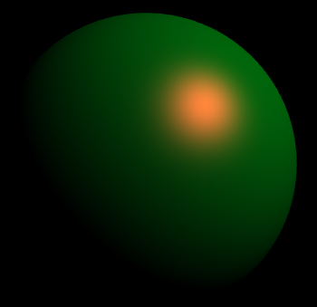

# WebGL 点光源

**[返回主目录](../readme.md)**

#### 点光源
+ 点光源被认为是从一个点出发, 向四面八方发射光线
+ 点光源的示意图如下   
  
+ 由上图可知, 点光源发出的光线, 到达每个顶点所形成的`光线方向`都与众不同
+ 除此之外, 其他的颜色计算方式, 都和平行光相同

#### 点光源的颜色计算
+ 定义点光源只需要指定一个位置, 标识了`光源位置`
+ 将所有的顶点, 和光源位置连线, 得到每个顶点的`光线向量`
+ 后续的操作, 和平行光一致, 获取`光线反方向`, 和法向量通过`点乘`获取`夹角余弦`, 再与顶点颜色相乘即可
+ 注意, 点乘前, 需要对光线反方向和法向量进行`单位化`
+ 如何获取所有的顶点呢? 答案是通过`varying`变量, 下面进行步骤详解
+ **Step1:** 顶点着色器中, 需要定义两个`varying`类型的变量, 用于接收`法向量`和`顶点数据`, 并将其传到片元着色器, 获取插值后的全部顶点和法向量
  ```glsl
  varying vec3 v_Position;
  varying vec3 v_Normal;

  void main() {
    // 顶点和法向量是一体的, 因此都要应用模型变换矩阵
    v_Position = mat3(u_MVP) * a_Position;
    v_Normal = mat3(u_MVP) * a_Normal;
  }
  ```
+ **Step2:** 片元着色器中, 将顶点和光源位置连线, 获取`光线方向`, 后续和平行光计算步骤一致, 将`光线反方向`和`法向量`单位化后, 点乘获取夹角余弦, 并和顶点颜色相乘
  ```glsl
  varying vec3 v_Normal;
  varying vec3 v_Position;

  // 光源位置
  vec3 lightPosition = vec3(10.0, 10.0, 10.0);

  // 顶点颜色
  vec3 vertexColor = vec3(0.0, 1.0, 0.11);

  void main() {
    // 计算光线方向
    vec3 lightDirection = lightPosition - v_Position;

    // 计算夹角余弦, 注意要使用光线反方向
    float c = dot(normalize(v_Normal), normalize(-lightDirection));

    // 得到最终的顶点颜色, 并赋值给gl_FragColor
    gl_FragColor = vec4(vertexColor.rgb * c, 1.0);
  }
  ```
+ 通过上述代码, 就可以添加点光源了, 如图, 更改光源位置查看效果   
  

#### 镜面高光
+ 在实际生活中, 将一束光打到物体上, 如果`反射光`刚好进入眼睛, 会有非常明亮的感觉, 这就是`镜面高光`, 如下图   
  
+ 现在我们尝试着给我们的示例中加入镜面高光
+ 第一个要考虑的问题就是, 我们如何判断顶点的反射光刚好进入眼睛?
+ 我们通过一张图片来说明, 见下图  
  
+ 看着这张图, 我们分析出以下几个结论:
  - `视点`其实就是`相机位置`
  -  入射角 = 反射角, 因此, 入射光`反`方向向量和反射光方向向量, 单位化后再相加, 其方向和法向量相同
  -  方向相同, 换成数学表达就是, 假设两个向量都是`单位向量`, 其`点乘`结果就为1
+ 根据以上结论, 我们得出了一个反射光是否进入眼睛的判断方法:
  - 假设对于某顶点
  - 首先将`顶点`和`光线位置`连线, 计算出`光线反方向`, 并单位化, 记为 $m$
  - 再将`顶点`和`视点`位置连线, 计算出一个向量, 并单位化, 记为 $n$
  - 将 $m$ 和 $n$ 向量相加, 并单位化, 记为 $vector$
  - 如果 $vector \cdot normal = 1$ , 则说明该顶点的反射光会进入眼睛
+ 以上只是数学知识的复习, 在WebGL中, 有一个更简单的处理方式:
  - 直接计算出 $vector$ 向量
  - 将 $vector$ 向量和法向量`单位化`后求出`点乘`, 即夹角余弦
  - 将该余弦值加到算完光照的颜色上 (为什么可以这样, 见下方`TIPS`)
  - 着色器代码如下:
  ```glsl
  // 光源位置
  uniform vec3 u_lightPosition;

  // 相机位置
  uniform vec3 u_cameraPosition;

  vec3 vertexColor = vec3(0.0, 1.0, 0.11);

  void main() {
    // 计算光线方向
    vec3 lightDirection = v_Position - u_lightPosition;

    // 先计算光线颜色
    float light = dot(normalize(v_Normal), normalize(-lightDirection));

    // 得到最终顶点的光照颜色
    gl_FragColor = vec4(vertexColor.rgb * light, 1.0);

    // 计算顶点到视点的向量
    vec3 vertexToCamera = u_cameraPosition - v_Position;

    // 将两个向量单位化后, 相加再单位化
    vec3 vector = normalize(normalize(vertexToCamera) + normalize(-lightDirection));

    // 计算该向量和法向量的夹角余弦
    float specular = dot(vector, normalize(v_Normal));

    // 顶点的光照颜色再加上高光颜色
    gl_FragColor.rgb += specular;
  }
  ```
+ 我们来看看效果   
  
+ 太亮了!!! 这个高光有点猛了, 不能这样!!
***
**TIPS:** 为什么可以直接将夹角余弦值直接加到最终的颜色上, 我们并没有指定高光的颜色, 按照生活常识, 高光都偏白色, 所以最亮的地方, 颜色值可以理解为是 $(1, 1, 1)$ , 余弦值最大为1, 直接加到颜色上, 颜色分量便会大于1, WebGL会处理为1, 就呈现出了白色, 而当余弦值不够大, 相加之后, 颜色分量不到1, 可能会接近1(淡白色), 或者远小于1(偏向顶点颜色), 这就是我们想要的结果
***

#### 通过求幂来降低镜面高光的亮度
+ 上面的例子中, 镜面高光太强了, 这个会晃瞎眼睛的
+ 我们可以通过求幂, 将余弦值降低, 理由呢?
  - 由于余弦值处于 $[-1, 1]$ 之间, 因此绝对值小于1, 求幂会越来越小
  - 指数级下降会让白色的高光范围快速收拢, 不会扩散的那么大
+ 在代码中需要稍作修改 (为什么要加入`if`, 下方的`TIPS`有解释)
  ```glsl
  // 计算该向量和法向量的夹角余弦
  float specular = 0.0;
  float c = dot(vector, normalize(v_Normal));
  if (c >= 0) {
    specular = pow(c, 30.0);
  }
  ```
+ 修改后的代码, 效果如下  
  
+ 这个效果就很完美
***
**FBI WARNNING:** `pow()`方法可能会出现undefined, 假设`pow(-3.0, 0.5)`, 其实就是 $\sqrt{-3}$ , 这个是无法计算的, 因此在使用`pow()`方法的地方, 一定要确保不要出现这种情况, 最好只对正值使用
***

#### 光线的颜色
+ 直到现在, 无论是平行光还是点光源, 我们都没有考虑光线的颜色, 默认是`透明`的光, 只提供了`亮度`, 其实光线也是可以有颜色的
+ 如果要将多种颜色`融合`在一起, 其实是一个很值得深入学习的内容, 怎样才能提供出最完美的效果, 并不是那么容易的
+ 但是这不是WebGL本身的内容, 因此我们只考虑最简单的实现方式: `直接相乘`
+ 我们修改一下代码, 提供光线的颜色, 也顺便提供一个镜面高光的颜色
  ```glsl
  vec3 lightColor = vec3(1.0, 0.4, 0.4);
  vec3 specularColor = vec3(1.0, 0.2, 0.2);

  gl_FragColor = vec4(vertexColor * light * lightColor, 1.0);
  // ...
  gl_FragColor.rgb += specular * specularColor;
  ```
+ 最后的效果是这样   
  
****
**[返回主目录](../readme.md)**