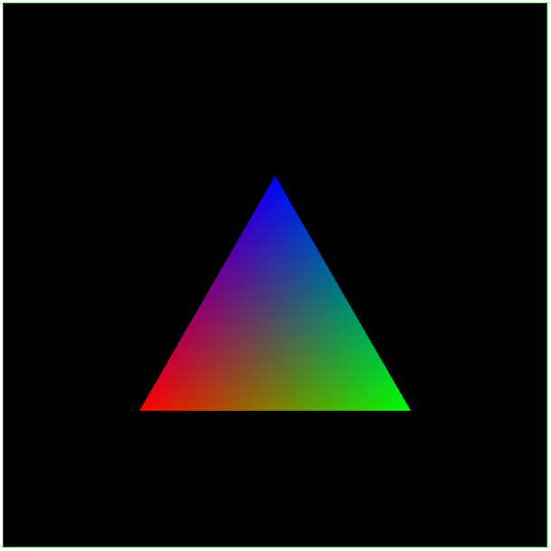

# WebGL 示例程序

**[返回主目录](../readme.md)**

本文给出了一个简单的2D WebGL示例程序, 用于引出WebGL的全面学习知识, 该示例程序包含了所有需要的代码  

**示例绘制了一个三角形, 包含注释代码, 建议从主函数`main()`开始阅读**
```HTML
<!DOCTYPE html>
<html lang="en">

<head>
    <meta charset="UTF-8">
    <meta http-equiv="X-UA-Compatible" content="IE=edge">
    <meta name="viewport" content="width=device-width, initial-scale=1.0">
    <title>WebGL示例程序</title>
    <style>
        canvas {
            border: 1px solid green;
        }
    </style>
</head>

<body>
    <canvas class="canvas" width="600" height="600"></canvas>
    <script type="text/javascript" id="x-vertex">
        // 定义顶点着色器
        const vShaderSource = `
            attribute vec3 a_position; // 用于接收顶点坐标数据
            attribute vec3 a_color; // 用于接收顶点颜色数据
            varying vec3 v_color; // varying变量用于向片元着色器传值

            void main() {
                gl_Position = vec4(a_position, 1.0); // 将顶点赋值给WebGL内置变量: gl_Position
                v_color = a_color; // 将颜色值传递给v_color, 该值将通过varying传递给片元着色器

                // 无法通过外部向varying变量传值, 因此只能再定义一个attribute变量获取值, 再传递
            }
        `;

        // 定义片元着色器
        const fShaderSource = `
            precision mediump float; // 定义片元着色器的精度

            varying vec3 v_color; // 和顶点着色器中的varying变量同名同类型, 用于接收顶点着色器中的值

            void main() {
                gl_FragColor = vec4(v_color, 1.0); // 将颜色值换递给WebGL内置变量: gl_FragColor;
            }
        `;

        // 获取canvas画布的webgl上下文
        function getWebGLRenderingContext(selector) {
            const element = document.querySelector(selector);
            if (!element || !(element.tagName.toLowerCase() === 'canvas')) {
                throw new Error('No canvas element found!');
            }
            const gl = element.getContext('webgl');
            if (!gl) {
                throw new Error('Failed to get webgl context!');
            }
            return gl;
        }

        // 将着色器源码编译为真正的WebGL着色器
        function compileShader(gl, shaderType, shaderSource) {
            // 创建着色器, 参数为类型[顶点着色器, 片元着色器]
            const shader = gl.createShader(shaderType);

            // 指定着色器源码
            gl.shaderSource(shader, shaderSource);

            // 编译着色器
            gl.compileShader(shader);

            // 获取编译结果, 判断受是否编译成功
            const success = gl.getShaderParameter(shader, gl.COMPILE_STATUS);
            if (!success) {
                throw new Error(gl.getShaderInfoLog(shader));
            }
            return shader;
        }

        // 从源码编译顶点/片元着色器, 并将着色器链接为一个WebGL程序
        function getWebGLProgram(gl, vSource, fSource) {
            const vShader = compileShader(gl, gl.VERTEX_SHADER, vSource); // 编译顶点着色器
            const fShader = compileShader(gl, gl.FRAGMENT_SHADER, fSource); // 编译片元着色器

            const program = gl.createProgram(); // 创建一个WebGL程序
            gl.attachShader(program, vShader); // 将顶点着色器附加到program
            gl.attachShader(program, fShader); // 将片元着色器附加到program
            gl.linkProgram(program); // 开始链接着色器程序

            // 获取链接结果, 判断是否链接成功
            const success = gl.getProgramParameter(program, gl.LINK_STATUS);
            if (!success) {
                throw new Error(gl.getProgramInfoLog(program));
            }
            return program;
        }

        // 向着色器中的attribute变量传递数据
        function setAttribute(gl, program, name, data, size, type, offset, stride) {
            // 创建一个WebGL缓冲
            const buffer = gl.createBuffer();

            // 将创建的缓冲绑定到指定类型的缓冲区, 这里是gl.ARRAY_BUFFER类型
            gl.bindBuffer(gl.ARRAY_BUFFER, buffer);

            // 将数据绑定到该类型的缓冲区上, gl.STATIC_DRAW表示了数据的读取使用方式之一, WebGL会根据该值进行必要的优化
            gl.bufferData(gl.ARRAY_BUFFER, data, gl.STATIC_DRAW);

            // 从program中获取attribute变量的地址, name是变量的名称
            const pointer = gl.getAttribLocation(program, name);

            // 激活该attribute变量, 让其可以从gl.ARRAY_BUFFER类型的缓冲区中读取数据
            gl.enableVertexAttribArray(pointer);

            // 给该attribute变量指定数据的读取方式
            // size: 一次读取几个数据, 顶点有3个坐标, 因此这里通常是3
            // type: 读取数据的类型, 这个取决于创建的定型数组的类型, 如gl.FLOAT
            // stride和offset指定了数据读取的偏移量和跨度, 会在其他文章中介绍
            gl.vertexAttribPointer(pointer, size, type, false, stride, offset);
        }

        // 绘制函数
        function render(gl, program, mode, count) {
            // 告诉WebGL上下文, 使用哪一个WebGL程序
            gl.useProgram(program);

            // 指定清除颜色
            gl.clearColor(0, 0, 0, 1);

            // WebGL使用指定的清除颜色清空canvas画布
            gl.clear(gl.COLOR_BUFFER_BIT);

            // WebGL使用给定的参数绘制数据
            // mode: 绘制的模式, LINES/TRIANGLES/TRIANGLES_FAN/POINTS
            // 0: 起始位置, 一般是0
            // count: 总共需要绘制多少个点
            gl.drawArrays(mode, 0, count);
        }

        // 主函数: 绘制一个顶点颜色分别为红绿蓝的等边三角形
        function main() {
            const gl = getWebGLRenderingContext('.canvas');
            const program = getWebGLProgram(gl, vShaderSource, fShaderSource);

            // 定义三角形的顶点坐标, 每个顶点都有(x, y, z)值, 因此有9个数据
            const triangleVertex = new Float32Array([
                -0.5, -0.5, 0.0,
                0.5, -0.5, 0.0,
                0.0, 0.366, 0.0
            ]);

            // 定义三角形的顶点颜色, 每个顶点颜色都有RGB分量, 因此有9个数据
            const triangleColor = new Float32Array([
                1.0, 0.0, 0.0,
                0.0, 1.0, 0.0,
                0.0, 0.0, 1.0
            ]);
            setAttribute(gl, program, 'a_position', triangleVertex, 3, gl.FLOAT, 0, 0);
            setAttribute(gl, program, 'a_color', triangleColor, 3, gl.FLOAT, 0, 0);

            render(gl, program, gl.TRIANGLES, triangleVertex.length / 3);
        }

        main();
    </script>
</body>

</html>
```

**绘制效果**  

****
**[返回主目录](../readme.md)**