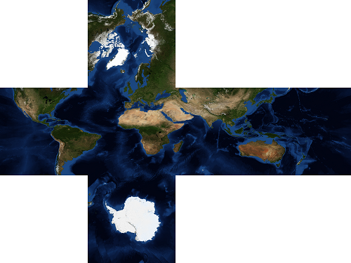
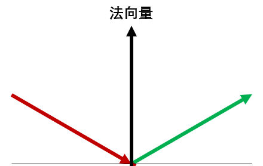
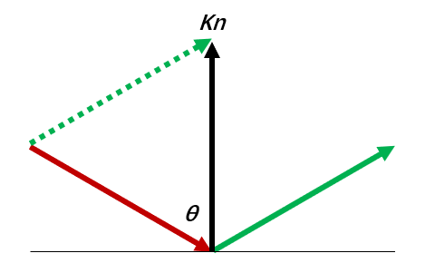
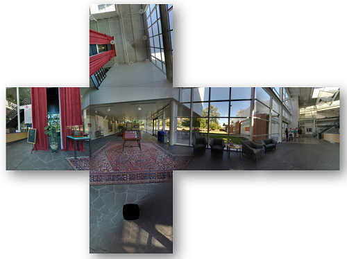
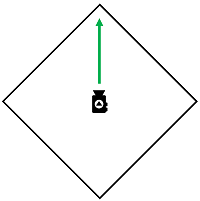
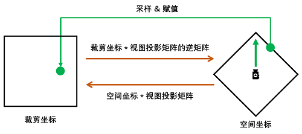
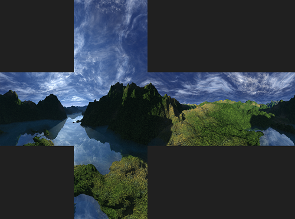
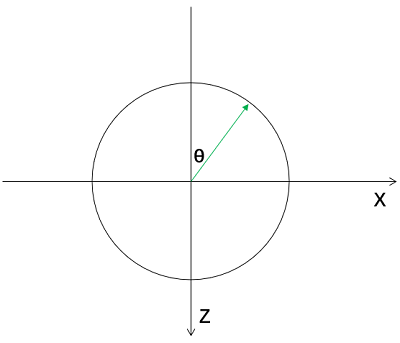
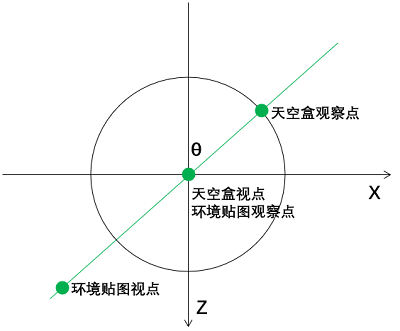

# WebGL 立方体纹理

**[返回主目录](../readme.md)**

#### 立方体纹理
+ 在之前的纹理笔记中, 我们一直在使用`TEXTURE_2D`, 即2D纹理
+ 即使是将图片贴到立方体的6个面, 也是使用`2D图集`, 来设置不同的纹理坐标
+ 立方体纹理总共保存了6张图片, 代表了立方体的六个面
+ 立方体纹理的关键参数有两个:
  - `TEXURE_CUBE_MAP`: 创建纹理时, 传入该参数表明要创建的是立方体纹理
  - `方向参数`: 使用`gl.texImage2D()`传入图片资源时, 第1个参数需要设置方向
+ 方向参数当然有6个, 因为立方体有6个面
  - `TEXTURE_CUBE_MAP_POSITIVE_X`: $+X$方向
  - `TEXTURE_CUBE_MAP_NEGATIVE_X`: $-X$方向
  - `TEXTURE_CUBE_MAP_POSITIVE_Y`: $+Y$方向
  - `TEXTURE_CUBE_MAP_NEGATIVE_Y`: $-Y$方向
  - `TEXTURE_CUBE_MAP_POSITIVE_Z`: $+Z$方向
  - `TEXTURE_CUBE_MAP_NEGATIVE_Z`: $-Z$方向
+ 立方体纹理所使用的的采样器和采样方式也需要修改:
  - `samplerCube`: 立方体纹理需要使用的采样器, 而不是`sampler2D`
  - `textureCube`: 立方体纹理需要使用的采样方法, 而不是`texture2D`
+ 除此之外, 和使用2D纹理的区别并不大, 需要注意的地方会在代码实现中讲解
  
#### 立方体纹理的代码实现
+ 和2D纹理一样, 首先需要创建纹理, 基本代码并无差异
```TypeScript
const texture: WebGLTexture = gl.createTexture();
gl.bindTexture(gl.TEXTURE_CUBE_MAP, texture);
```
+ 接下来需要绑定图片, 有6个方向, 需要调用6次`gl.texImage2D()`, 图片可以是支持的所有格式:
  - `HTMLImageElement`
  - `HTMLCanvasElement`
  - `HTMLVideoElement`
  - ...
+ 注意第1个参数, 这是前文描述的`方向`参数
```TypeScript
gl.texImage2D(gl.TEXTURE_CUBE_MAP_POSITIVE_X, 0, gl.RGBA, gl.RGBA, gl.UNSIGNED_BYTE, image1);
gl.texImage2D(gl.TEXTURE_CUBE_MAP_NEGATIVE_X, 0, gl.RGBA, gl.RGBA, gl.UNSIGNED_BYTE, image2);
gl.texImage2D(gl.TEXTURE_CUBE_MAP_POSITIVE_Y, 0, gl.RGBA, gl.RGBA, gl.UNSIGNED_BYTE, image3);
gl.texImage2D(gl.TEXTURE_CUBE_MAP_NEGATIVE_Y, 0, gl.RGBA, gl.RGBA, gl.UNSIGNED_BYTE, image4);
gl.texImage2D(gl.TEXTURE_CUBE_MAP_POSITIVE_Z, 0, gl.RGBA, gl.RGBA, gl.UNSIGNED_BYTE, image5);
gl.texImage2D(gl.TEXTURE_CUBE_MAP_NEGATIVE_Z, 0, gl.RGBA, gl.RGBA, gl.UNSIGNED_BYTE, image6);
```
***
**TIPS:** 图片的资源加载在之前的笔记已经讲述过了, 以`HTMLImageElement`为例, 需要等待其`onload()`方法
***
+ 最后就是设置采样参数了, 对于立方体纹理来说, 采样参数不多, 简要设置一下
```TypeScript
// 生成Minmap纹理, 根据情况载入最合适的纹理, 注意, 纹理必须是2的n次方大小
gl.generateMipmap(gl.TEXTURE_CUBE_MAP);

gl.texParameteri(gl.TEXTURE_CUBE_MAP, gl.TEXTURE_MIN_FILTER, gl.LINEAR_MIPMAP_LINEAR);
gl.texParameteri(gl.TEXTURE_CUBE_MAP, gl.TEXTURE_MAG_FILTER, gl.LINEAR_MIPMAP_LINEAR);
```
+ 接下来编写着色器, 我们不再使用纹理坐标, 而是将顶点坐标传入(为什么?)
```TypeScript
export const VSHADER = `
    attribute vec3 a_position;
    uniform mat4 u_model;
    uniform mat4 u_view;
    uniform mat4 u_projection;
    varying vec3 v_position;
    void main() {
        gl_Position = u_projection * u_view * u_model * vec4(a_position, 1.0);
        v_position = normalize(a_position);
    }
`;

export const FSHADER = `
    precision mediump float;
    varying vec3 v_position;
    uniform samplerCube u_sampler;
    void main() {
        gl_FragColor = textureCube(u_sampler, normalize(v_position));
    }
`;
```
+ 上述代码大部分都没有什么特别的, 顶点坐标, 矩阵, 包括新增的`samplerCube`采样器和`textureCube()`采样方法, 也已经讲述过了
+ 重点需要关注两行代码, 两个着色器中各有一行
```GLSL
// 顶点着色器
v_normal = normalize(a_position);

// 片元着色器
gl_FragColor = textureCube(u_sampler, normalize(v_position));
```
+ 直接将顶点坐标传入, 采样器会根据坐标的范围, 确定该点应该使用哪个纹理, 并从该张纹理上抽取纹素
***
**TIPS1:** 立方体的边长是4, 中心点在原点, 以$(1, 1, 2)$这个点为例, 很明显$z$分量最大, 可以判断该点位于正前方的面, 因此会使用`gl.TEXTURE_CUBE_MAP_POSITIVE_Z`关联的图片  

**TIPS2:** 确定了点和纹理的归属, 则需要开始采样, 使用$+Z$的纹理, 就需要$x, y$坐标采样, 因此代码中使用了`normalize()`方法, 将其归一化到纹理坐标范围, 再开始采样
***
+ 完成以上代码后, 就可以看到立方体纹理的效果图   
  
+ 顶点着色器中, 我们使用`v_normal = normalize(a_position);`来传递顶点数据, 你可能会奇怪, 为什么不用`gl_Position`的值?
  - `gl_Position`的值每次绘制都会变化, 因为模型矩阵在变化
  - 我们需要立方体每个面`始终`都是某张图, 因而传递`原始`顶点坐标
***
**TIPS:** 给立方体6个面贴上纹理贴图, 最合适的办法还是使用`2D图集`, 将6张图片放到一张图片上, 设置纹理坐标访问, 立方体纹理的用途, 更多的是被用在一些炫酷的场景, 比如`环境贴图`, 或者`天空盒`
***
+ `环境贴图`和`天空盒`都会使用到一种特殊的立方体纹理, 即6张纹理组成的立方体, 各个边都可以`完美的衔接`, 即图像能够刚好拼接到一起, 就像全景图一样, 我们将上面的这个例子中的立方体纹理换成这种纹理
+ 我在网站上找到一张`地球`的立方体纹理, 长这样, 可以利用你的空间想象能力, 想象一下, 当它组成一个立方体的时候, 每个边都可以刚好衔接   
  
+ 用Photoshop的切片工具切成6张图像, 并传进纹理, 记住, 要确保大小是$2^n$, 然后我们将立方体的顶点数据, 修改为`球体`, 就会得到这样一个效果   
  
***
**TIPS:** 是的, 你没看错, 立方体纹理不一定要用在立方体的顶点数据上, 球体也行, 甚至你可以试试其他的形状
***

#### 环境贴图(反射)
+ 试想这样一种情况: 将一个立方体, 放在一个`大厅`的正中央
+ 现在从任意一个角度, 观察这个立方体, 我们希望立方体的表面, 能够`反射`出对应的6个面的环境
+ 即我们可以从立方体的6个面, 看到大厅的`上, 下, 左, 右, 前, 后`的场景
+ 这样的效果, 就被称之为`环境贴图`, 即`反射`

#### 环境贴图的准备工作
+ 要实现环境贴图, 基本的代码和上述的立方体纹理示例代码并无太大差异
+ 为了实现反射的效果, 我们需要加入立方体表面的`法向量`, 这里涉及到一点数学知识
+ 加入法向量的描述过程如下, 针对立方体表面的某点:
  - 从视点观察该点, 这里可以得到一条`视线向量`, 我们将其记为`in`
  - 该点具有一个`法向量`, 我们将其记为`n`
  - 有了视线向量和法向量, 我们可以计算出`反射向量`, 将其记为`out`
  - 反射向量`out`就是我们最终要用来进行立方体纹理采样的坐标
  - 这样就实现了, 我们从立方体表面, 观察四周的效果(反射)
+ 这个过程如下图:   
  
+ 我们最终将使用绿色箭头表示的反射向量, 作为`采样坐标`
+ 一个数学问题产生了, 已知视线向量和法向量, 如何求解反射向量?
+ 即已知`in`和`n`, 求解`out`
+ 以下简述一下计算过程, 参考上图, 将视线向量(红色)记为`in`, 将反射向量(绿色)记为`out`, 法向量记为`n`:
  - 将`in`反向, 很容易得知, $-in + out$的结果和$n$共向, 长度未知
  - 假设: $-in + out = k n$, 现在的问题即是如何求解$k$
  - 将向量平移一下, 构成一个三角形, 参考下图, 假设$in$和$n$的夹角为$\theta$   
  
  - 根据正弦定理, 马上可以列出一个公式:
$$\frac{|kn|}{sin(180-2\theta)}=\frac{|out|}{sin\theta}$$
  - 由于WebGL中会单位化, 因此`in`, `out`和`n`的长度都可以简化为1
  - 变换一下公式, 可以简化为$k=2cos\theta$
  - 看到余弦值, 立马想到夹角余弦, 将$cos\theta$改写为向量点乘:
$$cos\theta=\frac{-in \cdot n}{|in||n|}=-in \cdot n$$
  - 一定要注意是$-in$, 这样就可以得出反射向量的求解公式
$$out = in - 2 \cdot (in \cdot n) \cdot n $$
+ WebGL中的`reflect(in, n)`内置方法, 实现了该功能, 传参需单位化
  
#### 环境贴图代码实现
+ 首先需要找到6张合适的图片, 这6张图片能够反映出上下左右前后6个方向
+ 为了效果完美, 6张图片最好能够在衔接处完美`无缝衔接`
+ 懒得找, 直接使用例子, 这是加州计算机历史博物馆的图   
  
+ TypeScript基本代码都无需变化, 只是需要传递法向量数据给着色器
```TypeScript
const normal = new Float32Array(this.geometry.getCubeNormals());
this.webgl.setAttribute(gl, program, 'a_normal', normal, 3, 0, 0);
```
+ 接下来是着色器, 先看顶点着色器, 省略部分无变化的代码, 注意注释的部分
```TypeScript
export const VSHADER = `
    attribute vec3 a_normal;
    varying vec3 v_normal;
    varying vec3 v_position;
    void main() {
        // 法向量会随着模型矩阵而变化, 这在光照的笔记中就讲述过了
        v_normal = mat3(u_model) * a_normal;
        // 反射内容只和模型矩阵有关, 反射内容是会变的, 这和上例不同
        v_position = mat3(u_model) * a_position;
    }
`;
```
+ 再看片元着色器
```TypeScript
export const FSHADER = `
    varying vec3 v_normal;
    varying vec3 v_position;
    void main() {
        // 单位化法向量
        vec3 normal = normalize(v_normal);
        // 入射向量, 即视线向量, 单位化
        vec3 in = normalize(v_position - vec3(0.0, 0.0, 10.0));
        // 计算反射向量
        vec3 out = reflect(in, normal);
        // 采样
        gl_FragColor = textureCube(u_sampler, normalize(out));
    }
`;
```
+ 其他的代码基本不需要变化, 直接运行, 效果如下:    
  
+ **小补充:** 上面提到过, 立方体纹理也可以用在球体上
```TypeScript
const points = new Float32Array(this.geometry.getSpherePoints([0, 0, 0], 2));

// 球体的法向量可以用顶点坐标来代替
const normal = points;
```
+ 来看看效果, 除了旋转不能识别到, 也还挺酷的:   
  

#### 天空盒
+ 立方体纹理第二个实际的用途, 就是实现`天空盒`
+ 试想我们站在某点, 望向四面八方, 看到的是连续不断的景物变化
+ 如果用一个立方体代表四周, 而我们在立方体的`正中央`看向6个面, 然后再将立方体纹理贴到6个面上, 就可以实现这样一个效果, 这个立方体就叫`天空盒`
***
**TIPS:** 天空盒和上一节的环境贴图区别是什么?
- `环境贴图`: 立方体的6个面更像是6面`镜子`, 视点在`立方体外`某处, 观察立方体的6个面`反射`出来的周围的物体
- `天空盒`: 立方体的6个面就代表了周围, 而视点在立方体`正中央`, 观察6个面上的物体
- 它们有一个共同点: 所使用的立方体纹理, 应该是`无缝衔接`的 
***

#### 天空盒的准备工作
+ 最简单的方法, 是直接创建一个立方体, 将立方体纹理贴上去, 然后将视点放在中心, 但这样有个问题: 观察棱角处, 会很突兀   
  
+ 就像上图一样, 你会觉得棱角处要比平面处`更远`, 这明显不符合真实世界的感受, 看向同样的地方, 应该是同样的效果
+ 鉴于此, 我们决定换一种方式来实现天空盒效果, 我们将始终使用一个`平面`, 来代表视线所能看到的矩形, 并想办法贴上纹理
+ 整体的过程可以描述如下:
  - 使用一个平面, 代表视线观测到的`矩形`
  - 想办法确定这个矩形上每个像素点的立方体纹理坐标
  - 根据坐标, 在立方体纹理中采样, 并赋值给`gl_FragColor`
+ 问题的难点在第二步: 确定矩形上每个像素点的纹理坐标
+ 这里需要使用逆向思维, 我们来逐步剖析这个过程
  - 假设有立方体, 其空间坐标为$P$, 每个面都贴上了纹理, 视点在正中央, 观察任意方向
  - 我们会用视图投影矩阵, 将空间坐标转换为$[-1, 1]$范围内的裁剪坐标, 这是已知的知识
  - $P_{clip}$表示裁剪坐标, 这个过程用公式表示为:
$$P_{clip} = (View \cdot Projection) \cdot P$$
  - 重头戏来了, 我们将两边乘以$(View \cdot Projection)$的逆矩阵, 则公式变为:
$$(View \cdot Projection)^{-1} \cdot P_{clip} = P$$
  - 我们将裁剪空间的坐标, 乘以视图投影矩阵的逆矩阵, 即可得到其原始的空间坐标!
  - 这有什么用呢? `原始空间坐标, 就是立方体纹理的采样坐标!` 用下图可以描述出这个过程  
  
  - 这样, 可以将立方体纹理上的纹素, 赋值给一个矩形的像素, 就规避了观测棱角带来的问题
+ 因此, 绘制天空盒, 只需要遵循以下几个步骤:
  - 直接创建一个$[-1, 1]$的矩形, 当然也可以比这个范围小, 使用$[-1, 1]$可以`充满`整个画布, 更具有观赏性
  - 该矩形的坐标直接赋值给`gl_Position`, 作为其最终的裁剪坐标
  - 定义视图投影矩阵, 并求解其逆矩阵, 通过和裁剪坐标相乘, `逆向`得到相对应的立方体`空间坐标`
  - 将该空间坐标作为采样坐标, 采样并赋值给`gl_FragColor`

#### 天空盒的代码实现
+ 这次我们换一个立方体纹理图, 看起来更好看   
  
+ 将其切为6张图片, 创建立方体纹理并传入, 注意每张图片的方位, 弄错了就不好看了
+ 接下来是顶点着色器, 非常简单, 阅读注释即可
```TypeScript
export const SKYBOX_V_SHADER = `
  attribute vec3 a_position;  // 顶点坐标
  uniform mat4 u_inverseVP;   // 视图投影矩阵的逆矩阵
  varying vec4 v_position;    // varying变量, 传入片元着色器
  void main() {

    // a_position就是[-1, 1]的矩形, 因此直接作为裁剪坐标
    gl_Position = vec4(a_position, 1.0);

    // 将矩阵和裁剪坐标相乘, 得到空间坐标, 传入片元着色器
    v_position = u_inverseVP * vec4(a_position, 1.0);
  }
`;
```
+ 然后是片元着色器, 也不复杂, 阅读注释即可
```TypeScript
export const SKYBOX_F_SHADER = `
  precision mediump float;
  varying vec4 v_position;
  uniform samplerCube u_sampler;
  void main() {

    // 采样
    gl_FragColor = textureCube(u_sampler, normalize(v_position.xyz));
  }
`;
```
+ 最后是TypeScript代码, 只关注一点, 就是`a_position`
```TypeScript
// 创建[-1, 1]的矩形, 传递给a_position
const points = new Float32Array([
  -1, -1, -1,  1, -1, -1,  1,  1, -1,
   1,  1, -1, -1,  1, -1, -1, -1, -1
]);
```
+ 加入动画: 为了证明代码是正确的, 我们让`视点`永远在原点, 但`目标点`绕着$Y$轴旋转, 以此来模拟`原地转圈观察周围`的效果
+ 这涉及到三角函数, 示意图如下, 半径为1:   
  
```TypeScript
let degree: number = 0;
const render = () => {
  const r = degree * Math.PI / 180;
  const cos = Math.cos(r);
  const sin = Math.sin(r);
  const view = this.matrix.setLookAt(0, 0, 0, sin, 0, -cos, 0, 1, 0);

  // ...绘制代码

  degree += 0.5;
  requestAnimationFrame(render);
}
```
+ 最后我们就可以看到天空盒的效果了   
  

#### 天空盒和环境贴图一同上镜
+ 我们试着将环境贴图和天空盒一起展示出来
+ 首先要明确几点, 这里再次提醒一下:
  - `环境贴图`: 观察点在原点, 视点从任意处指向观察点
  - `天空盒`: 视点在原点, 观察点在距离为1的圆环上
  - 为了在动画中二者和谐统一, 二者的视点和观察点需要满足如下的示意图, 并一起绕Y轴旋转, 我们在距离原点距离为2的地方定义环境贴图的视点   
  
+ 我们需要两对着色器, 分别绘制, 着色器的代码都在上述示例中, 无需修改, 直接拿来用即可
+ 需要创建两个着色器程序, 使用`gl.useProgram()`分别初始化数据和绘制
+ 需要注意的几个点, 非常重要:
  - 需要关闭全局的`深度测试`, 因为环境贴图视点的距离为2, 比天空盒远, 深度测试开启后, 会看不到环境贴图立方体
  - 绘制环境贴图的立方体的时候, 需要开启深度测试, 不然立方体就会看起来怪怪的, 这样看起来就和上面这点矛盾了?
  - 因此整体的处理流程是, 关闭深度测试-->绘制天空盒-->开启深度测试-->绘制环境贴图立方体
  - 一定要避免在中途调用`gl.clear()`, 避免绘制下一个的时候, 清楚了上一个的绘制结果
+ 这里贴上关键的一些代码, 注意两个视图矩阵的视点和观察点, 以及深度测试的开启和关闭: 
```TypeScript
// 省略了所有设置attribute和uniform的代码, 以及部分矩阵和数据的定义
const render = () => {
  this.webgl.ready(gl, skyBoxProgram);
  const u_view_skybox = this.matrix.setLookAt(0, 0, 0, sin, 0, -cos, 0, 1, 0);
  gl.disable(gl.DEPTH_TEST);
  this.webgl.draw(gl, points.length / 3, gl.TRIANGLES);

  this.webgl.ready(gl, cubeProgram);
  gl.enable(gl.DEPTH_TEST);
  const u_view_cube = this.matrix.setLookAt(-2 * sin, 0, 2 * cos, 0, 0, 0, 0, 1, 0);
  this.webgl.draw(gl, cubePoints.length / 3, gl.TRIANGLES);
      
  degree += 0.3;
  requestAnimationFrame(render);
}
render();
```
+ 这是效果   
  
+ 这是球体的演示效果   
  
***
**TIPS:** Google搜索`Cube Mapping`主题, 可以找到很多立方体纹理下载
***

#### 结束语
+ 立方体纹理并非用来给立方体的6个面贴图的, 这种效果最好的办法依然是使用2D图集
+ 立方体纹理, 主要是在`环境贴图`和`天空盒`两个方面发挥作用, 这也是3D游戏, 以及一些炫酷效果实现的有力方法

**[返回主目录](../readme.md)**
