# WebGL 纹理

**[返回主目录](../readme.md)**

#### 三种坐标系
+ WebGL纹理需要区分三种坐标系, `WebGL坐标系`, `纹理坐标系`以及`图像坐标系`
+ WebGL坐标系就不再重复讲述了, 以下是纹理坐标系和图像坐标系的区别  
  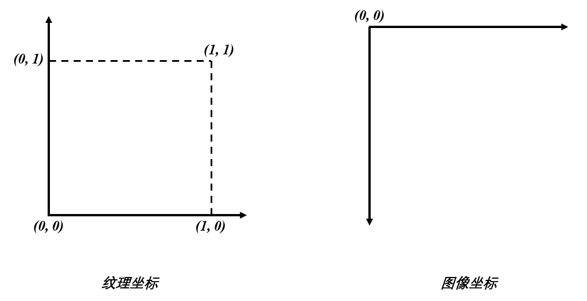
+ 需要注意以下两点:
  - 纹理坐标系的原点在`左下角`, 无论使用的纹理有多大, 纹理坐标的范围永远都是 $[0, 1]$
  - 图像坐标原点在`左上角`, 没有范围限制, 取决于图像大小, 单位是`像素`
+ 因此后续在使用纹理的时候, 要注意不同的坐标系之间的转换, 否则会影响采样的结果

#### 图像纹理
+ WebGL可以使用很多纹理, 图像, 视频, 甚至DOM, 本篇笔记将从图像纹理作为入口, 讲解WebGL纹理的使用
+ WebGL使用纹理大致上可分为如下几个步骤:
  1. 准备好要使用的图像, 可以是HTML支持的所有格式的图像
  2. 定义好`顶点坐标`和`纹理坐标`的映射关系
  3. 创建`纹理对象`, 绑定到`纹理单元`, 并载入图像
  4. 定义采样器, 配置采样参数, 采样器将从纹理单元绑定的图像按照纹理坐标采取像素
  5. 将采取的像素值赋值给`gl_FragColor`变量
+ 接下来我们将一步一步完成纹理的使用
+ **准备图像:** 使用JavaScript内置的`Image`对象来创建图像, 并使用`src`属性获取图像资源
  ```JavaScript
    const image = new Image();
    image.src = './xxx.png';
  ```
+ **定义顶点坐标和纹理坐标的映射关系:** 纹理最终是要绘制到顶点所构成的图形上, 以矩形为例, 将图片放置到四个顶点构成的矩形中, 必须要指定4个顶点和4个纹理坐标点如何一一对应, 如下图
  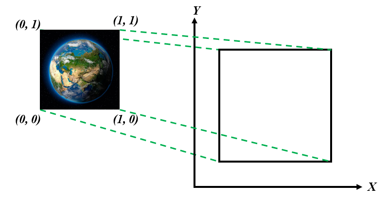
+ 因此我们需要定义这种映射关系, 使用如下代码, 为了方便, 我们将数据放在同一个`ArrayBuffer`中, 前面两个值代表了顶点坐标的 $x, y$ , 后面两个值代表了该顶点对应的纹理坐标
  ```JavaScript
  const vertex_and_texture_coord = new Float32Array([
    -0.5, -0.5, 0.0, 0.0,
     0.5, -0.5, 1.0, 0.0,
     0.5,  0.5, 1.0, 1.0,
    -0.5,  0.5, 0.0, 1.0
  ]);
  ```
+ 有了数据, 就需要将数据传入顶点着色器, 因此, 顶点着色器中至少有两个`attribute`变量用于接收数据
  ```glsl
  attribute vec2 a_vertexPosition;
  attribute vec2 a_texturePosition;
  ```
+ **创建纹理对象 & 激活纹理单元:** 创建纹理对象, 并将其绑定到`纹理目标`上, WebGL支持两种纹理目标: `2D图像纹理`和`立方体纹理`, 目前我们使用图像, 因此使用2D纹理, 但是绑定前目标前, 我们必须先激活纹理单元
  ```JavaScript
  const texture = gl.createTexture();
  gl.activateTexture(gl.TEXTURE0);
  gl.bindTexture(gl.TEXTURE_2D, texture);
  ```
***
**TIPS1:** WebGL在不同的平台所支持的纹理单元个数不同, 但至少都有8个纹理单元, 分别用`gl.TEXTURE0`, `gl.TEXTURE1`, ..., `gl.TEXTURE7`表示  

**TIPS2:** 上面这样代码可以这样理解: 激活0号纹理单元, 并将绑定了`gl.TEXTURE_2D`类型的纹理对象放置其中, 等待载入图像以及采样器访问  
  
**TIPS3:** 如果只有一个纹理, 默认会自动使用0号纹理单元, 但如果程序需要使用多个纹理, 则一定要遵循`创建纹理对象`, `激活纹理单元`, `绑定纹理目标`的顺序
***
+ **定义和使用采样器:** 我们需要在片元着色器中定义采样器, 并按照纹理坐标对图像进行采样, 并将像素值赋给`gl_FragColor`变量
  ```glsl
  precision medium float;
  uniform sampler2D u_Sampler;
  void main() {
    gl_FragColor = texture2D(u_Sampler, texture_coord);
  }
  ```
+ 上述代码有两个问题: 
  1. `texture_coord`是什么? 
  2. 采样器`u_Sampler`如何知道该访问哪个纹理单元?
+ **问题1答案:** `texture_coord`其实就是纹理坐标, 但问题是, 我们只向`顶点着色器`中传入了4个点的纹理坐标, 难道采样器只采4个点的坐标吗? 当然不是, 这里就需要借助`varying`变量了, 前面的笔记说过, `varying`变量是顶点着色器向片元着色器传递值的, 而且传递的是`插值`之后的值, 因此, 完整的着色器代码如下:
  ```glsl
  // 顶点着色器
  attribute vec2 a_vertexPosition;
  attribute vec2 a_texturePosition;
  varying vec2 v_texturePosition;

  void main() {
    gl_Position = vec4(a_vertexPosition, 0.0, 1.0);
    v_texturePosition = a_texturePosition;
  }

  // 片元着色器
  precision medium float;
  uniform sampler2D u_Sampler;
  varying vec2 v_texturePosition;

  void main() {
    gl_FragColor = texture2D(u_Sampler, v_texturePosition);
  }
  ```
***
**TIPS:** 经过`varying`的传值, 片元着色器中的`v_texturePosition`就是四个纹理坐标点, 经过`插值`之后的坐标点了, 采样器就可以根据这些点, 逐个采取像素值, 并赋给`gl_FragColor`变量了
***
+ **问题2答案:** 默认情况下, 着色器全局变量默认值为0, 也就是说, `u_Sampler`会默认访问`0号纹理单元`中绑定的图像, 但是为了清晰明了, 我们仍然可以显示的将0号纹理单元赋值给`u_Sampler`变量, 就采用uniform变量传值的方式
  ```JavaScript
  const location = gl.getUniformLocation(program, 'u_Sampler');
  gl.uniform1i(location, 0);
  ```
***
**TIPS:** 上面的代码中, 我们手动使用`gl.activeTexture(gl.TEXTURE0);`激活了0号纹理单元, 其实创建纹理对象后, 如果不显示激活, WebGL也会默认激活0号纹理单元, 在仅使用一个纹理单元的情况下, 这些代码都可以省略, 但如果要使用多个纹理单元, 这些代码就必须显示的指定
***
+ **绑定图像:** 别忘了, 我们只是创建了纹理对象, 并将其绑定到`gl.TEXTURE_2D`目标, 还放置到了0号纹理单元中, 但是我们还没有将实际的图像资源载入进去, 采样器还无法访问到, 以下代码将图像信息传给纹理对象, 采样器通过纹理单元即可访问到
  ```JavaScript
  gl.texImage2D(gl.TEXTURE_2D, 0, gl.RGBA, gl.RGBA, gl.UNSIGNED_BYTE, image)
  ```
***
**TIPS:** `gl.texImage2D()`的参数
| 参数  |                        释义                         |
| :---: | :-------------------------------------------------: |
| 参数1 |    纹理目标, 可用值是`gl.TEXTURE_2D`和立方体纹理    |
| 参数2 | 该参数为`Mip映射`准备, 暂不涉及, 固定传入`0`即可 |
| 参数3 |     图像内部格式, 因为是PNG, 因此使用`gl.RGBA`      |
| 参数4 |           纹理使用的格式, 必须和参数3一致           |
| 参数5 |     纹理数据的类型, RGBA使用`UNSIGNED_BYTE`存储     |
| 参数6 |   `src`有值的`Image`对象, 即包含图像的`Image`对象   |
***
+ **配置采样参数:** 至此, 我们已经准备好了顶点坐标, 纹理坐标, 采样器, 也创建了纹理对象和激活了纹理单元, 并将图像载入, 采样器好像已经可以开始采样了, 那么, 采样器会如何采样呢? 其实, 我们还需要指定`采样参数`, 即告诉采样器, 按照何种规则采样, 见如下代码
  ```JavaScript
  // 翻转Y轴, 为什么要翻转, 上面已经解释了, 坐标系的区别
  gl.pixelStorei(gl.UNPACK_FLIP_Y_WEBGL, 1);
  gl.texParameteri(gl.TEXTURE_2D, gl.TEXTURE_MIN_FILTER, gl.LINEAR);
  gl.texParameteri(gl.TEXTURE_2D, gl.TEXTURE_MAG_FILTER, gl.LINEAR);
  gl.texParameteri(gl.TEXTURE_2D, gl.TEXTURE_WRAP_S, gl.REPEAT);
  gl.texParameteri(gl.TEXTURE_2D, gl.TEXTURE_WRAP_T, gl.REPEAT);
  ```
***
**`gl.pixelStorei()`方法:** 该方法是一个通用方法, 用于配置一系列属性值, 第一个参数是要配置的属性, 第二个参数是该属性的值, 可接受的属性和属性值见下表
|                属性                 |      含义      |    可用的属性值     |
| :---------------------------------: | :------------: | :-----------------: |
|      `gl.UNPACK_FLIP_Y_WEBGL`       |  翻转 $Y$ 轴   | `1`(启用)/`0`(禁用) |
| `gl.UNPACK_PREMULTIPLY_ALPHA_WEBGL` | RGB分量都乘以A | `1`(启用)/`0`(禁用) |
    
**`gl.texParameteri()`方法:** 该方法也是通用方法, 第一个参数是纹理目标, 第二个参数是要配置的属性, 第三个参数是该属性的值, 可接受的属性和属性值见下表
|          属性           |              含义              | 可用的属性值 |
| :---------------------: | :----------------------------: | :----------: |
| `gl.TEXTURE_MIN_FILTER` | 纹理大于顶点范围, 指定如何缩小 |    见下表    |
| `gl.TEXTURE_MAG_FILTER` | 纹理小于顶点范围, 指定如何放大 |    见下表    |
|   `gl.TEXTURE_WRAP_S`   |        纹理水平填充方法        |    见下表    |
|   `gl.TEXTURE_WRAP_T`   |        纹理垂直填充方法        |    见下表    |

| `gl.TEXTURE_MIN_FILTER`和`gl.TEXTURE_MAG_FILTER`可接受的值 |          含义           |
| :--------------------------------------------------------: | :---------------------: |
|                        `gl.LINEAR`                         | 使用最近4个像素加权计算  |
|                        `gl.NEAREST`                        | 使用离采样点最近的像素 |

| `gl.TEXTURE_WRAP_S`和`gl.TEXTURE_WRAP_T`可接受的值 |         含义         |
| :------------------------------------------------: | :------------------: |
|                    `gl.REPEAT`                     |   平铺式的重复纹理   |
|                `gl.MIRRORED_REPEAT`                | 镜像对称式的重复纹理 |
|                 `gl.CLAMP_TO_EDGE`                 | 使用纹理图像的边缘值 |
***
+ **最后需要注意的一点:** `image.src`是异步加载图像的, 因此绘制代码, 和载入图像的代码一定要确保图像获取完毕之后才能执行, 这里使用`onload`方法, 将绘制代码放到其中
  ```JavaScript
  image.src = './xxx.png';
  image.onload = () => {
    // 创建纹理对象, 绑定纹理, 载入图像, 配置采样参数
    // 绘制
  }
  ```
+ 我们现在已经配置完毕, 这里准备了两张图片, 一起来看看效果吧  
  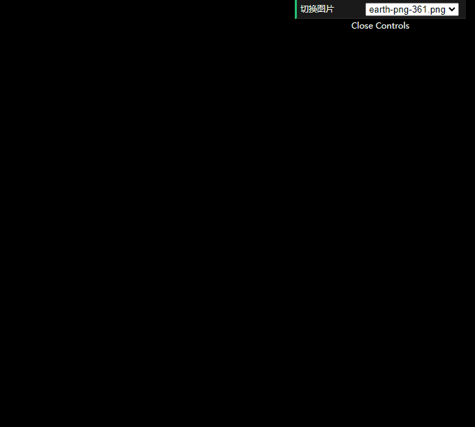
***
**出了问题:** 我们准备了两张图片, 一张是512 * 512的, 一张是361 * 361, 但361分辨率的图像并不能绘制出来, 原因是, WebGL纹理默认只支持 $2^n$ 大小的图片, 即图像的宽和高, 都必须是2的指数(并不一定是正方形)
***

#### 任意大小的纹理
+ WebGL并不是没有办法处理非 $2^n$ 大小的图像, 但有一定的限制
+ 其限制是:
  1. 不能使用`Mip`映射贴图, 这个后面会讲到
  2. 唯一的重复模式只能是`gl.CLAMP_TO_EDGE`
+ 也就是说, 我们必须要修改一下采样器的参数配置, 如下:
  ```JavaScript
  gl.pixelStorei(gl.UNPACK_FLIP_Y_WEBGL, 1);
  gl.texParameteri(gl.TEXTURE_2D, gl.TEXTURE_MIN_FILTER, gl.LINEAR);
  gl.texParameteri(gl.TEXTURE_2D, gl.TEXTURE_MAG_FILTER, gl.LINEAR);

  // gl.texParameteri(gl.TEXTURE_2D, gl.TEXTURE_WRAP_S, gl.REPEAT);
  // gl.texParameteri(gl.TEXTURE_2D, gl.TEXTURE_WRAP_T, gl.REPEAT);

  gl.texParameteri(gl.TEXTURE_2D, gl.TEXTURE_WRAP_S, gl.CLAMP_TO_EDGE);
  gl.texParameteri(gl.TEXTURE_2D, gl.TEXTURE_WRAP_T, gl.CLAMP_TO_EDGE);
  ```
+ 我们将`gl.TEXTURE_WRAP_S`和`gl.TEXTURE_WRAP_S`的值都改为`gl.CLAMP_TO_EDGE`
+ 再来看看效果   
  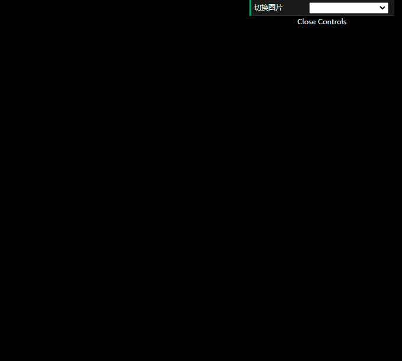
+ 完美!

#### 使用多个纹理
+ 在有些时候, 一张纹理图片是不够用的, 比如想给立方体的6个面贴上不同的图片
+ 和使用一张纹理图片相同, 唯一需要注意的是, 我们必须分开给每张纹理重复使用`创建对象`, `绑定目标`, `激活纹理单元`, `设置采样参数`这几个步骤
+ 当然, 我们也需要定义两个`采样器`, 因为采样器只能从一个纹理单元中采样
+ 而若非特别情况的使用, 顶点坐标和纹理坐标都不需要额外的定义, 因为纹理坐标始终都是 $[0, 1]$ 的范围
+ 以下是着色器的样板代码
```glsl
precision mediump float;
varying vec2 v_Tex;
uniform sampler2D u_Sampler0;
uniform sampler2D u_Sampler1;
void main() {
  vec2 color0 = texture2D(u_Sampler0, v_Tex);
  vec2 color1 = texture2D(u_Sampler1, v_Tex);
  gl_FragColor = color0 * color1;
}
```
***
**TIPS:** 代码将两种颜色相乘的结果赋给了`gl_FragColor`, 但其实你也可以用任何你想要的处理方式, 这些内容已经超过了WebGL本身, 只是必须要注意的是, 颜色的RGB分量都必须在 $[0, 1]$ 之间
***
+ 定义一个专门帮忙初始化纹理的样板函数, 可以针对多个纹理进行处理
```JavaScript
/**
 * 设置纹理
 * @param {WebGLRenderingContext} gl 
 * @param {WebGLProgram} program 
 * @param {string} name 采样器的名称
 * @param {HTMLImageElement} image 图像
 * @param {number} index 序号, 以此来激活相应的纹理单元
 */
function initTextureConfig(gl, program, name, index, image) {
    const texture = gl.createTexture();
    gl.activeTexture(gl.TEXTURE0 + index);
    gl.bindTexture(gl.TEXTURE_2D, texture);

    gl.pixelStorei(gl.UNPACK_FLIP_Y_WEBGL, 1);
    gl.texParameteri(gl.TEXTURE_2D, gl.TEXTURE_MIN_FILTER, gl.LINEAR);
    gl.texParameteri(gl.TEXTURE_2D, gl.TEXTURE_MAG_FILTER, gl.LINEAR);
    gl.texParameteri(gl.TEXTURE_2D, gl.TEXTURE_WRAP_S, gl.CLAMP_TO_EDGE);
    gl.texParameteri(gl.TEXTURE_2D, gl.TEXTURE_WRAP_T, gl.CLAMP_TO_EDGE);

    gl.texImage2D(gl.TEXTURE_2D, 0, gl.RGBA, gl.RGBA, gl.UNSIGNED_BYTE, image);

    const pointer = gl.getUniformLocation(program, name);
    gl.uniform1i(pointer, index);
}
```

+ 我们用两张图片来进行测试, 两张图片如下所示   
  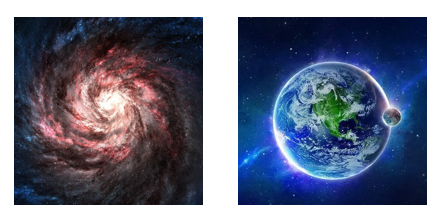
+ 使用上述代码将两张图片采样并绘制出来之后, 效果如下图  
  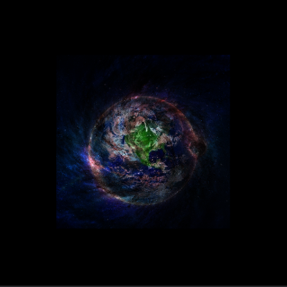


#### Mipmap纹理映射(仅作了解)
+ 上面讲到过, 当纹理的大小和顶点坐标的大小并不相等时, 我们可以设置`gl.TEXTURE_MIN_FILTER`和`gl.TEXTURE_MAG_FILTER`的相应属性值, 来调节纹理放大或缩小的方式
+ 当时我们只讲述了两种属性值: `gl.LINEAR`和`gl.NEAREST`, 表示利用周围点加权计算或直接使用最近的点作为最终像素值
+ 这种方式存在两方面的问题:
  1. 当纹理很小, 顶点区域很大时, 纹理需要放大, `gl.NEAREST`采用最近点作为像素值, 这会导致`块状效应`, 因为很多点可能都是同一个像素值, 而`gl.LINEAR`不会产生块状效应, 但会有`模糊效应`
  2. 反过来, 纹理大但顶点区域小, 纹理需要缩小, `gl.NEAREST`和`gl.LINEAR`容易产生`锯齿效应`
  3. **总结:** 本身顶点区域在真实程序中不可能一直确定, 这导致了纹理在放大或缩小上, 或多或少会遇到一些问题, 因此, 单纯的使用一张纹理, 效果并不好
+ 所以我们希望, 在不同的时候, 我们可以提供同一张纹理图片`不同的尺寸`, 以便于更好的提供视觉效果
+ `Mip纹理映射`就提供了这种解决方案
+ 即是假设有一张纹理图片A, 现在再提供一张纹理图片B, B只有A的一半大小, 继续提供C, 只有B的一半大小, 一直提供, 直到最后一张纹理的大小为 $1 \times 1$ 为止, 这一系列图片除了大小, 其余都完全相同, 这就叫`Mip纹理映射`   
  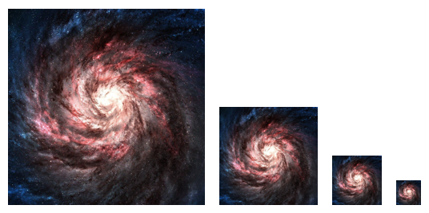
+ **如何生成Mip映射纹理**
  1. **WebGL自动生成:** 当我们创建纹理对象, 并且激活相应的纹理单元, 再将图像绑定到纹理单元后, 我们只需要执行一行代码, 即可快速的生成Mip映射纹理
  ```JavaScript
  gl.generateMipmap(gl.TEXTURE_2D);
  ```
  2. 有些时候, 不同分辨率的图片, 可能会有额外的要求, 不一定非要完全相同, 因此自动生成不满足这种情况, 我们可以利用图像编辑工具, 手动生成一系列不同分辨率的图像, 再调用如下方法来绑定
  ```JavaScript
  gl.texImage2D(gl.TEXTURE_2D, 0, gl.RGBA, gl.RGBA, gl.UNSIGNED_BYTE, image0);
  gl.texImage2D(gl.TEXTURE_2D, 1, gl.RGBA, gl.RGBA, gl.UNSIGNED_BYTE, image1);
  gl.texImage2D(gl.TEXTURE_2D, 2, gl.RGBA, gl.RGBA, gl.UNSIGNED_BYTE, image2);
  ...
  gl.texImage2D(gl.TEXTURE_2D, n, gl.RGBA, gl.RGBA, gl.UNSIGNED_BYTE, imagen);
  ```
***
**TIPS:** 为了使用Mip纹理映射, 初始纹理的大小必须满足 $2^n$ , 即宽度和高度都必须是2的指数, 但宽度和高度可以不相等, 即初始纹理可以不是正方形
***
+ **基于Mip纹理映射的放大缩小方法:**
  1. 首先, `gl.LINEAR`和`gl.NEAREST`也是可以用的, 作用不变, 分别是使用周边纹理颜色加权计算, 和直接使用最近的纹理颜色作为最终的颜色, 除此之外, 还有4种属性值
  2. `gl.LINEAR_MIPMAP_LINEAR`: 使用两个最近的Mip映射纹理, 分别使用`LINEAR`方法计算颜色值, 得到两个中间结果, 再对中间结果插值得到最终结果
  3. `gl.LINEAR_MIPMAP_NEAREST`: 直接使用最近的Mip映射纹理, 并在此纹理上使用`LINEAR`方法计算颜色值, 作为最终结果
  4. `gl.NEAREST_MIPMAP_NEAREST`: 直接使用最近的Mip映射纹理, 使用`NEAREST`计算得出最终结果
  5. `gl.NEAREST_MIPMAP_LINEAR`: 使用两个最近的Mip映射纹理, 使用`NEAREST`计算得出两个中间结果, 并对中间结果插值计算得到最终结果
+ **辅助记忆:** 4种和Mip映射相关的属性值, 都满`gl.A_MIPMAP_B`的形式, 且A和B都有`LINEAR`和`NEAREST`两种:
  1. `A`表示的是, 在Mip映射纹理中, 直接使用最近值或者使用加权计算
  2. `B`表示的是, 使用`一个`最近的Mip映射纹理, 或者使用`两个`最近的
***
**TIPS1:** `gl.LINEAR_MIPMAP_LINEAR`由于使用了三次插值计算, 也被称作`三线性插值`(或三线性过滤), 其质量是最好的, 但开销也是最大的  
  
**TIPS2:** 怎么正确理解纹理和顶点范围谁大谁小? 很简单, 最终绘制到屏幕上的空间范围要比图像的实际分辨率还要大, 则纹理会放大, 反之亦然, 比如最终绘制到屏幕上的顶点范围占据了 $1000 \times 1000$ 的像素范围, 但图片的原始分辨率是 $2000 \times 2000$ , 则图像会缩小
***

#### 纹理包装
+ 纹理的坐标范围是 $[0, 1]$ , 且 $(0, 0)$ 位于左下角, 这个在上面的笔记已经讲过了, 给出的示例, 顶点和纹理坐标的映射关系中, 纹理坐标也都是使用的 $(0, 0)$ , $(0, 1)$ , $(1, 1)$ , $(1, 0)$ 四个点\
+ 其实我们可以将纹理坐标定义在 $[0, 1]$ 范围之外, 比如, 将顶点和纹理的坐标映射定义成如下形式:
  ```JavaScript
  const VERTEX_AND_TEXTURE_COORD = new Float32Array([
    -0.8, -0.8, -2, -2,
     0.8, -0.8,  2, -2,
     0.8,  0.8,  2,  2,
    -0.8,  0.8, -2,  2
  ]);
  ```
+ 在这种情况下, WebGL最终会绘制出什么样的结果呢, 我们先用分辨率为 $512 \times 512$ 的图片看看效果   
  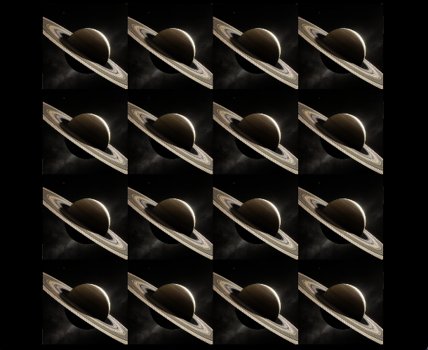
+ 纹理被平铺了! 这是因为原有的纹理坐标范围只有1, 现在变成了4, 宽高都扩大了4倍, WebGL使用默认的处理方式, 即依次平铺
+ 除了默认的方式以外, 还有其他的方式可以自定义处理这种情况吗? 
+ WebGL提供了三种纹理的平铺方式, 我们在上面的例子中已经见过了, 就是`gl.TEXTURE_WRAP_S`和`gl.TEXTURE_WRAP_T`的三个可用的属性值
  1. `gl.REPEAT`: 这是默认的方式, 即直接平铺
  2. `gl.MIRRORED_REPEAT`: 这是镜像反转平铺, 即默认的 $[0, 1]$ 范围正常显示, 它的上下左右范围则反转图像, 且一直递归下去, 效果如下   
   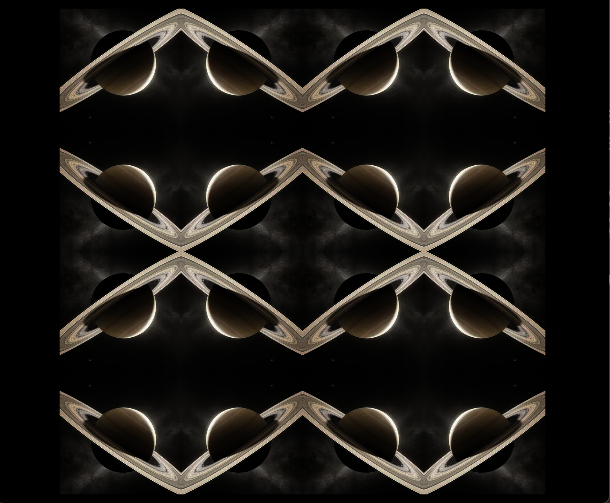
  3. `gl.CLAMP_TO_EDGE`, 超出 $[0, 1]$ 范围的空间都用最接近的边界上的点采样得到, 效果如下   
   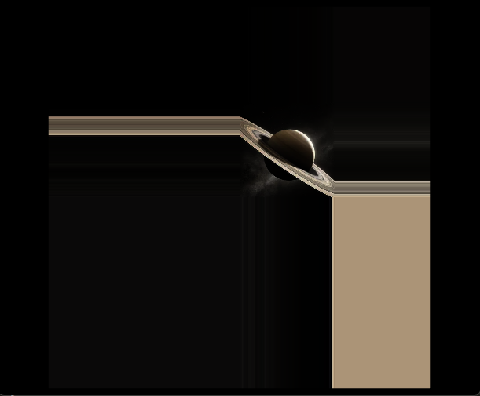
***
**TIPS:** 再次强调一点, WebGL纹理如果要处理非 $2^n$ 宽高的图像, `gl.CLAMP_TO_EDGE`是唯一能使用的平铺方式, 包括`gl.TEXTURE_WRAP_S`和`gl.TEXTURE_WRAP_T`, 即你需要显示的写出如下两行代码
```JavaScript
gl.texParameteri(gl.TEXTURE_2D, gl.TEXTURE_WRAP_S, gl.CLAMP_TO_EDGE);
gl.texParameteri(gl.TEXTURE_2D, gl.TEXTURE_WRAP_T, gl.CLAMP_TO_EDGE);
```
***

#### 示例: 将纹理贴在立方体的六个面上
+ 这个示例绘制了一个立方体, 并将纹理贴在了六个面上
+ 动画: 使用`requestAnimationFrame`, 在每次请求关键帧时更新绘制
+ 动画描述: 初始旋转角度`degree`为0, 每次更新动画, 都让视图绕`X`轴旋转`degree`度, 绕`Y`轴旋转`degree * 0.7`度, 绕`Z`轴旋转`degree * 0.3`度, 并将degree自增1, 即`degree = degree + 1`
+ **说明:** 将纹理绘制在立方体的6个面, 这和`立方体纹理`不是一回事   
  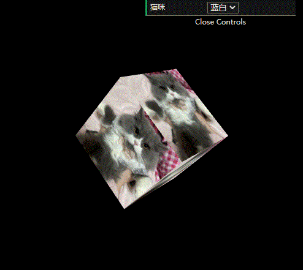
  
#### 数据纹理
+ 纹理并不一定要图片, 也可以使用JavaScript直接创建一张指定宽高的纹理, 并指定每个像素的颜色值
+ 创建好了之后, 需要使用`gl.texImage2D()`方法传入, 其他的代码和图片纹理一致

#### JavaScript支持的数据纹理(WebGL1)
+ 图片有很多种格式, `RGB`或者`RGBA`等, 同理, 使用JavaScript可以创建这些格式的数据纹理
+ 以下是WebGL1支持的格式
  |格式|数据类型|通道数|每个像素占用的字节数|
  |:-:|:-:|:-:|:-:|
  |RGBA|UNSIGNED_BYTE|4|4|
  |RGBA|UNSIGNED_SHORT_4_4_4_4|4|2|
  |RGBA|UNSIGNED_SHORT_5_5_5_1|4|2|
  |RGB|UNSIGNED_BYTE|3|3|
  |RGB|UNSIGNED_SHORT_5_6_5|2|2|
  |LUMINANCE_ALPHA|UNSIGNED_BYTE|2|2|
  |LUMINANCE|UNSIGNED_BYTE|1|1|
  |ALPHA|UNSIGNED_BYTE|1|1|
+ 注意: JavaScript无法直接创建指定格式的纹理, 只能创建`定型数组`
+ 格式解析则是交给`gl.texImage2D()`方法的`格式参数`来指定
+ 首先来看一下`gl.texImage2D()`方法, 该方法被重载了两次, 分别用于`图片纹理`和`数据纹理`, 以下是重载声明
  ```TypeScript
  // 用于数据纹理
  texImage2D(target, level, internalformat, width, height, border, format, type, pixels);
  // 用于图片纹理
  texImage2D(target, level, internalformat, format, type, source);
  ```

#### 创建数据纹理
+ 上文说过, JavaScript无法直接创建指定格式的纹理, 但可以创建符合要求的`定型数组`
+ 以上表的第一个`RGBA`格式为例, 假设我们要创建一个 $3 \times 3$ 大小的数据纹理, 那么该纹理总共有9个像素, 每个像素有4个通道, 每个通道都是`UNSIGNED_BYTE`类型
+ 因此使用JavaScript代码可以以如下方式创建
  ```TypeScript
  const dataTexture: Uint8Array = new Uint8Array([
    // 第1个像素, 4通道, 分别是R, G, B, A
    255, 0, 0, 255,
    // 第2个像素, 4通道, 分别是R, G, B, A
    0, 255, 0, 255,
    // 第3个像素, 4通道, 分别是R, G, B, A
    0, 0, 255, 255,
    // 第4个像素, 4通道, 分别是R, G, B, A
    0, 255, 0, 255,
    // 第5个像素, 4通道, 分别是R, G, B, A
    0, 0, 255, 255,
    // 第6个像素, 4通道, 分别是R, G, B, A
    255, 0, 0, 255,
    // 第7个像素, 4通道, 分别是R, G, B, A
    0, 0, 255, 255,
    // 第8个像素, 4通道, 分别是R, G, B, A
    255, 0, 0, 255,
    // 第9个像素, 4通道, 分别是R, G, B, A
    0, 255, 0, 255
  ]);
  ```
+ 定义好了数据后, 需要将其传入`gl.texImage2D()`方法, WebGL会根据传入的`width`, `height`, 以及`internalformat`参数, 来读取数据, 并使用
  ```TypeScript
  gl.texImage2D(gl.TEXTURE_2D, 0, gl.RGBA, 3, 3, 0, gl.RGBA, gl.UNSIGNED_BYTE, dataTexture);
  ```
+ 其他的代码基本上一致, 设置采样器, 创建绑定纹理, 配置采样参数等
  ```TypeScript
  const F_SHADER = `
    precision mediump float;
    varying vec2 v_Texcoord;
    uniform sampler2D u_Sampler;
    void main() {
        gl_FragColor = texture2D(u_Sampler, v_Texcoord);
    }
  `;

  const texture = gl.createTexture();
  gl.activeTexture(gl.TEXTURE0);
  gl.bindTexture(gl.TEXTURE_2D, texture);
  gl.texImage2D(gl.TEXTURE_2D, 0, gl.RGBA, 3, 3, 0, gl.RGBA, gl.UNSIGNED_BYTE, dataTexture);

  // 注意我们使用NEAREST来设置缩放, 这会有成块的效果
  gl.texParameteri(gl.TEXTURE_2D, gl.TEXTURE_MIN_FILTER, gl.NEAREST);
  gl.texParameteri(gl.TEXTURE_2D, gl.TEXTURE_MAG_FILTER, gl.NEAREST);
  gl.texParameteri(gl.TEXTURE_2D, gl.TEXTURE_WRAP_S, gl.CLAMP_TO_EDGE);
  gl.texParameteri(gl.TEXTURE_2D, gl.TEXTURE_WRAP_T, gl.CLAMP_TO_EDGE);

  // 采样器传值
  this.setUniformInt(gl, program, 'u_Sampler', 0);
  ```
+ 来看看最终的效果   
  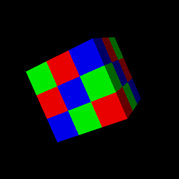

#### 数据纹理的坑
+ 我们现在来创建一个`gl.LUMINANCE`格式的数据纹理, `gl.LUMINANCE`用于创建`亮度/黑白`风格的纹理
+ `gl.LUMINANCE`格式, 每个像素只有单通道, 每个通道是`UNSIGNED_BYTE`类型, WebGL会将单通道的值同时赋值给RGB分量
+ 我们同样创建一个 $3 \times 3$ 大小的数据, 很明显, 定型数组定义如下:
  ```TypeScript
  const dataTexture: Uint8Array = new Uint8Array([
    // 第1个像素, 1通道
    0,
    // 第2个像素, 1通道
    64,
    // 第3个像素, 1通道
    128,
    // 第4个像素, 1通道
    64,
    // 第5个像素, 1通道
    128,
    // 第6个像素, 1通道
    0,
    // 第7个像素, 1通道
    128,
    // 第8个像素, 1通道
    0,
    // 第9个像素, 1通道
    64
  ]);
  ```
+ 传值代码也需要修改一下
  ```TypeScript
  gl.texImage2D(gl.TEXTURE_2D, 0, gl.LUMINANCE, 3, 3, 0, gl.LUMINANCE, gl.UNSIGNED_BYTE, dataTexture);
  ```
+ 其他代码保持不变, 来看看效果, ...啥也没有, 纹理消失了   
  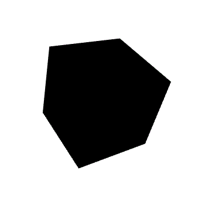
+ 如果你按`F12`打开控制台, 你会发现WebGL抛出了一条警告信息
  ```cmd
  WebGL: INVALID_OPERATION: texImage2D: ArrayBufferView not big enough for request
  ```
+ 这个是WebGL的原因, 简单来说, WebGL采用了默认的模糊设定, WebGL认为一次读取4个字节, 要比逐字节读取快, 因此WebGL会尝试每次都读取4个字节
+ WebGL第一次读取4个, 第二次读取4个, 第三个`期望`读取4个, 但我们只有`9`个像素, 因此第三次实际只能读取到1个, WebGL由此抛出警告信息, 认为我们的数据`不够充足`
+ 解决办法就是, 强制告诉WebGL, 一次读取一个字节, 逐字节处理, 不要搞默认设定那一套了, 以下是解决办法
  ```TypeScript
  // 传值
  gl.texImage2D(...);

  // 就这行代码, 放在这里, 告诉WebGL逐字节处理
  gl.pixelStorei(gl.UNPACK_ALIGNMENT, 1);

  // 设置采样参数
  gl.texParameteri(...)
  ```
+ 友情提示, 我们又学到了`gl.pixelStorei()`方法的新配置参数, 在纹理的笔记中, 我们已经介绍了这个方法了, 用的最多的是图片纹理中的`翻转Y轴`
+ 言归正传, 加入这个设置之后, 再来看看效果    
  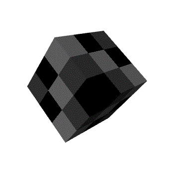

#### 数据纹理总结
数据纹理本身比较简单, 但也是一定要掌握的基础, 它是后续复杂技术的基石

****
**[返回主目录](../readme.md)**
