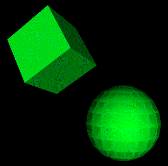

# WebGL 绘制多个物体

**[返回主目录](../readme.md)**

#### 传统方法
+ 我们可以将所有物体的顶点数据放在一起, 传递给着色器程序然后一起绘制出来
+ 但这样有不足的地方, 举个例子, 我现在要绘制一个立方体和一个球体, 但是我希望他们有`不同的动画模式`
+ 比如, 立方体在绕三个轴旋转, 而球体只绕 $Y$ 轴旋转, 应该如何实现?
+ 这里就不作展开, 直接进入今天的主题

#### 着色器程序
+ 通常在绘制时, 我们遵循的步骤是获取WebGL上下文`gl`, 和通过着色器源码创建着色器程序`program`
+ 而数据的传入, 赋值, 如`attribute`, `uniform`等, 都是在`program`中获取位置并传递数据
+ 最后通过`gl.useProgram(program)`来使用该程序并绘制
+ 因此, 要绘制多个物体的方法, 就有两种:
  - 第1种: `使用不同的program`
  - 第2种: `使用不同的数据`
  - 不管哪一种, 都要多次调用绘制方法
+ 以上面的例子为例, 我们分别给出两种方法的伪代码表示
+ **1. 使用不同的program**: 可以分别为立方体和球体创建不同的着色器程序, 再使用`gl.useProgram()`分别调用两个程序, 最终绘制出来, 伪代码 (部分) 可能像这样
  ```JavaScript
  // 立方体的着色器程序
  const cubeProgram = WebGLHelper.linkProgram(gl, V_SOURCE, F_SOURCE);

  // 球体的着色器程序
  const sphereProgram = WebGLHelper.linkProgram(gl, V_SOURCE, F_SOURCE);

  // 绘制
  function render(gl, program) {
    // 核心代码
    gl.useProgram(program);

    // ...
    gl.drawArrays(...);
  }

  // 设置数据
  setAttributeUniformDataCube();
  render(gl, cubeProgram);

  // 设置数据
  setAttributeUniformDataSphere();
  render(gl, sphereProgram);
  ```
+ **2. 使用不同的数据**: 在大部分情况下, 其实着色器源代码可以是同一套, 仅仅只是attribute/uniform变量的数据不同而已, 没有必要创建两个着色器, 传入不同的数据即可, 伪代码表示如下:
  ```JavaScript
  // 着色器程序
  const program = WebGLHelper.linkProgram(gl, V_SOURCE, F_SOURCE);

  gl.useProgram(program);

  // 绘制
  function render(gl, program) {
    // ...
    gl.drawArrays(...);
  }

  // 设置数据
  setAttributeUniformDataCube();
  render(gl, cubeProgram);

  // 设置数据
  setAttributeUniformDataSphere();
  render(gl, sphereProgram);
  ```
***
**TIPS:** 其实两种方法没啥区别, 不管是一个program还是多个program, 都要多次绘制, 并且绘制前都需要分别传入各自的数据, 唯一需要注意的是`gl.clear(gl.COLOR_BUFFER_BIT | gl.DEPTH_BUFFER_BIT)`的使用, 一定要写对地方, 不要后一个绘制的时候, 清除了前一个
***

#### 示例的程序
+ 我们来实现上方的立方体和球体的绘制
+ 立方体绕三个轴旋转, 而球体仅绕 $Y$ 轴旋转
+ 效果如下, 为了明显一点, 我们加入了全局的平行光  
   

#### 源代码
+ 源代码略去了视图矩阵和几何体数据的设置代码, 这些并不是最重要的
+ 主体代码如下
  ```JavaScript
  const gl = WebGLHelper.getWebGLContext('#cs');
  let degree = 0;

  // 创建着色器程序
  const pProgram = WebGLHelper.linkProgram(gl, V_SOURCE, F_SOURCE);

  gl.useProgram(program);

  // 设置立方体的顶点, 法向量和模型矩阵数据, 这里只设置平移, 旋转需要在每次绘制前重新更新
  const cubePoints = new Float32Array(GeometryHelper.getCubePoints(0.5));
  const cubeNormals = new Float32Array(GeometryHelper.getCubeNormals());
  const cubeTranslate = MatrixHelper.setTranslate(-0.5, 0.5, 0.0);

  // 设置球体的顶点, 法向量和模型矩阵数据, 这里只设置平移, 旋转需要在每次绘制前重新更新
  const spherePoints = new Float32Array(GeometryHelper.getSpherePoints(0.7));
  const sphereNormals = spherePoints; // 球体法向量和其顶点坐标一致
  const sphereTranslate = MatrixHelper.setTranslate(0.8, -0.8, 0.0);

  // 绘制
  const render = () => {
    WebGLHelper.ready(gl);

    // 每次绘制前要更新立方体的模型矩阵, 这里只需要更新旋转即可
    const cubeRotateX = MatrixHelper.setRotateX(degree);
    const cubeRotateY = MatrixHelper.setRotateY(degree * 0.7);
    const cubeRotateZ = MatrixHelper.setRotateZ(degree * 0.3);
    const cubeModel = MatrixHelper.multiply(cubeRotateX, cubeRotateY, cubeRotateZ, cubeTranslate);

    // 每次绘制前要更新球体的模型矩阵, 这里也只需要更新旋转即可
    const sphereRotateY = MatrixHelper.setRotateY(degree);
    const sphereModel = MatrixHelper.multiply(sphereRotateY, sphereTranslate);

    // 分别绘制
    WebGLHelper.render(gl, cubeProgram, cubePoints, cubeNormals, cubeModel, gl.TRIANGLES);
    WebGLHelper.render(gl, sphereProgram, spherePoints, sphereNormals, sphereModel, gl.TRIANGLE_FAN);

    degree += 0.8;
    requestAnimationFrame(render);
  };

  render();
  ```
****
**[返回主目录](../readme.md)**
