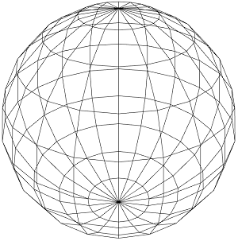
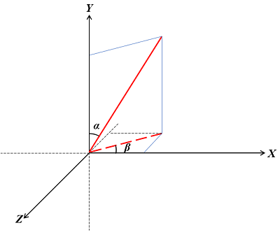
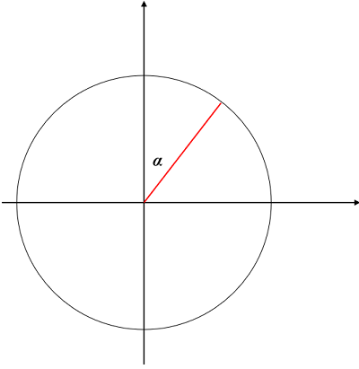
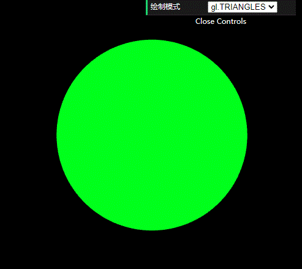

# WebGL 绘制球体

**[返回主目录](../readme.md)**

#### 原理介绍
+ 使用经纬度原理, 将球体表面用经纬线划分为多个矩形
+ 求出矩形四个顶点的坐标, 并绘制出两个三角形
+ 循环绘制, 直至所有的矩形全部绘制完成
+ 如图所示  
  
+ 经纬线拆分的越多, 表面就越接近于球体

#### 求解图示
  
+ 如上图, `红线实线`是球体上一点和坐标原点的连线, 假设球体上该点, 是第`m`条纬线, 和第`n`条经线的交点
+ 假设红色实线和 $Y$ 轴的夹角是 $\alpha$
+ `红色虚线`是实线在 $XOZ$ 平面的投影, 假设虚线和 $X$ 轴的夹角为 $\beta$
+ 假设球体半径为 $r$ , 很容易得出, $x, y, z$ 坐标分别为:
  $$
  x = r * sin\alpha * cos\beta , \quad
  y = r * cos\alpha , \quad
  z = r * sin\alpha * sin\beta
  $$
+ 现在的问题是, 如何求出 $\alpha$ 和 $\beta$
+ 如下图  
   
+ 由于该点是从上到下第`m`条纬线(从0开始), 因可以通过比例来求出 $\alpha$ , 假设总共有`count`条纬线, 则有公式:
  $$\alpha = (m \div count) \times \pi $$
+ 很明显, 该条线在 $XOZ$ 面的投影的长度就是 $R \times sin\alpha$
+ 现在来求 $\beta$ , $\beta$ 其实就是两条经线所在面的夹角, 由于该点位于第`n`条经线, 因此, 用比例求出夹角, 假设总共有`count`条经线, 则有公式:
  $$\beta = (n \div count) \times 2\pi$$
+ 现在就可以开始利用循环来生成坐标了, 下面给出代码

#### 代码实现
```JavaScript
// 经线数量
const LONGITUDE = 20;

// 纬线数量
const LATITUDE = 10;

const GeometryHelper = {
    /**
     * 获取第w条纬线和第j条经线交点的x, y, z坐标
     * @param {number} r 球体半径
     * @param {number} w 纬线的索引
     * @param {number} j 经线的索引
     */
    getCoordinate(r, w, j) {
        // 角度要转成弧度制
        const angleLatitude = (w / LATITUDE) * Math.PI;
        const angleLongitude = (j / LONGITUDE) * 2 * Math.PI;

        const x = r * Math.sin(angleLatitude) * Math.cos(angleLongitude);
        const y = r * Math.cos(angleLatitude);
        const z = r * Math.sin(angleLatitude) * Math.sin(angleLongitude);

        return [x, y, z];
    },

    /**
     * 生成球体的坐标
     * @param {number} r 球体半径
     */
    getSpherePoints(r) {
        // 保存坐标
        const points = [];
        for (let w = 0; w < LONGITUDE; w++) {
            for (let j = 0; j < LATITUDE; j++) {
                // 前三个点
                points.push(...this.getCoordinate(r, w, j));
                points.push(...this.getCoordinate(r, w + 1, j));
                points.push(...this.getCoordinate(r, w + 1, j + 1));

                // 后三个点
                points.push(...this.getCoordinate(r, w + 1, j + 1));
                points.push(...this.getCoordinate(r, w, j + 1));
                points.push(...this.getCoordinate(r, w, j));
            }
        }

        return points;
    }
}
```

#### 效果(利用50条纬线, 和100条经线生成)   

****
**[返回主目录](../readme.md)**