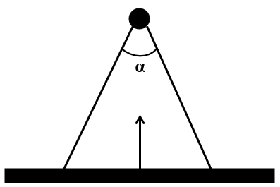
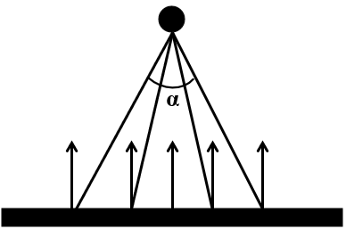
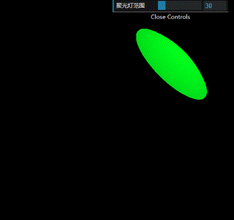
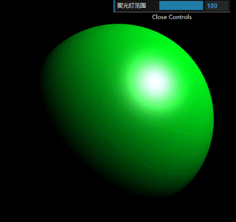
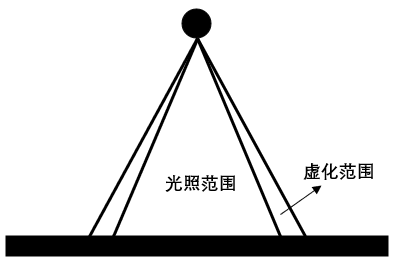
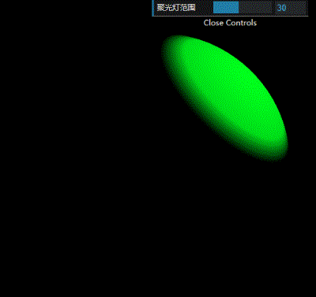

# WebGL 聚光灯

**[返回主目录](../readme.md)**

#### 聚光灯
+ 聚光灯和点光源是完全一样的模型, 只是在点光源的基础上, 增加了`范围限定`
+ 这是聚光灯的示意图  
  
+ 定义聚光灯, 需要指定光源的位置, 以及`聚光范围`

#### 计算光线颜色
+ 聚光灯的计算和点光源完全一样, 将`光线反方向`向量和法向量单位化后再点乘
+ 由于聚光灯有范围, 因此需要考虑范围比较, 落在范围内的顶点, 按照点光源方法计算颜色, 范围之外的顶点, 则不着色
+ 来看一下示意图  
  
+ 很明显, 光线和法向量的夹角, 处于 $[0, \alpha/2]$ 之间
+ 即, 当我们计算点乘得到夹角余弦后, 只有当该值处于 $[cos(\alpha/2), cos0]$ 之间时, 才会着色
+ 将点光源的着色器代码稍作修改, 加入范围判断
  ```glsl
    // 聚光灯范围, 注意是弧度制
    float spotLightRange = cos(30.0 * 3.1415926 / 180.0);

    void main() {
        // 计算光线方向
        vec3 lightDirection = lightPosition - v_Position;

        // 计算夹角余弦, 注意要使用光线反方向
        float c = dot(normalize(v_Normal), normalize(-lightDirection));

        // 不在范围内的顶点, 不着色
        if (c < spotLightRange) {
            light = 0.0;
        }

        // 得到最终的顶点颜色, 并赋值给gl_FragColor
        gl_FragColor = vec4(vertexColor.rgb * c, 1.0);
    }
  ```
+ 效果如下  
  
***
**TIPS:** 当范围为360度的时候, 聚光灯和点光源将完全一样
***

#### 镜面高光
+ 和点光源镜面高光实现的方式完全一样, 直接将点光源的实现代码搬过来
+ 来看看效果   
  
+ 出了问题! 这明显不对, 这是因为计算镜面高光的时候, 点光源我们不需要考虑光照范围, 只需要考虑反射光线是否会进入相机
+ 但是聚光灯是有范围的, 符合高光条件的顶点, 也许根本不在光照范围内, 因此这种情况下的顶点是不能着色的
+ 将镜面高光代码稍作修改, 加入范围判断
  ```glsl
  // 计算光线颜色
  float light = dot(normalize(v_Normal), normalize(lightDirection));
  // 计算vector向量和法向量的夹角余弦
  float specular = 0.0;
  float c = dot(vector, normalize(v_Normal));

  // 这里需要加入对light的判断, 确保light处在范围内才启用高光
  if (c >= 0.0 && light >= range) {
    specular = pow(c, 30.0);
  }

  gl_FragColor.rgb += specular;
  ```
+ 修改后的效果如下   
  
+ 这就对了

#### 边缘虚化
+ 上面的聚光灯效果有个问题, 边缘非常的`生硬`, 一点过渡都没有, 看起来不好看
+ 可以在边缘加入虚化效果, 让边缘从有色, `缓慢过渡`到无色, 这个是可选项, 不加也没事
+ 我们来探讨如何实现虚化效果, 首先必须要指定`虚化范围`, 即过渡的范围大小, 用角度来表示
+ 其次, 需要指定过渡效果, 为了简单, 我们直接使用线性变化, 即从当前颜色线性变化到0.0
+ 来看示意图  
  
+ 我们可以得出以下几个结论
  - 虚化范围可以用角度来指定, 如光照范围是 $m$ , 虚化范围设置为 $n$
  - 在计算夹角余弦的时候, 虚化范围的角度处在 $[m, m + n]$ 
  - 因此虚化范围的颜色值将从 $cos(m)$ 变化到 $cos(m+n)$ , 即
  - 但我们需要将颜色从 $cos(m)$ 降低到 $0.0$
  - 利用数学知识, 可以求得线性变换如下
  $$f(x) = \frac{x - cos(m+n)}{cos(m) - cos(m+n)}cos(m)$$
  - 光照范围内的顶点, 按照聚光灯的方式计算颜色
+ 对着色器代码稍作修改
  ```glsl
    // 聚光灯范围, 设置为30, 注意是弧度制
    float spotLightRange = cos(30.0 * 3.1415926 / 180.0);

    // 虚化范围, 设置为10
    float blurRange = cos((30.0 + 10.0) * 3.1415926 / 180.0);

    void main() {
        // 计算光线方向
        vec3 lightDirection = lightPosition - v_Position;

        // 计算夹角余弦, 即为颜色值 注意要使用光线反方向
        float c = dot(normalize(v_Normal), normalize(-lightDirection));

        // 不在范围内的顶点, 不着色
        if (c < spotLightRange) {
            c = 0.0;
        }

        // 虚化范围的顶点, 使用线性变化
        if ( c >= blurRange && c < Range) {
            c = Range * (c - blurRange) / (Range - blurRange)
        }

        // 得到最终的顶点颜色, 并赋值给gl_FragColor
        gl_FragColor = vec4(vertexColor.rgb * c, 1.0);
    }
  ```
+ 最终效果如下   
  


#### 光照总结
+ 平行光/点光源/聚光灯, 都是计算某一顶点处, 光线`反`方向和法向量的夹角余弦, 并将该值和顶点颜色值`相乘`得到最终顶点颜色, 如果光线有颜色, 则将该颜色值也乘上去
+ 镜面高光则是计算某一顶点处, 光线`反`方向和`顶点-视点`向量`求和`后与法向量的夹角余弦, 并将该值`直接加到`顶点颜色上
+ 光照带来的最后一个特性, 就是`阴影`, 但阴影内容需要单独的一篇笔记来介绍
****
**[返回主目录](../readme.md)**