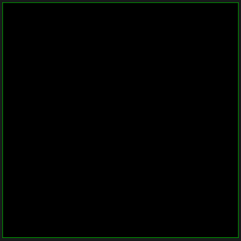
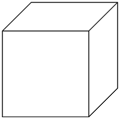
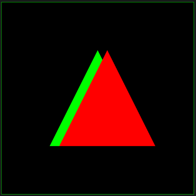
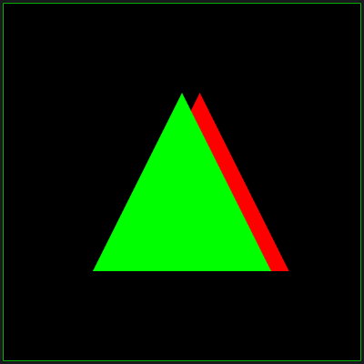

# WebGL 裁剪空间及坐标

**[返回主目录](../readme.md)**

#### 再探WebGL坐标系
+ 我们绘制一个正方形, 四个顶点的坐标为
  | 顶点  |     坐标      |
  | :---: | :-----------: |
  | 左上  | $(10, 11, 0)$ |
  | 左下  | $(10, 10, 0)$ |
  | 右下  | $(11, 10, 0)$ |
  | 右上  | $(11, 11, 0)$ |
+ 打开浏览器, 观察绘制的视图  
  
+ 什么都看不到, 这是为什么呢!? 原因在于, 顶点坐标值超过了WebGL的`可视范围`
+ WebGL坐标轴可以无限长, 坐标范围也可以任意取值, 但WebGL不会全部绘制, 它只会绘制`可视范围`内的顶点
***
**TIPS:** 多个顶点构成的复杂图形, 如果全部位于可视范围外, 则一律不绘制, 如果全部位于可视范围内, 则一律绘制, 如果部分位于可视范围外, 则将外面的图元删除, 只留位于内部的图元
***

#### 可视范围和裁剪空间
+ WebGL默认的可视范围, 是一个立方体, 立方体的`左右边界`, `上下边界`, `前后边界`的范围均为 $[-1, 1]$   
  
+ 可视范围的范围有着严格的`方向约束`, 并非任意, 如上图所示, 将可视范围的六个面分别称为`左边界`, `右边界`, `上边界`, `下边界`, `近边界`, `远边界`, 其方向约束如下
  |  边界  | 坐标取值 |        备注         |
  | :----: | :------: | :-----------------: |
  | 左边界 |  $x=-1$  | 左边界与 $X$ 轴垂直 |
  | 右边界 |  $x=1$   | 右边界与 $X$ 轴垂直 |
  | 上边界 |  $y=1$   | 上边界与 $Y$ 轴垂直 |
  | 下边界 |  $y=-1$  | 下边界与 $Y$ 轴垂直 |
  | 近边界 |  $z=-1$  | 近边界与 $Z$ 轴垂直 |
  | 远边界 |  $z=1$   | 远边界与 $Z$ 轴垂直 |
+ 这就是为什么, 当顶点坐标值超过 $[-1, 1]$ 范围后, 你将什么也看不到, 因为已经位于可视范围外部, WebGL不会绘制它
***
**TIPS1:** 这六个指定位置的边界构成的可视立方体, 也被称为WebGL默认的`裁剪空间`, 传递给WebGL的顶点坐标, 在裁剪空间中也拥有一个`裁剪坐标`, 裁剪坐标和WebGL坐标有什么区别吗? 为什么需要这样一个裁剪空间呢?  

**TIPS2:** 还有一个值得注意的点, `近`界面的 $Z$ 坐标值是-1, `远`界面的 $Z$ 坐标值是1, 这和WebGL坐标的 $Z$ 轴是方向是相反的! 坐标系是近大远小, 而裁减空间是近小远大!
***

#### 裁剪坐标和WebGL坐标
+ 先来看一个例子, 有两个三角形, 一个是红色, 一个是绿色, 红色三角形的 $Z$ 坐标为-0.5, 绿色三角形的 $Z$ 坐标是0.0, 顶点代码如下(省略颜色定义)
  ```JavaScript
  const triangleVertex = new Float32Array([
      // 绿色三角形
      -0.5, -0.5, 0.0,
       0.5, -0.5, 0.0,
       0.0,  0.5, 0.0,
              
      // 红色三角形
      -0.4, -0.5, -0.5,
       0.6, -0.5, -0.5,
       0.1,  0.5, -0.5,
  ]);
  ```
+ 由于WebGL $Z$ 坐标正方向是指向屏幕外部的, 因此很明显, 绿色三角形离我们更近一点, 因此我们将会看到绿色三角形挡住了红色三角形, 对吧?
+ 来看看效果:   
  
+ what the fucking ! 这是怎么回事, 难道哪里不对吗 ? 好吧, 这里应该了解一点新东西了, 看下方的小知识:
***
**深度测试:** WebGL默认是禁用深度测试的, 它保存图像深度信息, 并用来判断图像遮挡关系, 在后方被遮挡的图像将不会被绘制, 这就可以处理图像的正确遮挡, 只需要两行代码即可启用深度缓冲
```JavaScript
  // 开启深度测试
  gl.enable(gl.DEPTH_TEST);

  // 在绘制每一帧前, 都必须清除之前的深度信息
  gl.clear(gl.DEPTH_BUFFER_BIT);
```
**TIPS:** 当深度测试被禁用时, WebGL将会按照顶点的顺序依次绘制, `后绘制的遮挡先绘制的`(道理很简单, 计算机哪有真3D, 都是屏幕罢了, 最终还是要直接把像素打到屏幕上, 不启用深度测试可以节省性能), 上面的两个三角形, 先绘制的绿色, 后绘制的红色, 因此红色挡住了绿色 
***
+ 好的, 那我们就启用深度测试, 将上述两行代码添加进去, 现在我们应该可以看到绿色三角形在前面了, 对吧?
+ 再来看看效果   
  
+ ......这又是怎么回事, 已经启用深度测试了, 绿色的三角形在哪里? 好吧, 我们的例子先在这里暂停一下, 还记得上面有一个问题吗, `裁剪坐标`和`WebGL坐标`有什么区别吗?
+ 聪明的你应该已经想到了, WebGL坐标 $Z$ 轴正方向是向外的, 而裁剪空间`近边界`是 $z=-1$ , `远边界`是 $z=1$ , 裁剪空间和WebGL坐标的 $Z$ 是反向的! 也就是说, 在裁剪空间中, 红色三角形的 $Z$ 坐标不是-0.5, 而是0.5, 离我们更近!
***
**TIPS:** 严格来说, 红色三角形的裁减坐标不一定是0.5, 这取决于裁减空间的边界大小, 只是这里刚好是 $[-1, 1]$ , 下一篇笔记我们将要学习`WebGL 投影矩阵`, 到时候就会知道, WebGL坐标和裁减坐标真正的推导关系, 这里先暂时按下不表
***
+ 难道最终绘制出来的图像, 实际上是使用的裁剪坐标, 而不是原生的WebGL坐标吗? 为了验证我们的猜想, 我们继续上述的例子, 做一下修改, 我们将红色三角形的 $Z$ 坐标设置为0.5, 大胆猜测一波, 由于使用裁剪坐标, 0.5将会变成-0.5, 因此离我们更远, 我们将会看到绿色三角形, 对吧!
+ 来看看效果:   
  
+ 是的, 就是这样! 我们可以做个总结了
***
**1. WebGL在绘制时使用裁剪坐标:** WebGL会将原始顶点坐标, 转换为裁剪坐标, 再利用裁剪坐标绘制, 注意, WebGL最终实际仍然是在WebGL坐标系中绘制, 只是使用了裁剪坐标值, 是不是有点绕?  
   
**2. 裁剪坐标和WebGL坐标的关系:** 裁剪坐标和WebGL坐标的 $Z$ 值相反, 当传入顶点坐标为 $(x, y, z)$ 时, 最终相当于在WebGL坐标系的 $(x, y, -z)$ 处绘制该点, 这就是使用裁减坐标值在WebGL坐标系下绘制的理解

**3. 小提示:** 正如前面说到的, 裁减坐标和WebGL坐标并不一定是互为相反数的, 这取决于裁减空间的大小, 该部分内容我们会在下一篇笔记`WebGL 投影矩阵`中详细描述  
  
**TIPS:** 没错, WebGL非要使用反向 $Z$ 坐标来绘制, 这是个我不理解的坑, 当然, 这个坑可以填, 当学习了`WebGL 投影矩阵`后, 我们会找到一个方法, 不用再考虑可恶的负号了, 原始顶点的深度就是最后真实的深度!
***

#### 两个值的注意的坑
+ 这里准备有两个问题, 你可以试着回答一下:
***
**问题1:** `WebGL 视图矩阵`笔记中介绍过, WebGL默认相机位置在原点, 视线指向 $-Z$ 方向, 既然如此, 我们为什么可以看到 $Z$ 大于0的顶点呢, 它不是应该在相机的背后吗?  
  
**问题2:** WebGL开启深度测试后, 一定是根据裁剪空间坐标的 $Z$ 值来计算深度信息的吗?, 如果是的话, 我将相机放到图像的背后, 为何之前的遮挡情况也会马上反转呢?
***
+ **问题1的答案:**
***
1. 永远记住一句话, WebGL只会绘制可视范围内的顶点, 默认范围是 $[-1, 1]$ , 只要顶点坐标转换为裁剪坐标后在此范围, 你就能看见!
2. 你最终看到的视图, 是全部绘制的内容, 在`近边界`上的投影
3. WebGL没有真正的相机, 相机本质上只是通过矩阵相乘, 修改了顶点的坐标而已, 但只要修改后的坐标仍在可视范围内, 你就依然可以看见 
***
+ **问题2的答案:**
***
1. 就是裁剪空间的 $Z$ 坐标值, 别那么不自信, 就是
2. 无论是什么矩阵, 最终的结果都是改变原顶点坐标, WebGL再把新坐标转换成裁剪坐标, 再计算深度, 所以遮挡情况一定会变, 因为顶点坐标已经变了
***

#### 投影矩阵
本篇笔记讲述了可视空间, 裁剪空间和裁剪坐标, 以及最重要的一个知识点:   
  
**划重点:** WebGL会将原始顶点坐标转换为裁剪空间的坐标, 再进行绘制, 该转换过程由WebGL在内部完成, 最终得到的图像 $Z$ 坐标是反的  
  
在上文中我们提到了如何填补这个坑, 那就是利用`投影矩阵`, 我们自定义一个裁剪空间, 它和默认的裁剪空间具有相同的`方向约束`(即近小远大), 并推导出一个矩阵, 利用该矩阵求出顶点在该裁剪空间中的坐标, 再传入着色器, 而WebGL内部会再转换一次, 负负得正, 问题解决  
  
当然, 投影矩阵的标准定义肯定不是这样的, 这只是投影矩阵带来的一个比较积极的功能而已, 关于投影矩阵的真正的定义和推导使用, 将会在下一篇笔记中详细介绍
****
**[返回主目录](../readme.md)**