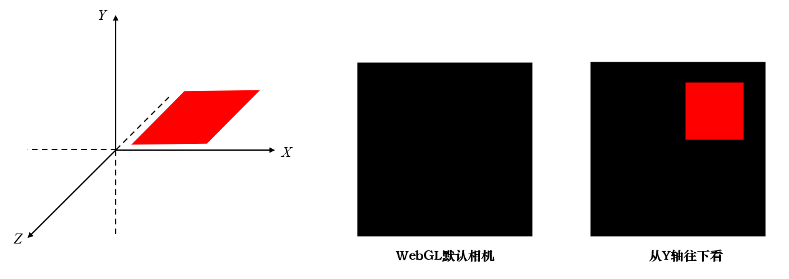
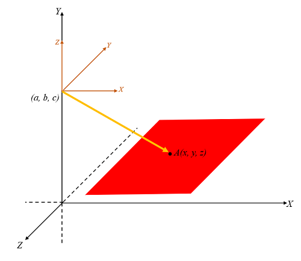
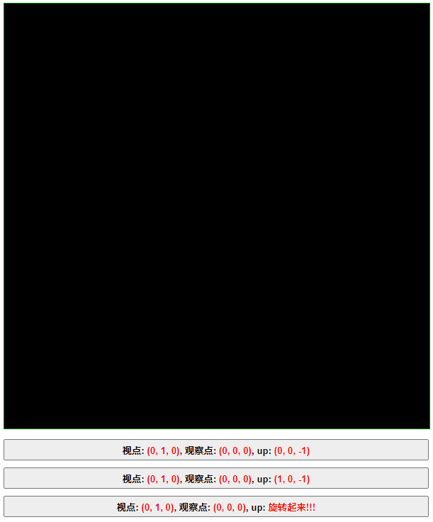

# WebGL 视图矩阵

**[返回主目录](../readme.md)**

### 视图矩阵的定义
- 想要看到窗口绘制的视图, 有两个主要的因素, `顶点坐标`和`相机`, 顶点坐标决定了视图的几何形状, 而相机则决定了最终看到的绘制效果, 从不同的角度和方向去看视图, 所看到的效果是不一样的
- 相机由三个重要的参数指定, `视点`, `观察点`和`上方向`, 以下是详细说明, WebGL自带一个默认的相机, 其参数也在下表给出
  |  概念  |             解释             | WebGL默认值  |
  | :----: | :--------------------------: | :----------: |
  |  视点  |        放置相机的位置        | $(0, 0, 0)$  |
  | 观察点 | 视点和观察点的连线即为`视线` | $(0, 0, -1)$ |
  | 上方向 |   告诉相机, 哪个方向是`上`   | $(0, 1, 0)$  |
- `上方向`非常重要, 如果仅有视线, 视图是可以沿着视线为轴旋转的, 视图就是不确定的状态, 因此指定相机, 除了视点和观察点以外, 还必须要指定上方向, 这样才能最终确定视图的呈现
- 以下这张图说明了从不同的角度去观察视图, 看到的效果是不一样的, 右图的相机参数: 视点 $(0, 1, 0)$ , 观察点 $(0, 0, 0)$ , 上方向 $(0, 0, -1)$ 
  
- **重要概念**: 不管再怎么指定相机, 最终的视图仍然是被绘制到`WebGL坐标系`下, 采用`WebGL默认相机`呈现的, 如上图, 右边之所以能看到视图, 是因为顶点坐标发生了改变, 改变后的顶点坐标值`模拟了`从上方往下看的效果
- 我们将上图中, 原始的顶点坐标, 和指定相机后的顶点坐标给出
  | 顶点方位 |    原始坐标值    | 指定相机后的坐标值 |
  | :------: | :--------------: | :--------------: |
  |   左下   | $(0.1, 0, -0.1)$ | $(0.1, 0.1, -1)$  |
  |   右下   | $(0.6, 0, -0.1)$ | $(0.6, 0.1, -1)$  |
  |   右上   | $(0.6, 0, -0.6)$ | $(0.6, 0.6, -1)$  |
  |   左上   | $(0.1, 0, -0.6)$ | $(0.1, 0.6, -1)$  |
- 如上, 原始的坐标值指定的正方形, 位于 $XOZ$ 平面内, WebGL默认相机看向 $-Z$ 方向, 什么都看不到, 但从上往下看的时候, 应该看到一个位于`左上方`的正方形, 因此我们修改原始坐标值, 将其改为一个`位于左上方的正方形`, 这样再次绘制, 就可以`模拟出`从上往下看的效果
- 回归到更通用的情况, 我们使用`视点`, `观察点`和`上方向`, 指定了一个相机, 如果我们能用这些数据, 构造一个矩阵 $V$ , 使得
  $$指定相机后的顶点坐标 = V \times 原始顶点坐标$$
- 这个 $V$ 矩阵, 就被称为`视图矩阵`
***
**简单一句话:** 视图矩阵的作用, 就是修改原始顶点坐标, 使得修改后的顶点坐标, 能够模拟出从指定的相机观察视图的效果
***

#### 视图矩阵的推导
- **首先必须理解:** 根据指定相机的三个参数, `视点`, `观察点`和`上方向`, 我们可以构造出一个`相机坐标系`, 假设原始顶点坐标为 $(x, y, z)$ , 只要我们将该顶点坐标`变换`为相机坐标系下的顶点坐标, 则转换后的顶点在WebGL坐标系下绘制出来的视图, 就是相机看到的视图, 这句话必须理解, 可以参考下图  
  
***
如上图, $A$ 点在WebGL坐标系下的坐标为 $(x, y, z)$ , 只要我们想办法求出 $A$ 点在相机坐标系(棕色的坐标系)下的坐标 $(x_1, y_1, z_1)$ , 则 $(x_1, y_1, z_1)$ 顶点传入着色器, 绘制出来的结果, 即为相机看到的效果
***
- 以上这句话涉及到两个知识点: `构造坐标系`和`坐标变换`, 构造坐标系后文会讲到, 而`坐标变换`将会用到`基向量`的知识, 这里稍作介绍, 结合坐标系来讲解, 内容和标准线性代数教材可能会有不同
***
**基底向量和坐标转换介绍:** 空间坐标系的三个坐标轴, 正方向的单位向量, 被称为该坐标系的空间基底向量, 分别为 $\overrightarrow{X}$ , $\overrightarrow{Y}$ , $\overrightarrow{Z}$ , 以WebGL为例, 三个基底向量分别为:
$$
\overrightarrow{X} = [1, 0, 0] \qquad
\overrightarrow{Y} = [0, 1, 0] \qquad
\overrightarrow{Z} = [0, 0, 1]
$$
坐标系的基底向量, 再结合`该坐标系下`任一点 $P$ 的坐标值, 可以用来表示 $P$ 点与坐标系原点 $O$ 连线而成的空间向量, 即 $\overrightarrow{OP}$, 用公式表示为
$$
\overrightarrow{OP}=
(x-0, y-0, z-0)=
x\overrightarrow{X}+
y\overrightarrow{Y}+
z\overrightarrow{Z}
$$
假设空间中有一个相机坐标系, 原点坐标为 $O_1(a, b, c)$ , 空间点 $P$ 在该坐标系下的坐标为 $(x_1, y_1, z_1)$ , 根据上述公式, 则有等式
$$
\overrightarrow{O_1P}=
x_1\overrightarrow{P}+
y_1\overrightarrow{Q}+
z_1\overrightarrow{R}
$$
其中 $\overrightarrow{P}, \overrightarrow{Q}, \overrightarrow{R}$ 是相机坐标系下的三个基底向量, 由于 $O_1$ 和 $P$ 在WebGL坐标系下的坐标为 $(a, b, c)$ 和 $(x, y, z)$ , 且向量本身和位置无关, 因此 $\overrightarrow{O_1P}$ 其实也就等于
$$
\overrightarrow{O_1P}=
(x-a, y-b, z-c)
$$
千万别傻乎乎的认为 $\overrightarrow{O_1P}=(x_1-a, y_1-b, z_1-c)$ , 因为 $(x_1, y_1, c_1)$ 和 $(a, b, c)$ 是不同坐标系下的坐标值, 不能混在一起, 因此最终的坐标转换计算公式就为
$$
(x-a, y-b, z-c)=
x_1\overrightarrow{P}+
y_1\overrightarrow{Q}+
z_1\overrightarrow{R}
$$
***
- 有了`基向量`的知识点, 我们可以开始进行矩阵推导, 假设相机坐标系的三个基底向量分别为:
$$
\overrightarrow{P}=[p_x, p_y, p_z] \qquad
\overrightarrow{Q}=[q_x, q_y, q_z] \qquad
\overrightarrow{R}=[r_x, r_y, r_z]
$$
- 则根据坐标转换公式, 即可得到
$$
(x-a, y-b, z-c)
=
x_1\overrightarrow{P} +
y_1\overrightarrow{Q} +
z_1\overrightarrow{R}
=(x_1, y_1, z_1) \times
\begin{Bmatrix}
    \overrightarrow{P} \\\\
    \overrightarrow{Q} \\\\
    \overrightarrow{R}
\end{Bmatrix}
=(x_1, y_1, z_1) \times
\begin{Bmatrix}
    px & py & pz \\\\
    qx & qy & qz \\\\
    rx & ry & rz
\end{Bmatrix}
$$
- 为了符合WebGL左乘的特性, 将上述公式改为`列向量`和`列主序矩阵`进行计算, 并进一步处理成4阶矩阵, 得到:
$$
\begin{Bmatrix}
    x_1 \\\\
    y_1 \\\\
    z_1 \\\\
    1
\end{Bmatrix}
=
\begin{Bmatrix}
    px & qx & rx & 0 \\\\
    py & qy & ry & 0 \\\\
    pz & qz & rz & 0 \\\\
    0 & 0 & 0 & 1
\end{Bmatrix}^{-1}
\begin{Bmatrix}
    1 & 0 & 0 & -a \\\\
    0 & 1 & 0 & -b \\\\
    0 & 0 & 1 & -c \\\\
    0 & 0 & 0 & 1
\end{Bmatrix}
\times
\begin{Bmatrix}
    x \\\\
    y \\\\
    z \\\\
    1
\end{Bmatrix}
$$
- 熟悉的地方来了, 在本文档第1点 `视图矩阵` 的定义一节中, 我们定义了视图矩阵的公式, 即满足如下条件的公式, 公式中的 $V$ 即为视图矩阵
  $$指定相机后的顶点坐标 = V \times 原始顶点坐标$$
- 至此, 视图矩阵 $V$ 即为: (基底向量构成的矩阵是`正交单位矩阵`, 因此其逆矩阵等于其转置矩阵)
$$
V=
\begin{Bmatrix}
    px & qx & rx & 0 \\\\
    py & qy & ry & 0 \\\\
    pz & qz & rz & 0 \\\\
    0 & 0 & 0 & 1
\end{Bmatrix}^{-1}
\begin{Bmatrix}
    1 & 0 & 0 & -a \\\\
    0 & 1 & 0 & -b \\\\
    0 & 0 & 1 & -c \\\\
    0 & 0 & 0 & 1
\end{Bmatrix}
=
\begin{Bmatrix}
    px & py & pz & 0 \\\\
    qx & qy & qz & 0 \\\\
    rx & ry & rz & 0 \\\\
    0 & 0 & 0 & 1
\end{Bmatrix}
\begin{Bmatrix}
    1 & 0 & 0 & -a \\\\
    0 & 1 & 0 & -b \\\\
    0 & 0 & 1 & -c \\\\
    0 & 0 & 0 & 1
\end{Bmatrix}
$$
***
只要求出相机坐标系下的三个基底向量 $\overrightarrow{P}, \overrightarrow{Q}, \overrightarrow{R}$, 视图矩阵就出来了, 接下来将描述如何计算这三个基底向量  
**TIPS:** 向量叉乘公式, 后面会用到
$$\overrightarrow{a} \times \overrightarrow{b} = (l, m, n) \times (o, p, q) = (mq - np, no - lq, lp - mo)$$
***

#### 基底向量的计算(采用 $4 \times 4$ 矩阵)
- 指定相机需要给出三个参数: `视点`, `观察点`, `上方向`, 分别设为 $eye, target, up$
- 计算 $\overrightarrow{R}$ : 
    + 计算视线向量并单位化 $\overrightarrow{V}=target-eye$ , $\overrightarrow{V_n}=\frac{\overrightarrow{V}}{|\overrightarrow{V}|}$ 
    + WebGL坐标系下, 视线向量指向 $\overrightarrow{-Z}$ 轴, 因此 $\overrightarrow{V_n}$ 向量就指向 $\overrightarrow{-R}$
    + 因此
$$\overrightarrow{R}=\overrightarrow{-V_n} = \frac{\overrightarrow{-V}}{|\overrightarrow{V}|}$$
- 计算 $\overrightarrow{P}$ 
    + 在WebGL坐标系下, 很容易得知: $\overrightarrow{X}=\overrightarrow{-Z} \times \overrightarrow{Y}$ , 对应到相机坐标系下, 则有 $\overrightarrow{P}=\overrightarrow{-R} \times \overrightarrow{Q}$ 
    + 但是 $\overrightarrow{Q}$ 未知, 因此用`上方向`向量代替, 但上方向不一定和视线垂直, 且也不一定是单位长度, 因此叉乘之后要单位化
    + 因此
$$\overrightarrow{P}=\frac{\overrightarrow{-R} \times \overrightarrow{up}}{|\overrightarrow{-R} \times \overrightarrow{up}|}$$
- 计算 $\overrightarrow{Q}$
    + 在WebGL坐标系下, 很容易得知: $\overrightarrow{Y}=\overrightarrow{Z} \times \overrightarrow{X}$ , 对应到相机坐标系下, 则有 $\overrightarrow{Q}=\overrightarrow{R} \times \overrightarrow{P}$ 
    + $\overrightarrow{R}, \overrightarrow{P}$ 都已求出, $\overrightarrow{Q}$ 也就求出来了
    + 因此
$$\overrightarrow{Q}=\overrightarrow{R} \times \overrightarrow{P}$$
- 最终的基底向量矩阵如下所示(写公式太麻烦了, 直接给出计算函数吧), 需要注意的是计算 $\overrightarrow{R}$ 的时候, 不要把正负号搞错了, 视线的方向和 $\overrightarrow{R}$ 的方向是相反的
```JavaScript
function getViewMatrixBeforeTranslate(
    eye1, eye2, eye3,
    target1, target2, target3,
    up1, up2, up3
) {
    // 第一步: 计算R向量

    // 先计算视线向量
    const rx = target1 - eye1;
    const ry = target2 - eye2;
    const rz = target3 - eye3;

    // 单位化视线向量
    const rSquareSum = Math.sqrt(rx * rx + ry * ry + rz * rz);

    // 得到视线向量的单位向量, R = -视线向量
    const rxn = rx / rSquareSum;
    const ryn = ry / rSquareSum;
    const rzn = rz / rSquareSum;

    // 第二步: 计算p向量, P = -R X up

    // 点计算 -R X up, -R就是视线向量
    const px = ryn * up3 - rzn * up2;
    const py = rzn * up1 - rxn * up3;
    const pz = rxn * up2 - ryn * up1;

    // 单位化该项量
    const pSquareSum = Math.sqrt(px * px + py * py + pz * pz);

    // 得到P向量的单位向量
    const pxn = px / pSquareSum;
    const pyn = py / pSquareSum;
    const pzn = pz / pSquareSum;

    // 计算Q向量 Q = R X P = P X (-R), -R就是视线向量
    const qxn = pyn * rzn - pzn * ryn;
    const qyn = pzn * rxn - pxn * rzn;
    const qzn = pxn * ryn - pyn * rxn;

    // P, Q, R顺序对应X, Y, Z, 注意, R = -视线向量
    return [
         pxn,  pyn,  pzn, 0,
         qxn,  qyn,  qzn, 0,
        -rxn, -ryn, -rzn, 0,
         0,    0,    0,   1
    ]
}
```
- 因此最终的 $V$ 矩阵就等于:
$$
V =
\begin{Bmatrix}
     pxn &  pyn &  pzn & 0 \\\\
     qxn &  qyn &  qzn & 0 \\\\
    -rxn & -ryn & -rzn & 0 \\\\
     0   &  0   &  0   & 1
\end{Bmatrix}
\times
\begin{Bmatrix}
    1 & 0 & 0 & -eye1 \\\\
    0 & 1 & 0 & -eye2 \\\\
    0 & 0 & 1 & -eye3 \\\\
    0 & 0 & 0 & 1
\end{Bmatrix}
$$
- 计算最终结果  
$$
V = 
\begin{Bmatrix}
     pxn &  pyn &  pzn & -eye1 * pxn - eye2 * pyn - eye3 * pzn \\\\
     qxn &  qyn &  qzn & -eye1 * qxn - eye2 * qyn - eye3 * qzn \\\\
    -rxn & -ryn & -rzn &  eye1 * rxn + eye2 * ryn + eye3 * rzn \\\\
     0   &  0   &  0   &  1
\end{Bmatrix}
$$

#### 视图矩阵函数
```JavaScript
function getViewMatrix(
    eye1, eye2, eye3,
    target1, target2, target3,
    up1, up2, up3,
) {
    const m = getViewMatrixBeforeTranslate(
        eye1, eye2, eye3,
        target1, target2, target3,
        up1, up2, up3
    );
    return [
        m[0], m[1], m[2],  -eye1 * m[0] - eye2 * m[1] - eye3 * m[2],
        m[4], m[5], m[6],  -eye1 * m[4] - eye2 * m[5] - eye3 * m[6],
        m[8], m[9], m[10], -eye1 * m[8] - eye2 * m[9] - eye3 * m[10],
        0,    0,    0,     1
    ];
}
```

***
**TIPS:** 上述方法获得的 $V$ 矩阵, 是数学意义上的矩阵, 如果要传入WebGL, 请转置后传入!
***

#### 示例程序(修改相机位置, 看看效果)
***
本例将文档开篇的例子绘制出来了, 一个位于 $XOZ$ 平面的正方形, 因此, 默认的WebGL相机将无法看见  
程序设置了三个按钮:
+ 按钮1: 修改相机位置, 将从正上方观察图形, up方向在 $-Z$
+ 按钮2: 修改相机位置, 将从正上方观察图形, up方向在 $Z=-X, X \ge 0$ 方向
+ 按钮3: 仍然从正上方观察, 间隔1秒, 就顺时针修改up方向, 让图形动起来(图形会逆时针转动)
***

****
**[返回主目录](../readme.md)**
