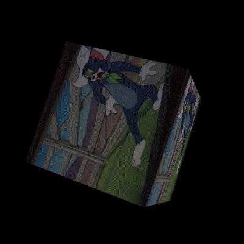

# WebGL 视频纹理

**[返回主目录](../readme.md)**
****

#### WebGL纹理支持的内容
+ 目前为止, 我们一直在使用`图片纹理`, 以及`数据纹理`, 你可能也很好奇, 还有没有其他可用的纹理类型
+ 创建纹理最重要的一个传递数据的方法是`gl.texImage2D()`, 该方法被重载了两次, 这些内容已经讲过了
+ 我们来看看这个方法的类型声明, 当使用图片纹理时, 最后一个参数是`image`, 类型为`TexImageSource`
+ 打开VSCode的声明库, 可以看到, `TexImageSource`其实就是以下类型
  ```TypeScript
  type TexImageSource = ImageBitmap | ImageData | HTMLImageElement | HTMLCanvasElement | HTMLVideoElement | OffscreenCanvas;
  ```
+ 这些就是WebGL支持的纹理, 可以看到, 前面几个都是图片, 还有视频, 以及Canvas元素
+ 本篇笔记主要讲述`视频纹理`, 因此我们要重点关注`HTMLVideoElement`

#### 视频纹理
+ 很重要的一点, 由于`gl.texImage2D()`方法已经原生支持了`HTMLVideoElement`, 因此创建纹理的代码, 其实不用重写, 即如下的代码完全可以复用
  ```TypeScript
  /**
   * 创建图片纹理, 包括视频
   * @param gl 
   * @param image 
   * @returns 
   */
  private createImageTexture(gl: WebGLRenderingContext, image: HTMLImageElement | HTMLVideoElement): WebGLTexture {
    const texture: WebGLTexture | null = gl.createTexture();
    if (!texture) {
      throw new Error('Failed to create texture!');
    }
    gl.bindTexture(gl.TEXTURE_2D, texture);
    gl.texImage2D(gl.TEXTURE_2D, 0, gl.RGBA, gl.RGBA, gl.UNSIGNED_BYTE, image);

    gl.texParameteri(gl.TEXTURE_2D, gl.TEXTURE_MIN_FILTER, gl.NEAREST);
    gl.texParameteri(gl.TEXTURE_2D, gl.TEXTURE_MAG_FILTER, gl.NEAREST);
    gl.texParameteri(gl.TEXTURE_2D, gl.TEXTURE_WRAP_S, gl.CLAMP_TO_EDGE);
    gl.texParameteri(gl.TEXTURE_2D, gl.TEXTURE_WRAP_T, gl.CLAMP_TO_EDGE);

    return texture;
  }
  ```
+ 所以, 我们要想处理视频纹理, 重点需要放在`HTMLVideoElement`元素上
+ 基本思路:
  - 创建一个`HTMLVideoElement`元素
  - 添加`src`地址
  - 启用`playsInline`, `loop`, `muted`属性为`true`
  - 调用`play()`方法开始播放
  - 将元素传给纹理创建方法, 生成纹理
  - WebGL着色器访问纹理并绘制
***
**几点解释:** 
  - `playsInline`属性, 是为了禁止视频的后台播放和自动全屏, 主要是为了适配手持设备
  - `loop`属性, 是为了让视频循环播放, 这样纹理也会循环绘制
  - `muted`属性, 是为了让视频静音, 如果你想要声音, 需要设置为`true`
  - 调用`play()`方法, 是为了让视频直接开始播放, 否则默认是`暂停`状态
***
+ 最后一个问题, 如何准确的知道视频元素已经成功载入, 可以访问到呢? 和`Image`一样, 这也是个`异步`的过程 (不能用`onload`方法)
+ 视频元素如果已经在播放视频, 会自动触发两个关键的事件: `playing`和`timeupdate`:
  - `playing`: 视频已经在播放
  - `timeupdate`: 视频的时间进度在更新
  - 保险一点, 两个事件一结合, 就可以确保视频已经加载完毕, 并且开始播放了
  - 可以设置`状态变量`, 一旦触发这两个事件, 就`更改变量的值`, 当指定的值被检测到, 就可以开始准备创建纹理了
+ 以下是一个处理视频元素的方法
  ```TypeScript
  /**
   * 加载视频资源
   * @param src 地址
   * @returns 
   */
  public static resolveVideo(src: string): Promise<HTMLVideoElement> {
    const path = `./${src}`;

    // 状态变量
    let playing: boolean = false;
    let timeUpdate: boolean = false;

    const video: HTMLVideoElement = document.createElement('video');
    video.src = path;
    video.muted = true;
    video.loop = true;
    video.playsInline = true;

    // 监听两个事件
    video.addEventListener('playing', () => {
      playing = true;
    });
    video.addEventListener('timeupdate', () => {
      timeUpdate = true;
    });

    // 播放方法
    video.play();
    return new Promise(resolve => {

      // 通过计时器, 定期检测状态变量, 如果都为true, 则Promise解决
      const interval: NodeJS.Timer = setInterval(() => {
        if (playing && timeUpdate) {

          // 别忘了清除计时器, 不然性能浪费
          clearInterval(interval);
          resolve(video);
        }
      }, 1000);
    });
  }
  ```
+ 关于视频纹理, 目前所需要的处理代码, 就这么多了, 现在可以编写主函数, 载入纹理, 我们将纹理贴到正在旋转的立方体上
  ```TypeScript
  // 创建视频元素, 并载入视频资源
  const video: HTMLVideoElement = await this.resolveVideo('assets/video.mp4');

  // 创建视频元素的纹理对象
  const texture: WebGLTexture = this.createImageTexture(gl, video);
  
  // 将纹理绑定到0号纹理单元, 供着色器访问
  const location = gl.getUniformLocation(program, 'u_Sampler');
  gl.uniform1i(location, 0);

  let angle: number = 0;
  const render = () => {
    const renderInfo: RenderInfomation = this.getRenderInformation(angle);
    WebGLHelper.render(gl, program, renderInfo, gl.TRIANGLES);
    angle += 0.5;
    requestAnimationFrame(render);
  }

  render();
  ```
+ 来看看效果    
  
+ 完犊子, 视频为什么没有动?

#### 在每一帧绘制前重新创建纹理
+ 上面的例子中, 视频并没有播放, 仔细观察代码, 我们提前创建了视频元素, 并由此创建了纹理对象, 并传入着色器, 我们将该纹理对象记为 $T$
+ WebGL在纹理单元中读取纹理时, 将始终读取 $T$ , $T$ `并没有`随着播放更新, 道理很简单, 纹理数据在调用`gl.texImage2D()`方法时, 就已传入并确定
+ 因此, 要修正这个bug, 也很简单, 我们需要在每一帧绘制前, 重新调用`gl.texImage2D()`方法, 将当前播放的画面再次传入纹理单元, 以供着色器读取
+ 这是修复后的代码, 请注意那唯一一行带注释的数据
  ```TypeScript
  const video: HTMLVideoElement = await this.resolveVideo('assets/video.mp4');
  const texture: WebGLTexture = this.createImageTexture(gl, video);
  const location = gl.getUniformLocation(program, 'u_Sampler');
  gl.uniform1i(location, 0);

  let angle: number = 0;
  const render = () => {
    const renderInfo: RenderInfomation = this.getRenderInformation(angle);

    // 重新传入当前播放画面的纹理数据
    gl.texImage2D(gl.TEXTURE_2D, 0, gl.RGBA, gl.RGBA, gl.UNSIGNED_BYTE, video);

    WebGLHelper.render(gl, program, renderInfo, gl.TRIANGLES);
    angle += 0.5;
    requestAnimationFrame(render);
  }
  render();
  ```
***
**TIPS:** 这不是一篇设计模式的笔记, 因此请忽略代码结构和模块化设计
***
+ 再来看看效果   
  

#### 关于声音
+ 部分浏览器对于声音的控制非常严格, 如果单纯的设置`muted`为`false`, 可能收不到效果
+ 浏览器可能会报错, 提示用户并没有与文档`交互`, 因此抛出错误
+ 有个灵活的解决办法, 通过`事件`来更改静音状态, 以下是代码
  ```TypeScript
  return new Promise(resolve => {
    const interval: NodeJS.Timer = setInterval(() => {
      if (playing && timeUpdate) {

          // 通过鼠标点击来开启声音
          document.addEventListener('click', () => {
            video.muted = false;
          });
          clearInterval(interval);
          resolve(video);
      }
    }, 1000);
  });
  ```
+ 使用`iframe`或者`video`标签嵌入的视频无法再GitHub上正常观看, 就不放视频了

****
**[返回主目录](../readme.md)**
