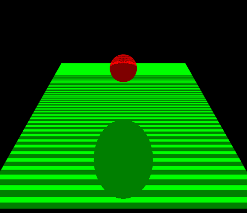

# WebGL 阴影

**[返回主目录](../readme.md)**

#### 阴影映射
+ 现在常用的阴影生成方法是`阴影映射`
+ 以下来简述阴影映射的过程
  - 针对于要绘制的物体, 首先要定义一个`观察视角`, 这是物体最终被绘制的视角
  - 其次, 我们需要指定`光线`位置和方向, 这是用于计算阴影的条件
  - 计算第1步: 从光线位置, 沿光线方向观察物体, 这样绘制得到的物体全部在光照下
  - 计算第2步: 绘制结果的每个片元, 将其$z$坐标保存下来
  - 计算第3步: 依然从光线位置, 沿光线方向观察物体, 得到视角下的`顶点坐标`
  - 计算第4步: 将顶点坐标的$z$坐标和第2步中保存的$z$坐标进行比较
  - 计算第5步: 如果顶点的$z$坐标小于保存的$z$坐标, 则该点一定处于阴影中
+ 有些步骤可能难以理解, 我们逐个来解释
***
**TIPS:** 解释之前, 有个概念一定要掌握, 之前讲过的: 最终看到的视图, 是全部绘制的内容, 在`近裁剪面`上的投影, 你也可以这么理解: `gl_FragColor`最终只记录了屏幕上显示的片元信息
***

#### 阴影映射的计算过程解释
+ 从光线位置观察物体, 所得到的绘制结果必然全都在光照下, 这一点无需解释, 这是常识
+ 将绘制结果的每个片元的$z$坐标保存下来, 以下是解释:
  - 绘制结果, 是`全部在光照下`的片元所构成的, 这些片元都没有阴影
  - 片元的$z$坐标, 标识了这个片元的`深度信息`, 保存下来备用
  - 这里要注意的是, 我们只保存最终投影到`近裁剪面`上的结果的片元的$z$坐标
+ 可以参考下图, 将光线视角下的所有片元,$z$坐标保存下载, 这里我们选择保存到`纹理`中  
  
+ 到了上面这一步, 实际上我们获得了一张`纹理`, 纹理上任意点, 其 $x, y$ 坐标标识了光线视角下顶点的`坐标`, 而其`颜色值`, 则代表了该顶点的`深度`, 也就是说, 用这张纹理, 我们保存了光线视角下物体的全部信息
***
**TIPS:** 你可能奇怪, $x, y$ 坐标是怎么搞出来的, 这个后面会讲到的, 包括`纹理采样`也会用到
***
+ 接下来就要开始判断阴影中的部分了, 依然是从光线视角观察物体, 获取物体的定点坐标
+ 针对每一个定点, 将其$z$坐标和保存到纹理中的对应点的$z$值 (其实就是`纹理采样值`) , 进行比较, 如果小了, 就说明该点处于阴影中
+ 可以参考下图, 描述了比较的示意图   
  
+ 通过比较, 确定了 $Z_1$ 大于 $Z_2$ , 则待计算的点`更深`, 就必然处于阴影中, 将其颜色指定为阴影颜色即可
+ 最后, 再通过正常的相机视角, 将整个视图绘制出来即可
+ 不难看出, 整个过程就这么几步:
  - 从光线位置观察物体, 并将全部在光照下的片元深度信息保存到纹理中
  - 从光线位置观察物体, 将全部的顶点, 和纹理对应点的深度信息进行比较, 确定阴影范围
  - 正常绘制
+ 接下来将会进入代码实现部分
***
**TIPS:** 将绘制结果保存到纹理中, 这里需要用到`渲染到纹理`的知识, 即我们需要使用`帧缓冲`, 同时我们需要`两对着色器`, 一对用来生成光线视角的物体深度信息, 写入纹理, 另一对则用来正常绘制, 并采样和判断阴影
***

#### 阴影的代码实现
+ 首先我们需要一对着色器, 用于从光线位置观察物体, 并记录其片元的深度信息
```TypeScript
export const SHADOW_V_SHADER = `
  attribute vec3 a_position;       // 顶点坐标
  uniform mat4 u_view_light;       // 光线视角下的视图矩阵
  uniform mat4 u_projection_light; // 光线视角下的投影矩阵
  void main() {
    gl_Position = u_projection_light * u_view_light * vec4(a_position, 1.0);
  }
`;

export const SHADOW_F_SHADER = `
  precision mediump float;
  void main() {
    gl_FragColor = vec4(gl_FragCoord.z, 0.0, 0.0, 0.0); // 注意gl_FragCoord内置变量
  }
`;
```
***
**TIPS1:** `gl_FragCoord`记录了片元的坐标信息, 取其$z$值, 并写入到`gl_FragColor`中, 前文提到, `gl_FragColor`只记录最终展示在屏幕上的信息, 也就是说, 通过这一行代码, 我们将所有`最靠前`的片元, 其深度信息记录下来了  

**TIPS2:** `gl_FragCoord`的$x, y$分量记录的是片元在`canvas`坐标系下的坐标值, 而非WebGL坐标系! $z$分量则是WebGL坐标系下的值
***
+ 现在准备另一对着色器, 这对着色器要做的事情比较多, 主要有以下几个:
  - 同样从光线位置观察物体, 获取该视角下的顶点坐标, 将用于纹理采样和比较深度
  - 从正常的相机位置观察物体, 获取相机视角下的顶点坐标, 用于最终的试图呈现
  - 从纹理中采样, 进行深度信息比较, 确定阴影范围, 并设置阴影的颜色
```TypeScript
export const V_SHADER = `
  attribute vec3 a_position;        // 顶点坐标
  uniform mat4 u_view_light;        // 光线视角下的视图矩阵
  uniform mat4 u_projection_light;  // 光线视角下的投影矩阵
  uniform mat4 u_view;              // 相机视角下的视图矩阵
  uniform mat4 u_projection;        // 相机视角下的投影矩阵
  varying vec4 v_position;          // 光线视角下的顶点坐标, 要传到片元着色器做深度比较
  void main() {
    // 最终要呈现在屏幕上的顶点信息 
    gl_Position = u_projection * u_view * vec4(a_position, 1.0);
    v_position = u_projection_light * u_view_light * vec4(a_position, 1.0);
  }
`;

export const F_SAHDER = `
  precision mediump float;
  varying vec4 v_position;      // 从顶点着色器传过来的光线视角下的顶点坐标
  uniform vec4 u_color;         // 顶点颜色, 用于绘制平面和球体
  uniform sampler2D u_sampler;  // 采样器
  void main() {
    // 将顶点坐标转换为纹理坐标
    vec3 texture_coord = (v_position.xyz / v_position.w) / 2.0 + 0.5;

    // 从纹理中采样, 采样结果是RGBA格式, 我们只需要R分量
    float depth = texture2D(u_sampler, texture_coord.xy).r;

    // 深度比较, 如果Z更大, 则说明在阴影中
    float shadow = (texture_coord.z > depth) ? 0.5 : 1.0;

    // 设置颜色, 阴影颜色需要将RGB分量乘以0.5
    gl_FragColor = vec4(u_color.rgb * shadow, u_color.a);
  }
`;
```
***
有几个点需要注意一下:
- 顶点着色器中使用了`gl_Position`和`v_position`, 要注意其区别, `gl_Position`是最终绘制相机视角下的视图的, `v_position`获取了光线视角下的顶点信息, 传递到片元着色器进行深度比较
- 在转换纹理坐标的时候, $xyz$ 分量都除以了 $\omega$ 分量, 这是进行透视纠正的, 在前面的笔记中都讲过了
- 采样的结果, 是 $RGBA$ 格式, 根据阴影着色器中的代码, 我们将 $z$ 值写入了 $R$ 分量, 因此我们只需要取出 $R$ 分量
- `重点:` 深度比较时, 为何要用`texture_coord.z`, 按照常识, `v_position.z`才代表深度, 算上透视纠正, 那也应该是`v_position.z / v_position.w`才对
- 其实, WebGL内部有如下的公式: `gl_FragCoord = (gl_Position.xyz / gl_Position.w) / 2.0 + 0.5`, 因此`gl_FragCoord`作为内置变量, 早已经被转换为 $[0, 1]$ 的范围了
***
+ 现在我们来讨论上面提到的一个问题: WebGL是如何处理纹理上的 $x, y$ 坐标的, 其实很简单
  - 帧缓冲中, 纹理其实是一个`画布`, WebGL`逐片元`处理, 处理时, 就已经根据`gl_Position`的值确定了片元的 $x, y$ 坐标
  - 第二个着色器中, 使用`完全相同的`原始顶点坐标和矩阵, 获取到`v_position`, 其 $x, y$ 坐标, 和上面是一致的, 因此可以直接采样
  - 只不过要先进行`透视纠正`和`纹理坐标转换`, 因为第一个着色器已经完成了这些工作
+ 现在可以进行后续的工作了, 即使用JavaScript设置数据, 传入, 并绘制, 这里只给出关键代码
```TypeScript
public ngOnInit(): void {
  // 两对着色器, 需要创建两个program
  const shadowProgram = this.webgl.getWebGLProgram(gl, SHADOW_V_SHADER, SHADOW_F_SHADER);
  const renderProgram = this.webgl.getWebGLProgram(gl, V_SHADER, F_SAHDER);

  // 创建帧缓冲
  const depthTexture = this.webgl.createDataTexture(gl, 1024, 1024, null);
  const renderbuffer = this.webgl.createRenderBuffer(gl, 1024, 1024);
  const framebuffer = this.webgl.createFrameBuffer(gl, depthTexture, renderbuffer);

  //... 省略顶点数据, 试图矩阵和投影矩阵的定义

  const render = () => {
    this.webgl.useFrameBuffer(gl, framebuffer); // 切换帧缓冲
    this.webgl.draw(gl, planePoints.length / 3, gl.TRIANGLES);
    this.webgl.draw(gl, spherePoints.length / 3, gl.TRIANGLES);

    this.webgl.useFrameBuffer(gl, null);

    // 一定要使用纹理
    this.webgl.set2DTextureAccess(gl, renderProgram, depthTexture, 'u_sampler', 0);
    this.webgl.draw(gl, planePoints.length / 3, gl.TRIANGLES);
    this.webgl.draw(gl, spherePoints.length / 3, gl.TRIANGLES);
  }

  requestAnimationFrame(render);
}
```
+ 可以看到最终的效果, 不过这效果明显不对, 出现了带状条纹   
  
+ 这是计算机图形学上常见的问题, 这是由于`精度`原因导致的, 这种带状条纹也被称为`马赫带`

#### 马赫带
+ 计算机并不是理想的数学, 无法存储任意的数字, 受限于`存储空间`和`精度`, 任意的数学意义上的数字, 都会被转换为最接近的`整数倍精度`的值 (向下取整), 
+ 先来看着色器中的`depth`, 这是从纹理中抽取的纹素的 $R$ 分量, 纹理上每一个纹素的存储空间都是 $4$ 字节, $RGBA$ 分量各占 $1$ 个字节, 即 $8$ 位, $8$ 位浮点数的精度是`1/256`
+ 以 $0.1234567$ 这个数字为例, 由于
$$ 0.1234567 / (1/256) \approx 31.6049152 $$
+ 将其转为最接近的`整数倍精度`, 这里取 $31$ , 因此实际的存储值是
$$31 * (1/256) \approx 0.12109375$$
+ 再来看`texture_coord.z`, 这是`v_position`经过透视纠正和转换后的 $z$ 值, `texture_coord.z`是`float`类型, 占 $2$ 个字节, $16$ 位, $16$ 位浮点数的精度是`1/65536`
+ 同样以 $0.1234567$ 这个数字为例, 由于
$$ 0.1234567 / (1/65536) \approx 8090.85829 $$
+ 将其转为最接近的`整数倍精度`, 这里取 $8090$, 因此实际的存储值是
$$8090 * (1/65536) \approx 0.1234436$$
+ 因此, 针对于同样的值 $0.1234567$ , `depth`变成了 $0.12109375$ , 而`texture_coord.z`变成了 $0.1234436$ , 结果就是: `texture_coord.z > depth` ,着色器将其当成了阴影, 变成了暗色
+ 由于数学意义上的 $z$ 是连续的, 但在计算机中, 存储是间断的, 会割裂成整数倍精度, 所以会产生一系列时大时小的值, 最终形成了一条一条的马赫带
+ **马赫带的消除:**
  - 对于高精度的`texture_coord.z`, 不需要进行额外的处理
  - 而对于`depth`, 由于精度是`1/256`, 且实际的存储最多只会相差 $1$ 个精度, 导致值变小
  - 因此给`depth`加上 $1$ 个精度的值, 抵消变小的可能性, 就可以消除马赫带
  - 为了保险起见, 通常会加上一个略大于精度的值, 由于 $1/256 \approx 0.00390625$ , 因此我们给`depth`的值加上 $0.04$
```TypeScript
export const F_SAHDER = `
  precision mediump float;
  // ...
  void main() {
    // ...
    float shadow = (texture_coord.z > depth + 0.04) ? 0.5 : 1.0;
    // ...
  }
`;
```
+ 这是消除马赫带之后的效果   
  

#### 提升精度(仅作了解)
+ 上述阴影的例子, 如果你将光线的位置, 设置的非常远, 阴影会消失
+ 如下图, 我们将光线位置的$y$设置为$40$, 可以看到, 阴影不见了  
  
+ 这是因为, `gl_FragCoord.z`太大了, 纹素的$1$个字节已经无法存储了
+ 一个解决的办法是, 利用纹素的$RGBA$总共$4$个字节, 共32位的大小来存储$z$值
+ 简单来说, 就是将`gl_FragCoord.z`拆成$4$个字节来存储
+ 采样器抽取纹素后, 需要将原始的$z$值还原出来
+ 以下是实现代码(仅作了解, 后续再来深入学习), 只有片元着色器需要修改
```TypeScript
export const SHADOW_FSHADER = `
  precision mediump float;
  void main() {
    const vec4 bitShift = vec4(1.0, 256.0, 256.0 * 256.0, 256.0 * 256.0 * 256.0);
    const vec4 bitMask = vec4(1.0 / 256.0, 1.0 / 256.0, 1.0 / 256.0, 0.0);
    vec4 rgbaDepth = fract(gl_FragCoord.z * bitShift);
    rgbaDepth -= rgbaDepth.gbaa * bitMask;
    gl_FragColor = rgbaDepth;
  }
`;

export const FSHADER =`
  precision mediump float;
  varying vec4 v_position;
  uniform sampler2D u_sampler;
  uniform vec4 u_color;

  float unpackDepth(vec4 rgbaDepth) {
    const vec4 bitShift = vec4(1.0, 1.0 / 256.0, 1.0 / (256.0 * 256.0), 1.0 / (256.0 * 256.0 * 256.0));
    float depth = dot(rgbaDepth, bitShift);
    return depth;
  }

  void main() {
    vec3 texture_coord = (v_position.xyz / v_position.w) / 2.0 + 0.5;
    vec4 rgbaDepth = texture2D(u_sampler, texture_coord.xy);
    float depth = unpackDepth(rgbaDepth);
    float visibility = (texture_coord.z > depth + 0.0015) ? 0.5 : 1.0;
    gl_FragColor = vec4(u_color.rgb * visibility, u_color.a);
  }
`;
```
***
**简要描述:** $1$个字节的精度是$1/256$, 因此:
- 将大于$1/256$的部分存储到$R$分量
- 将$1/256$到$1/(256*256)$的部分存储在$G$分量
- 将$1/(256*256)$到$1/(256*256*256)$的部分存储在$B$分量
- 将小于$1/(256*256*256)$的部分存储在$A$分量中  

**TIPS:** `fract()`内置函数, 返回参数的小数部分  

**TIPS:** 消除马赫带的偏移量变成了$0.001$, 这是因为`gl_FragCoord.z`已经是$4$字节存储了, 精度为$1/65536$, 但是由于我们使用了`mediump float`的精度限定, 实际上会采用$1/(2^{10})$, 大约为$0.00097656$, 因此取$0.001$
***
+ 应用上述代码后, 阴影又回来了  
  

**[返回主目录](../readme.md)**
