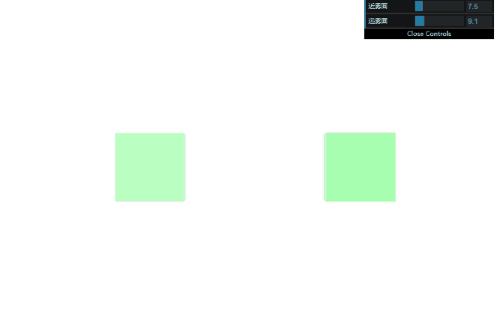

# WebGL 雾

**[返回主目录](../readme.md)**

#### 雾化因子
+ 雾其实是一种`朦胧看不清`的感觉
+ 只需要将`gl_FragColor`和雾的颜色进行`融合`即可
+ 设置雾化因子为`fogFactor`, 片元颜色为`color`, 雾的颜色为`fogColor`
+ 融合的公式如下(雾化因子的范围是$[0, 1]$), 这个公式很简单:
$$glFragColor = color * (1-fogFactor) + fogColor * fogFactor$$
+ 如果雾化因子是0, 则呈现片元颜色, 如果雾化因子为1, 则呈现雾色
+ 将代码设置到片元着色器中, 只需要添加这几行代码
```TypeScript
export const FSHADER = `
  precision mediump float;
  // ...
  uniform float fogFactor;
  uniform vec4 fogColor;

  void main() {
    // ...
    gl_FragColor = mix(color, fogColor, fogFactor);
  }
`;
```
***
**TIPS:** WebGL内置的函数`mix(origin, target, factor)`实现了上述的融合公式, `factor`为0时, 返回`origin`, `factor`为1时, 返回`target`
***
+ 绘制代码只需要传入上述两个`uniform`变量即可, 就可以实现一个简单的雾化效果
+ 这是效果   
  
***
**TIPS:** 一个很重要的提示: `背景色`和`雾色`要设置为一样的颜色, 这样才有雾化的效果
***

#### 根据深度确定雾化因子
+ 实际应用中不可能像上述例子那样简单, 更多的时候, 是根据`深度`, 来确定雾化因子
+ 试想一下, 看向远处, 近的会很清楚, 越远越模糊, 直至消失, 实现这种效果不止需要一个雾化因子, 还需要额外的参数
+ `近雾面`: 雾开始的地方, 在近雾面之前的物体, 是完全能看清楚的
+ `远雾面`: 雾结束的地方, 远雾面之后的物体, 是完全看不见的
+ 我们绘制30个立方体, 来说明这种情况
+ 这是效果  
  
+ 我们希望实现这样的效果: 
  - 距离视点$[0, near]$的范围内, 是没有雾的, 这里的物体完全清晰
  - 距离视点$[near, far]$的范围内, 雾是均匀的, 从清晰到模糊
  - 距离视点大于$far$的范围内, 物体完全看不见
+ 现在我们需要定义`近雾面`和`远雾面`, 即$near$和$far$
***
**TIPS:** 这里省略了立方体的绘制代码, 不过我可以告诉你, 立方体在$Z$轴上的总长度在$50$以内, 第一个立方体和视点的距离是$2$ 
***
+ 我们将`近雾面`和`远雾面`的范围都设置为$[0, 50]$, 并使用`dat.GUI`来实现交互
+ 如何确定每一个顶点的深度呢? 我们使用`视图矩阵`和`模型矩阵`再和`原始顶点坐标`相乘, 就可以得到相机视图下, 物体的顶点信息, 利用其$z$坐标来代表深度
+ 上面这一点在顶点着色器中实现, 代码非常简单
```TypeScript
export const VSHADER = `
  // ...
  void main() {
    gl_Position = u_projection * u_view * vec4(a_position, 1.0);
    v_depth = -(u_view * vec4(a_position, 1.0)).z;
  }   
`;
```
***
**TIPS1:** `投影矩阵`用于将顶点坐标转换到`裁剪坐标`下, 即$[-1, 1]$的范围, 如果不使用投影矩阵, 则顶点坐标没有经过裁剪转换, 相机视角下的顶点$z$值将得以保留, 因此这里不应该使用投影矩阵  
  
**TIPS2:** 矩阵的笔记已经讲过, 投影矩阵还有一个作用, 是将$z$`反转`, 因为WebGL还会进行一次反转, 这样就可以`保留原始深度`, 因此这里没有使用投影矩阵, $z$是负值, 需要转为正值
***
+ 再来看片元着色器, 核心是确定雾化因子, 根据`near`和`far`来获取:
  - 如果$z$值为`near`: 则雾化因子为0
  - 如果$z$值为`far`: 则雾化因子为1
  - 在`near`和`far`之间则使用$[0, 1]$的插值
```TypeScript
export const FSHADER = `
  precision mediump float;
  varying float v_depth;
  uniform vec4 fogColor;
  uniform float fogNear;
  uniform float fogFar;

  vec4 color = vec4(0.0, 1.0, 0.11, 1.0);

  void main() {
    float fogFactor = smoothstep(fogNear, fogFar, v_depth);
    gl_FragColor = mix(color, fogColor, fogFactor);
  }
`;
```
***
**TIPS:** 这里使用了WebGL的内置函数`smoothstep(min, max, test)`, 它实现了对雾化因子的计算, 函数描述如下:
  - 如果$test < min$: 则返回0
  - 如果$test > max$: 则返回1
  - 如果在$[min, max]$: 则返回$[0, 1]$的线性插值
  - 插值手动实现等价于: $(test - min)/(max - min)$
***
+ 实现代码后, 通过拖动交互滑块, 观察雾的效果   
  
***
**TIPS1:** 忽略界面上模糊的地方, 这是GIF录制工具精度不够, 质量太高会导致文件过大  

**TIPS2:** `near`不能大于`far`, 这是常识, 因此这里并没有演示这种异常情况, 编码也应该有所防护
***

#### 根据相机距离确定雾化因子
+ 我们将上述的例子修改一下, 让30个立方体分布在半径为10的圆环上, 相机放置在原点, 看向$-Z$方向
+ 同时修改近雾面和远雾面为一个合适的值, 我们来观察物体
+ 这是效果   
  
+ 我们是根据深度来计算的雾化因子, 这没什么问题, 因此立方体从左侧出现, 再进入雾中, 再出来, 也符合逻辑
+ 这种情况下, 雾只和深度有关
+ 有些时候, 我们需要和视点相关的雾化因子计算方式, 即, 根据`顶点到相机的距离`来确定
+ 实现这种方式很简单, 将相机的位置传入着色器, 计算顶点间的距离, 再来获取雾化因子
+ 这是顶点着色器的代码
```TypeScript
export const VSHADER = `
  varying vec3 v_position;
  // ...
  void main() {
    // ...
    v_position = (u_view * vec4(a_position, 1.0)).xyz;
  }   
`;
```
+ 这是片元着色器的代码, 使用内置的`length()`方法计算到相机的距离, 这里相机在原点
```TypeScript
export const FSHADER = `
  varying vec3 v_position;
  // ...
  void main() {
    float fogFactor = smoothstep(fogNear, fogFar, length(v_position));
    gl_FragColor = mix(vertexColor, u_fog_color, fogFactor);
  }
`;
```
+ 这样, 立方体的雾化就只和到相机的距离有关, 不管其深度, 距离一样的物体, 看起来的雾化效果也是一样的
+ 这是效果   
  

#### 密度(仅作了解)
+ 上面的所有例子, 都是采用的线性插值来计算的雾化因子
+ 实际情况中, 可能这并不常见, 雾化效果并不是`线性叠加`的
+ 这里是一个`指数叠加`的例子, 我们依然根据相机的距离, 通过指数的方式, 来确定雾化因子
+ 这里用到了一个常见的雾化公式, 将其写入到片元着色器中
```TypeScript
export const FSHADER = `
  uniform float fogDensity;
  // ...
  void main() {
    float fogDistance = length(v_position);
    float fogAmount = 1.0 - exp2(-fogDensity * fogDensity * fogDistance * fogDistance * 1.442695);
    float fogFactor = clamp(fogAmount, 0.0, 1.0);

    gl_FragColor = mix(color, u_fog_color, fogFactor);
  }
`;
```
***
**TIPS1:** $1.442695$是$log2$的值  

**TIPS2:** 内置函数`clamp(value, min, max)`, 将`value`值限制在`min`和`max`之间:
  - 如果$value < min$: 则返回`min`,
  - 如果$value > max$: 则返回`max`,
  - 否则返回`value`
***
+ 这是根据距离和密度来计算的雾的效果  
  

**[返回主目录](../readme.md)**
